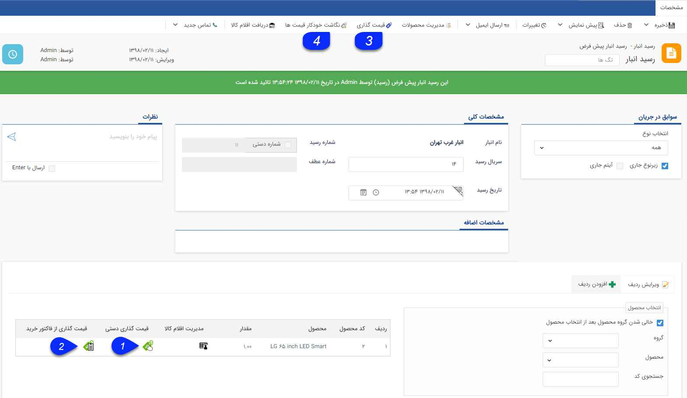
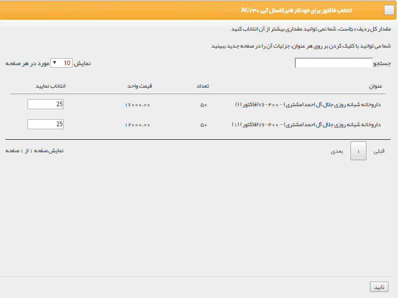
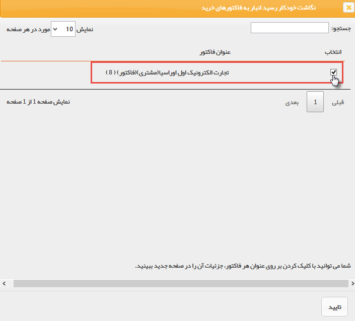
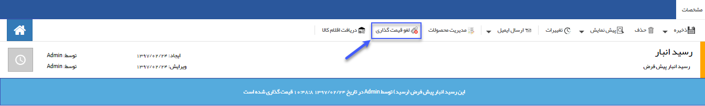

## قیمت گذاری رسید انبار

> مسیر دسترسی:  **خرید، فروش و انبار** >**انبارها** > **رسید انبار** 

برای وارد کردن کالا به انبار از رسید انبار استفاده می شود.

قیمت گذاری: به صورت دستی و یا از روی فاکتور خرید قیمت گذاری می شود.

1. قیمت گذاری دستی: در هر ردیف  با انتخاب کلید قیمت گذاری دستی می توانید تعداد کالا و قیمت آن را تعیین کنید.

میتوانید برای تعداد دلخواه قیمت متفاوت اعمال کنید. (برای مثال در تصویر 100 تا از کالاها قیمت 12000 ریال دارند در حالی که سایر آن ها می توانند با مبلغ متفاوتی قیمت گذاری شوند.)

.png)

2. قیمت گذاری از فاکتور خرید: لیست فاکتورهایی که این کالا ( در این مثال خودکار فابرکاستل آبی) در آن وجود دارد را نرم افزار نمایش می دهد و از بین آنها می توانید انتخاب کنید که چه تعداد از کالاهایی که در این رسید موجود است، مرتبط با کدام فاکتورهاست.

3. نگاشت خودکار قیمت ها: اگر تمامی اقلام موجود در این رسید مرتبط با یک فاکتور خرید به خصوص است، میتوانید با استفاده از نگاشت خودکار قیمت، نام فاکتور خرید مرتبط را انتخاب کنید تا نرم افزار قیمت های رسید را از روی آن نگاشت کند.

4. دکمه قیمت گذاری: پس از قیمت گذاری برای تمام ردیف های کالا، با کلیک بر روی این علامت قیمت گذاری روی رسید انجام می شود. توجه داشته باشید در صورتی که قیمت گذاری برای تمام ردیف های کالا انجام نشود، امکان قیمت گذاری و استفاده از این دکمه وجود ندارد.

> نکته : پس از قیمت گذاری ردیف ها حتما باید دکمه قیمت گذاری زده شود در غیر این صورت قیمت گذاری انجام نشده است.

پس از انجام قیمت گذاری، می توانید با استفاده از دکمه لغو قیمت گذاری، تراکنش را به حالت قیمت گذاری نشده برگردانید.

