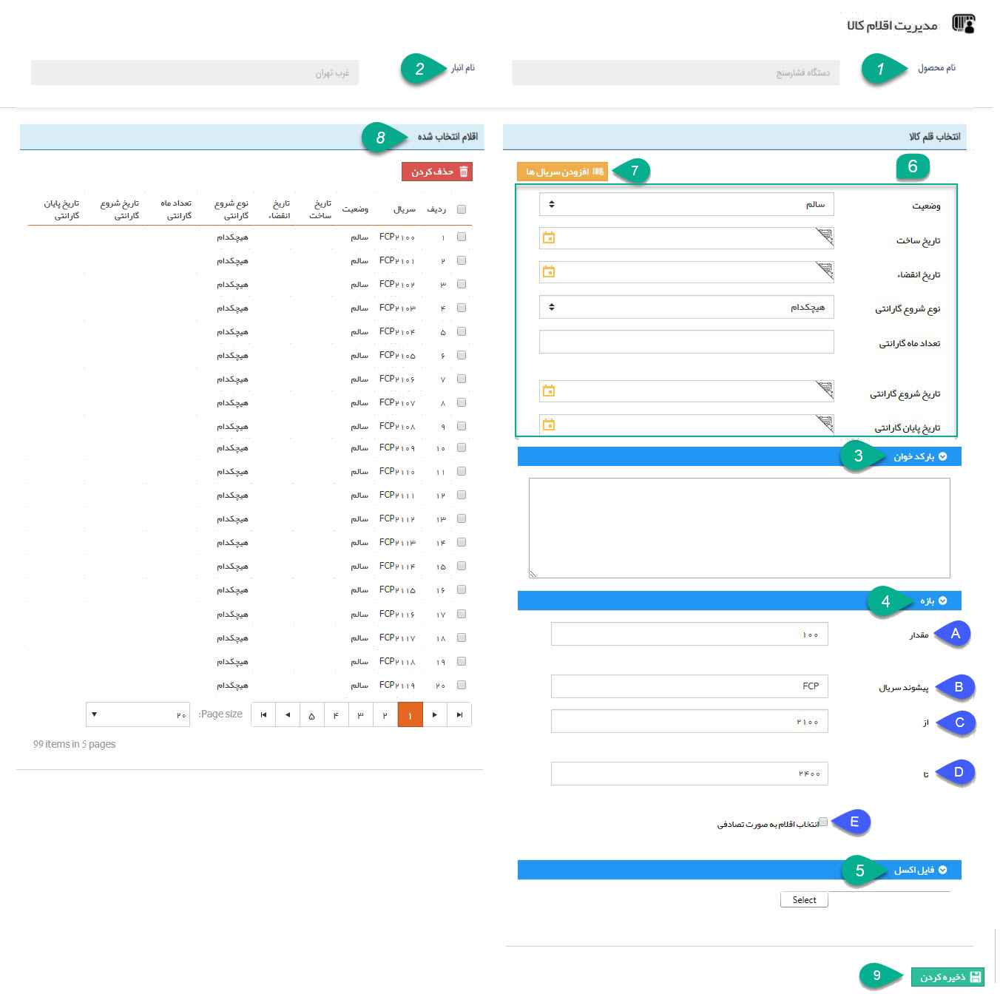
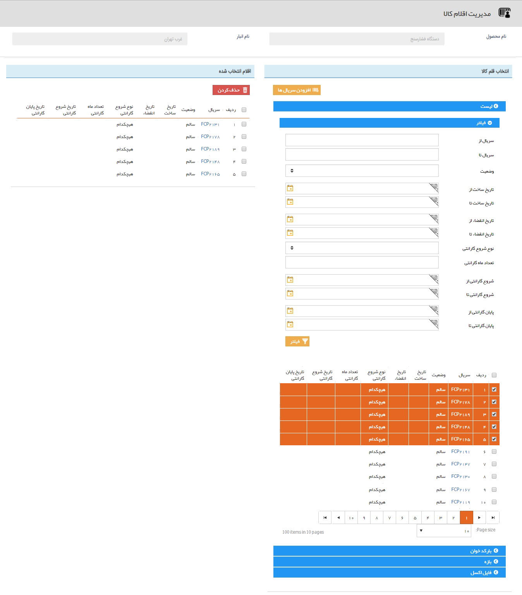

## مدیریت اقلام کالا

> مسیر دسترسی:  **خرید، فروش و انبار** >**انبارها** > **رسید اولیه/رسید انبار/حواله** > **مدیریت اقلام کالا** 

پس از اضافه کردن محصولات به تراکنش های انبار می توانید سریال اقلام کالا را نیز وارد کنید. وارد کردن سریال ها به شما کمک می کند تا با جستجوی سریال ها در قسمت[ جستجو قلم کالا  ،](https://github.com/1stco/PayamGostarDocs/blob/master/help2.5.4/Buy-warehouse-sales/Search-for-item-pen/ProductSerial.md) وضعیت کالا (موجود بودن آن در انبار، وضعیت گارانتی و ...) را به سادگی مشاهده نمایید. پس از اضافه نمودن محصولات به تراکنش های انبار، به ازای هر ردیف محصول، می توانید با کلیک بر روی مدیریت اقلام کالا نسبت به افزودن سریال ها اقدام نمایید.

با کلیک بر روی این دکمه صفحه زیر را مشاهده خواهید نمود:

1. نام محصول: نام محصولی که قصد وارد کردن سریال اقلام آن را دارید در این قسمت نمایش داده می شود.

2. نام انبار: نام انبار مرتبط که محصولات به آن وارد -یا از آن خارج- می شوند در این قسمت نمایش داده می شود.

کالای موجود در هر رسید انبار را میتوان از 3 راه به آن سریال افزود که توضیحات مرتبط با هر یک به شرح زیر می باشد:

3) بارکد خوان/ثبت دستی: با استفاده از دستگاه بارکد خوان یا بصورت دستی، سریال ها را می توانید در فیلد متنی اضافه کنید.

> نکته: برای استفاده از بارکد خوان، نشانگر(موس) را روی فیلد متن نگه دارید و سپس دستگاه بارکد خوان را متصل کنید و شروع به اسکن بارکدها نمایید.   

4) بازه: می توانید یک بازه عدد را همراه با پیشوند بخصوصی برای  سریال ها انتخاب نمود.   

A. مقدار: تعداد سریال هایی که مورد نیاز است را مشخص کنید (در این مثال 100 کالا مورد نظر بوده است.)

B. پیشوند سریال: در صورت نیاز پیشوند دلخواهی برای سریال های تولید شده در نظر بگیرید.

C. از: حد پایین بازه شروع سریال ها را مشخص کنید.

D. تا: حد بالای بازه پایان سریال ها را مشخص کنید.

E. انتخاب اقلام به صورت تصادفی: در صورت فعال کردن این گزینه از بین بازه انتخاب شده (در این مثال 2100 تا 2400) نرم افزار به صورت تصادفی به اندازه مقدار تعیین شده (در این مثال 100 عدد) شماره تصادفی ایجاد می کند.

5) فایل اکسل: اگر فایل اکسل سریال کالاها را در اختیار دارید، می توانید فایل آن را از این راه وارد نرم افزار کنید.

> نکته:در فایل اکسل فقط باید یک ستون بی عنوان داشته باشید که حاوی سریال اقلام کالاست.

6) مشخصات اقلام کالا: در این قسمت می توانید هنگام تعریف سریال اقلام مشخصاتی مانند وضعیت سلامت کالاها، تاریخ ساخت و وضعیت گارانتی آن ها را وارد کنید.

7)  افزودن سریال ها: پس از وارد کردن سریال ها (با استفاده از یکی از سه روش ذکر شده) و مشخص کردن مشخصات آن ها، با کلیک بر روی دکمه افزودن سریال ها، آن ها را به ستون سمت چپ اضافه نمایید.

8) اقلام انتخاب شده: سریال کالاهایی که وارد کرده اید به همراه مشخصات تعیین شده برای هرکدام در این قسمت نمایش داده می شود. در صورت اشتباه بودن اطلاعات می توانید آن ها را حذف کنید.

9) ذخیره: در انتها پس از وارد کردن سریال و مشخصات مربوط به تمامی اقلام کالا با کلیک بر روی دکمه "ذخیره کردن" سریال ها را به تراکنش انبار مربوطه اضافه کنید.

> نکته: در حواله ها تنها سریال هایی را می توان انتخاب کرد که قبلا از طریق رسید وارد انبار شده باشند. در واقع زمان وارد کردن سریال ها در حواله، علاوه بر سه روش ذکر شده، لیست سریال هایی که از قبل وارد انبار شده اند نمایش داده خواهد شد و می توانید از بین آن ها، سریال های مورد نظر خود را برای خروج از انبار انتخاب کنید. علاوه بر این می توانید از فیلترهای مختلف برای جستجوی سریال های مورد نظر استفاده کنید. به صورت زیر:

