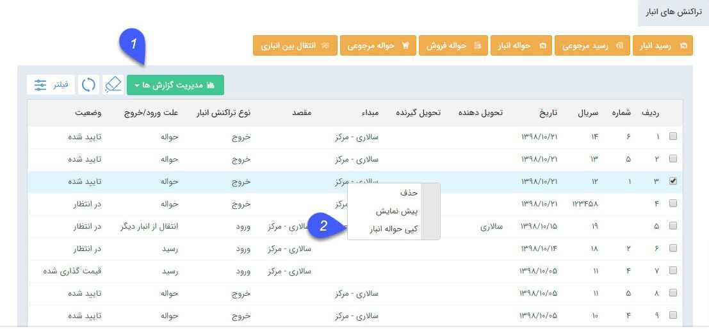

## ثبت حواله/رسید

هر حواله یا رسید در انبار ابتدا ذخیره می شود، سپس باید به تایید رسیده و بعد از آن باید قیمت گذاری روی آن انجام شود. می توانید در رسید یا حواله های ثبت شده، سریال اقلام کالا را نیز وارد کنید.

[اطلاعات مشترک ثبت رسید/حواله](https://github.com/1stco/PayamGostarDocs/blob/master/help2.5.4/Buy-warehouse-sales/Store/sabthavale-resid/moshtarak-resid-havale.md) 

[مدیریت اقلام کالا](https://github.com/1stco/PayamGostarDocs/blob/master/help2.5.4/Buy-warehouse-sales/Store/sabthavale-resid/aghlam-kala.md)

1. مدیریت گزارش ها :  با استفاده از این بخش میتوان از لیست درخواست ها با توجه به فیلتر های اعمال شده، گزارش گیری کرد. برای توضیحات بیشتر میتوانید به بخش [گزارش ساز جدید](https://github.com/1stco/PayamGostarDocs/blob/master/help2.5.4/Management-and-reports/Report-Builder/Report-Builder.md) مراجعه کنید.

## قابلیت صدور حواله/رسید از روی اسناد دیگر

برای جلوگیری از ثبت حواله یا رسید با محصولات تکراری، امکان صدور حواله یا رسید جدیدی از روی حواله یا رسیدی که قبلا ثبت شده وجود دارد. در این حالت تمامی محصولات از سند مبدا به سند مقصد (کپی میشود) انتقال می یابند.

عملکرد به این صورت می باشد که روی حواله یا رسید مورد نظر راست کلیک کرده و سند انبار را کپی می کنیم.

  با راست کلیک روی سند انبار و کپی گرفتن از آن، حواله یا رسید جدیدی  برای کاربر باز می شود که فقط شامل ردیف محصولات تراکنش مبدا می باشد.(نوع تراکنش بسته به سند انتخاب شده دارد ، برای مثال اگر رسید بعنوان تراکنش مبدا انتخاب شده باشد،رسید جدید باز خواهد شد )
  
  
  
  2. زیر نوع سند انبار: نوع رسید و حواله مقصد طبق سند مبدا مشخص می شود اما امکان انتخاب زیر نوع سند انبار وجود دارد .

 3. شماره سند انبار:  شماره و سریال رسید و یا حواله باید توسط کاربر مشخص شود.
 
 > نکته:رسید یا حواله مقصد هیچ وابستگی ای به رسید و یا حواله مبدا ندارد .  کاربر فقط رسید و حواله هایی را می تواند از این روش ایجاد کند که مجوز صدور آن ها را دارد.

> نکته : ردیف های سند ، همان ردیف ها و  تحویل دهنده و تحویل گیرنده همان تحویل دهنده و گیرنده سند مبدا بوده و امکان ویرایش توسط کاربر را دارد .

