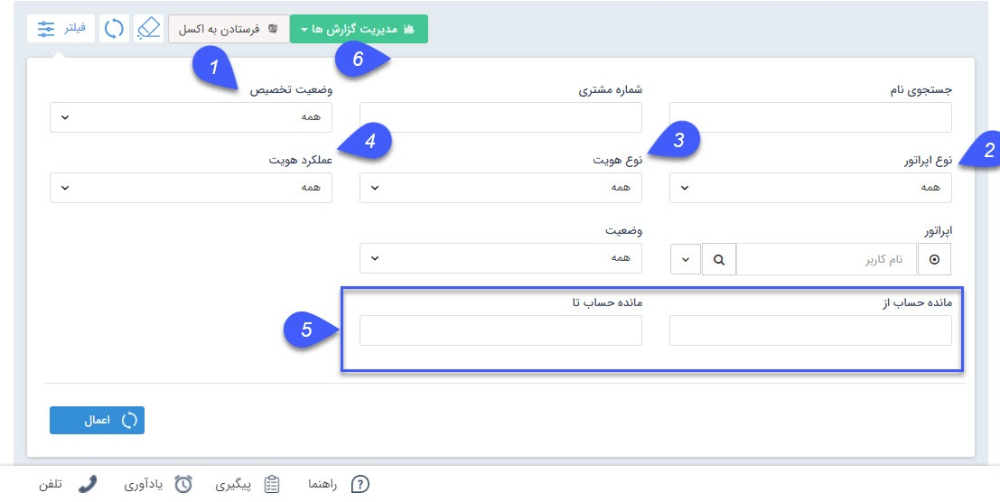

## تخصیص یافته ها

در این قسمت  کاربر در صورت دارا بودن مجوز مشاهده لیست نوع هویت ها،  هویت هایی که به کاربران(مسئول فروش، پشتیبانی و متفرقه) اختصاص داده شده اند در این لیست نمایش داده می شوند. هر کاربر می تواند پروفایل های اختصاص یافته به خود را مشاهده نماید. مدیران سیستم می توانن تمامی مخاطبان تخصیص یافته و نیافته را مشاهده کنند. با استفاده از فیلترهای موجود در این قسمت می توانید گزارشات متفاوت مورد نیاز از وضعیت تخصیص هویت ها را دریافت کنید.

نکته: لطف از قسمت از [فیلترهای پیشرفته](https://github.com/1stco/PayamGostarDocs/blob/master/help2.5.4/Customer-relationship-management/Advanced-filter/Advanced-filter.md) مطالعه فرمایید. 

1. وضعیت تخصیص: مشخص کنید که قصد مشاهده لیست هویت های تخصیص یافته را دارید یا هویت های تخصیص نیافته.

2. نوع اپراتور: از گزینه های کارشناس فروش، پشتیبانی یا متفرقه، اپراتور مورد نظر را انتخاب کنید.

3. نوع هویت: حقیقی یا حقوقی بودن هویت های مورد نظر خود را مشخص کنید.

4. عملکرد هویت: سرنخ یا مخاطب بودن هویت های مورد نظر خود را مشخص کنید.

5. مانده حساب: می توانید میزان مانده حساب (بدهکار و بستانکار) هویت ها را نیز به عنوان یک پارامتر جستجو اعمال کنید.

6. مدیریت گزارش ها :  با استفاده از این بخش میتوان از لیست تخصیص یافته ها با توجه به فیلتر های اعمال شده، گزارش گیری کرد. برای توضیحات بیشتر میتوانید به بخش گزارش ساز جدید مراجعه کنید.

> نکته: با استفاده از بخش تنظیمات جدول می توانیم فیلدهایی برای نمایش در لیست و خروجی اکسل انتخاب کنید.
