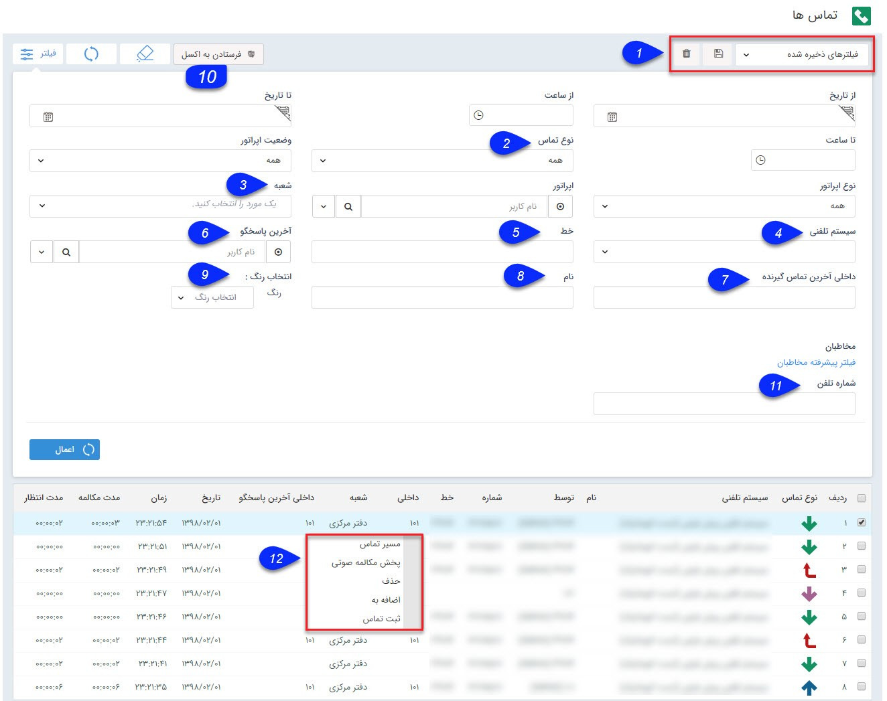


# تماس ها
در صورتی که ماژول نمایش تماس (ماژول مرکز تماس) نرم افزار تهیه و راه اندازی شده باشد، تمام تماس هایی که با خطوط شرکت انجام می شود  در این قسمت نمایش داده می شود.

همانطور که در لیست تماس مشخص است مدت مکالمه با هر شماره در مقابل آن نمایش داده شده ا ست. 

    

1. نوع فیلتر: میتوانید فیلترهای اعمال شده را به عنوان یک فیلتر اختصاصی خود ذخیره کرده و برای اخذ گزارشات بعدی از آن استفاده کنید.

نکته: لطفا ابتدا قسمت<a href="file%3A%2F%2F%2FC%3A%5CUsers%5CH.abasi%5CDesktop%5Chelp%5Chelp%20new%5C%D9%85%D8%AF%DB%8C%D8%B1%DB%8C%D8%AA%20%D8%A7%D8%B1%D8%AA%D8%A8%D8%A7%D8%B7%20%D8%A8%D8%A7%20%D9%85%D8%B4%D8%AA%D8%B1%DB%8C%D8%A7%D9%86%5CAdvanced-filter%5CAdvanced-filter.md" target="_blank"> فیلترهای پیشرفته </a>را مطالعه کنید.

2. نوع تماس: می توانید نوع تماس (دریافتی ، گرفته شده، از دست رفته) را تعیین کنید.

3. شعبه:   می توان براساس شعبه ای که سیستم تلفنی برای آن تعریف شده است فیلتر انجام داد .

4. سیستم تلفنی: می توانید سیستم تلفنی مورد نظر خود را از این قسمت انتخاب کنید.

5. خط: خطی که از طریق آن ارتباط برقرار شده است را می توانید درج کنید.

6.آخرین تماس گیرنده/پاسخگو: کاربری که به عنوان آخرین پاسخگوی تماس ورودی یا آخرین تماس گیرنده تماس خروجی در نرم افزار ثبت شده است را می توانید انتخاب کنید.

> نکته: توجه داشته باشید برای جستجو بر اساس کاربر، ابتدا باید در قسمت مدیریت سیستم های تلفنی کاربر متناظر با هر داخلی را تعیین کرده باشید

7.داخلی آخرین تماس گیرنده/پاسخگو: شماره داخلی کاربری که تماس را برقرار کرده و یا به عنوان آخرین نفر پاسخگوی مخاطب بوده است را می توانید درج کنید.

8.  نام: می توانید نام مخاطب یا بخشی از نام مخاطب را برای فیلتر کردن درج کنید.

9. انتخاب رنگ: می توانید تماس ها را بر اساس رنگ تخصیص داده شده به هویت ها فیلتر کنید. توجه داشته باشید که در صورتی که به هویت رنگ اختصاص داده باشید، در لیست تماس ها، رنگ هویت ها نمایش داده می شود.

10. فرستادن به اکسل: می توانید سوابق تماس ها را در قالب فایل اکسل دریافت کنید.

11. شماره تلفن: می توانید شماره تلفن دلخواه یا بخشی از شماره تلفن (مثلا 0912) برای فیلتر کردن درج کنید .

12. راست کلیک: برای اطلاع از گزینه های منوی راست کلیک به قسمت    تماس هادر بانک اطلاعاتی مراجعه کنید.

