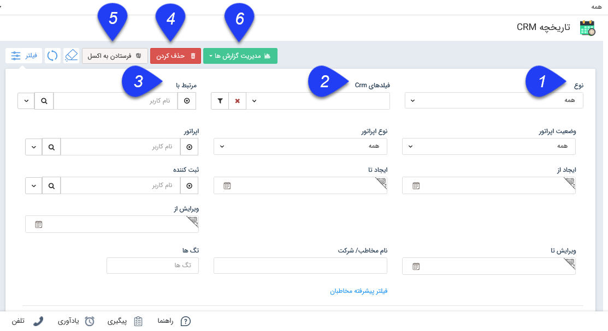

## تاریخچه CRM 

> مسیر دسترسی:  **مدیریت ارنباط با مشتریان** >**تاریخچه crm**

منظور از تاریخچه CRM تمام آیتم های ثبت شده در سیستم  شامل تماس تلفنی، قرار ملاقات، فاکتور، پیش فاکتور و ... است. با استفاده از این صفحه و فیلترهای مختلف  می توانید به جستجو در میان تمام موارد بپردازید و انواع گزارشات مورد نظر خود را از سوابق ثبت شده دریافت کنید.

> نکته: هر کاربر می تواند تنها سوابقی را که خود ثبت نموده است مشاهده نماید و برای مشاهده سوابق ثبت شده توسط سایر کاربران برای هر کدام از آیتم ها باید مجوز "مشاهده لیست" را برای آن آیتم داشته باشد

> نکته: لطفا ابتدا قسمت[  فیلترهای پیشرفته ](https://github.com/1stco/PayamGostarDocs/blob/master/help%202.5.4/Customer-relationship-management/Advanced-filter/Advanced-filter.md)را مطالعه کنید.

1. نوع: می توانید نوع آیتم دلخواه را برای فیلتر کردن مشخص کنید.

2. فیلدهای CRM: در صورتی که نوع آیتم را مشخص کرده باشید، می توانید در این قسمت یک زیرنوع را نیز مشخص کنید. همچنین می توانید با استفاده از دکمه فیلتر موجود در این فیلد، پس از انتخاب یکی از زیرنوع ها، روی فیلدهای اضافه شده به آن نیز فیلتر مورد نظر خود را اعمال کنید.  

3. مرتبط با: برای آیتم هایی که قابلیت تخصیص به یکی از کاربران را دارند کاربرد دارد. این  پارامتر برای آیتم های مختلف با نام های متفاوتی مشاهده می شود (فیلد "تخصیص داده شده به " در فرصت، فیلد "هماهنگ کننده" در قرار ملاقات و فیلد "فروشنده" در پیش فاکتور/فاکتورهای فروش/خرید، فیلد "کارشناس مرتبط" در درخواست و قرارداد)

4. حذف کردن: می توانید آیتم مورد نظر را حذف کنید.

5. فرستادن به اکسل: می توانید از آیتم های فیلتر شده به صورت یک فایل اکسل خروجی تهیه کنید.

نکته: امکان دریافت خروجی اکسل از آیتم های سیستم در هر بار به تعداد حداکثر 10000 آیتم وجود دارد. اگر لیست تمام آیتم های مورد نظر، بیشتر از این مقدار باشد، می توانید از قابلیت فیلتر استفاده نمایید تا آن تعدادی که نیاز دارید نمایش داده شود. در نظر داشته باشید اگر تعداد آیتم های مورد نیاز شما برای نمایش در اکسل بیشتر از 10000 مورد باشد، می بایست تنظیمات پیکربندی سرور توسط تیم پشتیبانی، به روز رسانی شود.

6.مدیریت گزارش ها :  با استفاده از این بخش میتوان از لیست تاریخچه CRM با توجه به فیلتر های اعمال شده، گزارش گیری کرد. برای توضیحات بیشتر میتوانید به بخش گزارش ساز جدید مراجعه کنید.
