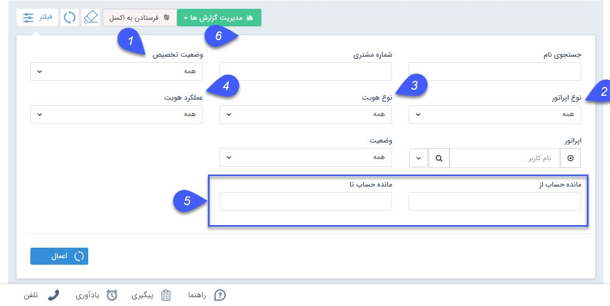

## سرنخ های من

> مسیر دسترسی:  **مدیریت ارتباط با مشتری** >**سرنخ‌های من** 

 هرکاربر در این قسمت لیست سرنخ های ایجاد شده توسط خود و در صورت دارا بودن مجوز مشاهده لیست نوع سرنخ ها، سرنخ هایی که به عنوان اپراتور مرتبط آن ها (کارشناس فروش، پشتیبانی و متفرقه) انتخاب شده باشد را مشاهده می کند. در واقع هر کاربر لیست سرنخ های مرتبط با خود را می تواند مشاهده کند و سایر سرنخ ها نمایش داده نمی شوند. توجه داشته باشید حتی ادمین و مدیران سیستم نیز از این قاعده مستثنی نیستند. 

 1. وضعیت تخصیص: وضعیت تخصیص(تخصیص یافته یا تخصیص نیافته) سرنخ هایی که قصد مشاهده آن ها را دارید، را مشخص کنید.

2. نوع اپراتور: از گزینه های کارشناس فروش، پشتیبانی یا متفرقه، اپراتور مورد نظر را انتخاب کنید.

3. نوع هویت: حقیقی یا حقوقی بودن سرنخ های مورد نظر خود را مشخص کنید.

4. عملکرد هویت: سرنخ یا مخاطب بودن سرنخ های مورد نظر خود را مشخص کنید.

5. مانده حساب: می توانید میزان مانده حساب (بدهکار و بستانکار) سرنخ ها را نیز به عنوان یک پارامتر جستجو اعمال کنید.

6. مدیریت گزارش ها :  با استفاده از این بخش میتوان از لیست سرنخ ها با توجه به فیلتر های اعمال شده، گزارش گیری کرد. برای توضیحات بیشتر میتوانید به بخش [گزارش ساز جدید ](https://github.com/1stco/PayamGostarDocs/blob/master/help%202.5.4/Management-and-reports/Report-Builder/Report-Builder.md)مراجعه کنید.

> نکته :  با استفاده از بخش تنظیمات جدول میتوانیم فیلد هایی برای نمایش در لیست و خروجی اکسل انتخاب کنید.

