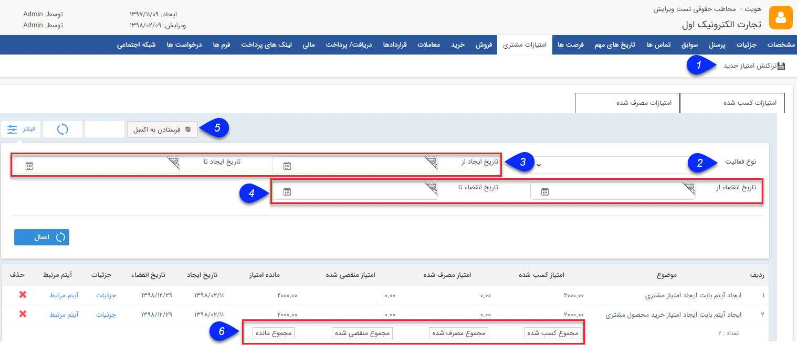

## امتیازات مشتری

> مسیر دسترسی:  **بانک یکپارچه** >**بانک اطلاعاتی** > **صفحه‌ی اصلی هویت** > **صفحه‌ی امتیازات مشتری** 

در تب امتیازات مشتری موجود در هویت تمامی تراکنش های امتیاز انجام شده برای هویت نمایش داده می شود. می توانید میزان امتیاز فعلی هویت را مشاهده کرده، از آن ها گزارشی در قالب فایل اکسل دریافت کنید و در صورت نیاز تراکنش امتیاز جدیدی به صورت دستی ایجاد کنید. تراکنش ها از نوع افزایش، کاهش یا خرج شده می توانند باشند.

برای اطلاع از نحوه محاسبه و قوانین امتیاز دهی مشتریان میتوانید بخش تنظیمات[ مدیریت انواع پروفایل](https://github.com/1stco/PayamGostarDocs/blob/master/help2.5.4/Settings/Manage-all-kinds-of-profiles/edit-profile.md) را مطالعه کنید.

براساس قانون امتیاز دهی که برای هر نوع پروفایل در این بخش تعریف میگردد، تراکنش های امتیازی از نوع افزایشی یا کاهشی ثبت میگردد.

اگر قانون امتیاز دهی تعریف شده برای این نوع هویت براساس ثبت سریال محصول باشد، چنانچه هویت مرتبط پیامکی حاوی سریال محصولی که خریداری کرده است ارسال کند و محصول مربوطه در اصالت کالا معرفی شده باشد،   به ازای هر سریال به میزان مشخص شده در این قسمت امتیازی کسب می کند و برای آن تراکنش از نوع افزایشی ثبت میگردد. (توجه داشته باشید که ابتدا باید در قسمت [مدیریت محصولات ](https://github.com/1stco/PayamGostarDocs/blob/master/help%202.5.4/Basic-Information/Product%20management/Product-management.md)، میزان امتیاز مرتبط با هر محصول و پایه امتیاز فعال آن را مشخص کرده باشید.)

اگر قانون امتیاز دهی تعریف شده برای این نوع هویت براساس ثبت نام هویت باشد، چنانچه هویت از طریق صفحه ثبت نام، اقدام به انجام عملیات ثبت نام کند، برای فرد مربوط، به میزان مشخص شده امتیاز ثبت می شود و تراکنش امتیاز از نوع افزایشی برای آن در این بخش ثبت میگردد.

در صورت اینکه برای نوع پروفایل مورد نظر قانون امتیازدهی براساس ایجاد آیتم باشد در صورت ایجاد ، ویرایش یا حذف آن ایتم تراکنش های امتیاز مربوطه به آن ثبت خواهد شد.

چنانچه برای این نوع پروفایل قانون امتیاز دهی براساس خرید محصول تنظیم شده باشد،چنانچه از روی آن، فاکتور برگشتی ثبت شود به میزان برگشتی ثبت شده، هویت مرتبط امتیاز مصرف شده کسب می کند.

تراکنش های کاهشی پس از گذشتن تاریخ انقضاء تراکنش های امتیاز افزایشی به طور خودکار توسط سیستم ایجاد می شوند و تراکنش های امتیاز خرج شده در زمان استفاده از امتیاز هنگام صدور فاکتور فروش برای مشتری ایجاد خواهند شد. همچنین کاربران سیستم می توانند در صورت نیاز به صورت دستی هر سه نوع تراکنش را برای مشتریان ثبت کنند.

1 . تراکنش امتیاز جدید: با استفاده از این دکمه می توانید یک تراکنش امتیاز جدید از نوع افزایشی، کاهشی یا خرج شده برای مشتری به صورت دستی ایجاد نمایید.

2.  نوع فعالیت :  نوع فعالیتی که پروفایل مرتبط از آن طریق باید امتیاز کسب کند را انتخاب کنید.  (برای اطلاع از عملکرد فعالیت ها بهمدیریت انواع پروفایل  رجوع کنید )

3. بازه زمانی ایجاد:  میتوانید تراکنش های امتیاز را براساس بازه زمانی ایجاد آنها فیلتر کنید.

4. بازه زمانی انقضاء: میتوانید تراکنش های امتیاز را براساس بازه زمانی انقضای آنها فیلتر کنید.

6. مجموع امتیازات: میزان امتیازات کسب شده و مصرف شده و منقضی شده و مانده امتیازات مشتری در این قسمت نمایش داده می شود.

7. فرستادن به اکسل: می توانید با استفاده از این دکمه، جزئیات تراکنش های امتیاز فیلتر شده را در قالب فایل اکسل دریافت نمایید.

> نکته: چنانچه بخواهید امتیازی که قبلا کسب شده و سپس مصرف شده را حذف کنید ابتدا باید امتیاز مصرفی آن را حذف کنید.

