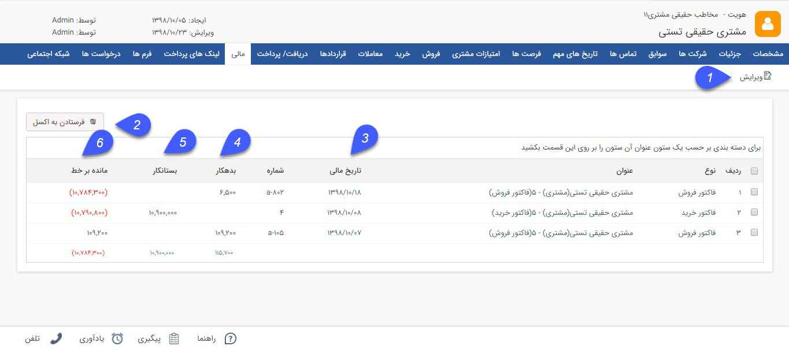

## مالی

> مسیر دسترسی:  **بانک یکپارچه** >**بانک اطلاعاتی** > **صفحه‌ی اصلی هویت** > **صفحه‌ی مالی** 

در این بخش کلیه سوابق مالی مشتری نمایش داده میشود.سابقه مالی مشتری شامل  تمام دریافت ها، پرداخت ها ، فاکتورهای خرید/فروش/ برگشت از خرید و فروش و قرارداد های نوع مالی  تایید شده میباشد.

> نکته : در مورد پیش فاکتور/فاکتورها و دریافت/پرداخت و قراردادها، در صورتی که نیاز به تایید داشته باشند بعد از تایید جز سابقه مالی محسوب می شوند .

> نکته : همان طور که عنوان شد در مورد قراردادها، تنها در صورتی که قرارداد جنبه مالی داشته باشد به عنوان سابقه مالی در نظر گرفته می شوند .

1. ویرایش: می توانید سابقه مالی مورد نظر را ویرایش کنید.

2. فرستادن به اکسل: با استفاده از این دکمه می توانید سابقه مالی مخاطب را در قالب یک فایل اکسل دریافت کنید.

3. تاریخ مالی: تاریخ صدور پرداخت/دریافت، تاریخ صدور  پیش فاکتور/فاکتور و تاریخ شروع قرارداد  را نمایش می دهد .

4. مجموع  بدهکاری: در این ستون میزان بدهی مخاطب در آیتم مالی (پرداخت ها، فاکتورهای فروش، قراردادها) به ازای هر سابقه و در انتهای ستون مجموع این مبالغ نشان داده می شود .

5. مجموع  بستانکاری: در این ستون میزان بستانکاری مخاطب در آیتم مالی (دریافت ها، فاکتورهای خرید، قرادادها) به ازای هر سابقه و در انتهای ستون مجموع این مبالغ نشان داده می شو د.

9. مانده بر خط :  عدد نمایش داده شده در این ستون نمایانگر مانده حساب هویت تا ان تاریخ است که عبارتست از مجموع مبالغ بدهکاری و مبالغ بستانکاری که با رنگ قرمز نمایش داده می شود .