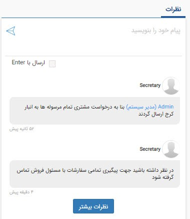
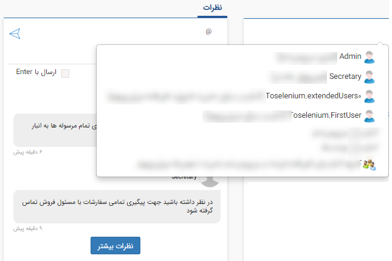

## نظرات

در این قسمت کاربران می توانند یک نظر مرتبط با آیتم جاری ثبت کنند.

توجه کنید که امکان اضافه کردن نظر به هریک از آیتم ها نیاز به مجوز مرتبط از سوی ادمین نرم افزار را دارد.

قابل ذکر است که تنها کاربر ایجاد کننده نظر می تواند نظر خود را حذف کند و امکان حذف نظر آن توسط کاربران دیگر وجود ندارد. (لازم به ذکر است ادمین و دارندگان مجوز مدیرسیستم از این امر مستثنی هستند و می توانند تمام نظرات را حذف کنند.)

> نکته: با کلیک بر روی قسمت نظرات و تایپ علامت"@"   قبل از نام یک کاربر میتوانید کاربر بخصوصی که قصد دارید برای او نظری ثبت نمائید را صدا بزنیدو از این طریق ان را مطلع کنید. به این ترتیب نظر در ویجت نظرات کاربر انتخابی نیز نمایش داده می شود.

 همچنین  علاوه بر امکان اشاره کردن به یک یا چند کاربر خاص می توان نام یک گروه از کاربران یا کل کاربران سیستم و یا کاربران مرتبط با پروفایل (مسئولان پشتیبانی، فروش و متفرقه) را نیز ذکر (mention) کرد.
 
 > نکته: در صورتی که یک پیام سیستمی برای"ذکر نام در نظرات" تنظیم کرده باشید، در صورت اشاره کردن به هر کاربر در نظر خود، این موضوع می تواند از طریق یادآوری سیستمی (نوتیفیکیشن)، پیامک، ایمیل یا تلگرام به کاربر خطاب شده اطلاع رسانی گردد.
 
 > نکته : برای تنظیم پیام مرتبط با هرکدام از رسانه ها به قسمت[ مدیریت پیام های سیستم](https://github.com/1stco/PayamGostarDocs/blob/master/help%202.5.4/Basic-Information/Manage-system-messages/Manage-system-messages.md)  مراجعه کنید.

