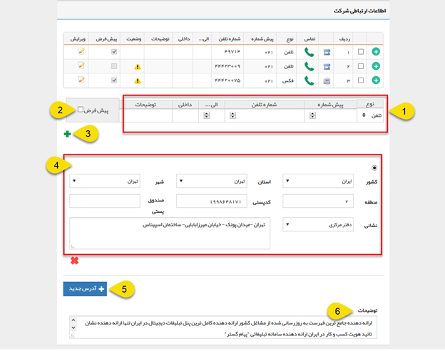

## اطلاعات ارتباطی

> مسیر دسترسی:  **بانک یکپارچه** >**بانک اطلاعاتی** > **صفحه‌ی اصلی هویت** > **اطلاعات ارتباطی** 

در این قسمت اطلاعات مربوط به راه های ارتباطی با هویت قرار داده می شود.

1. از این قسمت می توانید راه های ارتباطی با هویت ( اطلاعات تلفن، تلفن همراه، فکس و تلفکس و توضیحات مورد نیاز) آن را اضافه کنید.

2. پیش فرض: می توانید یک شماره را برای هر نوع از راه های ارتباطی(تلفن، موبایل و فکس) به عنوان پیشفرض تعیین کنید. در صورتی که بخواهید برای این هویت یک پیام کوتاه یا فکس از طریق نرم افزار ارسال کنید، این پیام به شماره پیشفرض تعیین شده در این قسمت ارسال خواهد شد. همچنین در صورت قرار دادن پارامتر هوشمند تلفن، موبابل یا فکس در هریک از قالب های چاپی آیتم ها، مقدار مرتبط با شماره پیشفرض درج خواهد شد.

> نکته : در هنگام افزودن شماره تماس ها امکان انتخاب پیش شماره کشور وجود دارد.(در صورتی که در تنظیمات کلی،  بخش تماس ها پیش شماره کشور وارد شده باشد در این قسمت بصورت پیش فرض آن پیش شماره نمایش داده خواهد شد.

3. با استفاده از این گزینه می توانید اطلاعاتی که در قسمت ۱ وارد کرده اید را به اطلاعات ارتباطی هویت اضافه کنید و یک ردیف اطلاعاتی ارتباطی جدید بازکنید.

4. آدرس: می توانید  با تکمیل پارامتر های آدرس، اقدام به ثبت آدرس مورد نظر خود کنید.

> نکته: میتوان برای ویرایش لیست کشور، استان و یا شهر به[ مدیریت شهر ها ](https://github.com/1stco/PayamGostarDocs/blob/master/help%202.5.4/Basic-Information/Management-of-countries%2C%20provinces-and-cities/Management-of-countries%2C%20provinces-and-cities.md)مراجعه کنید.

5. آدرس جدید: با استفاده از این گزینه می توانید یک آدرس دیگر  (برای مثال آدرس دفتر مرکزی و یا انبار) برای این هویت ایجاد کنید.

6. توضیحات: می توانید توضیحاتی که در خصوص این هویت مورد نیاز است را در این قسمت وارد کنید. (مانند حوزه فعالیت و یا خدماتی که این مخاطب ارائه می دهد