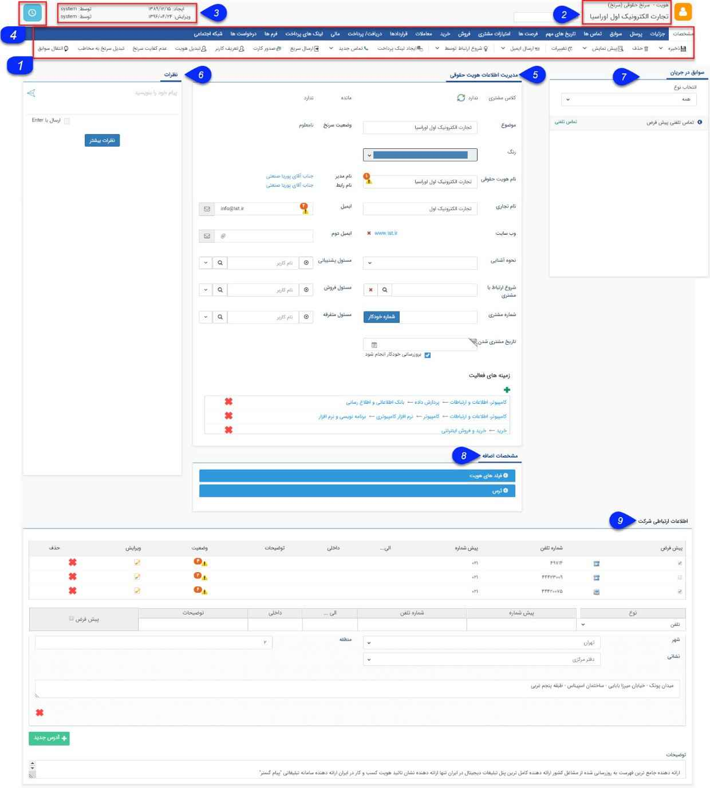

## مشخصات عمومی

با کلیک کردن بر روی هر هویت میتوانید مشخصات ثبت شده برای آن هویت را مشاهده کرد.

نام کاربر ثبت کننده اطلاعات به همراه تاریخ ایجاد آن نیز در این قسمت نمایش داده می‌شود.

> نکته: در صورتی که این پروفایل جزو پروفایل‌های بانک اطلاعاتی باشد، نام ایجاد کننده آن سیستم نمایش داده میشود

 در اینجا می‌توانید توضیحاتی در خصوص مشخصات عمومی‌ انواع هویت‌هایی که در نرم افزار پیام گستر تعریف شده، مشاهده و مطالعه نمایید.

> نکته:  انواع هویت‌ها عبارتست از : مخاطب حقیقی(شخص)، سرنخ حقیقی، مخاطب حقوقی (شرکت) و سرنخ حقوقی می‌باشد. همچنین می‌توانید در قسمت[ شخصی سازی](https://github.com/1stco/PayamGostarDocs/blob/master/help%202.5.4/Settings/Personalization-crm/Overview/General-information/Add-features/Add-features.md)، زیرنوع‌های جدیدی برای هویت اضافه کنید.

> نکته: به عنوان نمونه عکس زیر از صفحه ی مدیریت اطلاعات یک  مخاطب حقوقی(شرکت) در تب مشخصات می‌باشد. 

قابل ذکر است مشخصات هویت‌های حقیقی و حقوقی شامل اطلاعات اصلی، تلفن‌ها و آدرس‌ها می‌باشد، اضافه کردن فیلدهای اطلاعاتی دلخواه با استفاده از شخصی سازی  امکان پذیر است.

1. نوار ابزار مشخصات: بعد از ذخیره ی هویت با استفاده از دکمه‌های نمایش داده شده در این قسمت می‌توانید از عملکردهای متفاوتی بهره مند گردید که به تفصیل در بخش نوار ابزار مشخصات توضیح داده خواهد شد.

2. عنوان: عنوان آیتم و نوع آن را نمایش می‌دهد، لازم به ذکر است نوع  آیتم قبل از ذخیره  شدن هویت، قابل انتخاب و تغییر به یکی از انواع هویت‌های تعریف شده در قسمت شخصی سازی می‌باشد. 

3. اطلاعات ثبت: تاریخ ایجاد و آخرین ویرایش، کاربر ایجاد کننده و کاربری که آخرین ویرایش بر روی این آیتم انجام داده است را نمایش می‌دهد .

4. یادآور و پیگیری: با کلیک بر روی آیکون ساعت نمایش داده شده در این قسمت می‌توانید یک پیگیری بر روی آیتم، برای کاربری خود ایجاد کنید.

5. مدیریت اطلاعات هویت: در این قسمت اطلاعات اصلی هویت شامل نام، ایمیل، وب سایت و ... وارد می‌شود.

6. نظرات: در این قسمت می‌توانید نظرات ثبت شده روی این آیتم را مشاهده کنید و یا نظر جدید ثبت کنید.

7. سوابق در جریان: دراین قسمت سوابق در جریان مرتبط با هویت یا به عبارت دیگر سوابقی که تحت چرخه بوده و هنوز به مرحله پایانی نرسیده باشند مشخص می‌گردند که با استفاده از فیلتر انتخاب نوع می‌توانید انواع سوابق مدنظر جهت نمایش را مشخص نمایید .

8. مشخصات اضافه: اگر از قسمت شخصی سازی هویت، فیلدهایی را به این زیرنوع هویت یا فیلدهایی را به عنوان سوپر فیلد به هویت اضافه کرده باشید، می‌توانید این فیلدها را در این قسمت مشاهده کنید.

9. اطلاعات ارتباطی: در این قسمت شماره‌های تماس و آدرس‌های هویت وارد می‌شود.

هنگام ثبت شماره تماس برای هویت‌ها، میتوان پیش شماره کشور را انتخاب نمود. این پیش شماره به صورت لیست در کنار فیلد شماره تماس نمایش داده میشود.

در صورت اینکه در بخش تنظیمات کلی در قسمت تماس‌ها پیش شماره ای برای کشور انتخاب گردد، این پیش شماره بصورت پیش فرض در فیلد شماره تماس نمایش داده می‌شود.

> نکته: لازم به ذکر است برای ارسال فکس و یا استفاده از click to call  برای برقراری تماس، از فرمت شماره بدون  درج پیش شماره و یا شماره به همراه کدکشور و شهر پشتیبانی میگردد و در صورت اینکه تنها از پیش شماره شهر و یا کشور قبل از شماره استفاده گردد این ارسال صورت نمیگیرد.

> نکته: هویت‌های از نوع حقیقی شامل فیلدی با عنوان پیشوند می‌باشند که مقادیر این فیلد در بخش مدیریت آیتم‌های سیستم قابل ویرایش می‌باشد.

