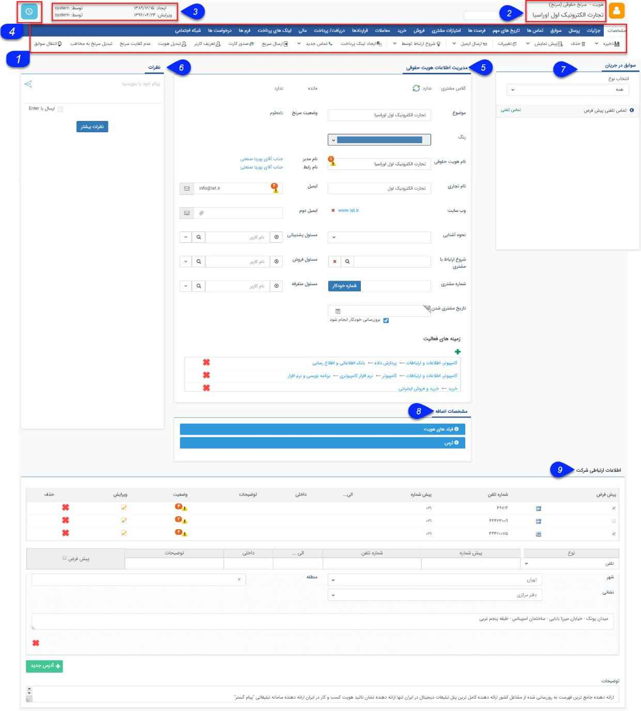

# ورود اطلاعات از طریق بانک اطلاعاتی 
**مسیر دسترسی:  بانک یکپارچه > بانک اطلاعاتی > انتخاب دسته بندی > شرکت جدید**

در این صفحه می‌توانید اطلاعات هویت حقوقی مورد نظر را ثبت کنید.

1. نوار ابزار مشخصات : بعد از ذخیره ی هویت با استفاده از دکمه های نمایش داده شده در این قسمت می توانید از عملکردهای متفاوتی بهره مند گردید که به تفصیل در بخش نوار ابزار مشخصات توضیح داده خواهد شد.

2. عنوان: عنوان آیتم و نوع آن را نمایش می دهد، لازم به ذکر است نوع  آیتم قبل از ذخیره  شدن هویت، قابل انتخاب و تغییر به یکی از انواع هویت های تعریف شده در قسمت شخصی سازی می باشد. 

3. اطلاعات ثبت: تاریخ ایجاد و آخرین ویرایش، کاربر ایجاد کننده و کاربری که آخرین ویرایش بر روی این آیتم انجام داده است را نمایش می دهد .

4. یادآور و پیگیری : با کلیک بر روی آیکون ساعت نمایش داده شده در این قسمت می توانید یک پیگیری بر روی آیتم، برای کاربری خود ایجاد کنید.

5. مدیریت اطلاعات هویت : در این قسمت اطلاعات اصلی هویت شامل نام، ایمیل، وب سایت و ... وارد می شود.

6. نظرات : در این قسمت می توانید نظرات ثبت شده روی این آیتم را مشاهده کنید و یا نظر جدید ثبت کنید.

7. سوابق در جریان: دراین قسمت سوابق در جریان مرتبط با هویت یا به عبارت دیگر سوابقی که تحت چرخه بوده و هنوز به مرحله پایانی نرسیده باشند مشخص می گردند که با استفاده از فیلتر انتخاب نوع می‌توانید انواع سوابق مدنظر جهت نمایش را مشخص نمایید .

8. مشخصات اضافه . : اگر از قسمت شخصی سازی هویت، فیلدهایی را به این زیرنوع هویت یا فیلدهایی را به عنوان سوپر فیلد به هویت اضافه کرده باشید، می توانید این فیلدها را در این قسمت مشاهده کنید.

9. اطلاعات ارتباطی : در این قسمت شماره های تماس و آدرس های هویت وارد می شود.

هنگام ثبت شماره تماس برای هویت ها، میتوان پیش شماره کشور را انتخاب نمود. این پیش شماره به صورت لیست در کنار فیلد شماره تماس نمایش داده میشود.

در صورت اینکه در بخش تنظیمات کلی در قسمت تماس ها پیش شماره ای برای کشور انتخاب گردد، این پیش شماره بصورت پیش فرض در فیلد شماره تماس نمایش داده می شود.

> نکته : لازم به ذکر است برای ارسال فکس و یا استفاده از click to call  برای برقراری تماس، از فرمت شماره بدون  درج پیش شماره و یا شماره به همراه کدکشور و شهر پشتیبانی میگردد و در صورت اینکه تنها از پیش شماره شهر و یا کشور قبل از شماره استفاده گردد این ارسال صورت نمیگیرد.

بعد از ثبت هویت، هویت ایجاد شده در دسته بندی مورد نظر بصورت زیر نمایش داده می‌شود .
Axe safe liste hoviat ha dar banke etelaati
با کلیک کردن بر روی هر هویت میتوانید مشخصات ثبت شده برای آن هویت را مشاهده کرد.

نام کاربر ثبت کننده اطلاعات به همراه تاریخ ایجاد آن نیز در این قسمت نمایش داده می شود.

> نکته: در صورتی که این پروفایل جزو پروفایل های بانک اطلاعاتی باشد، نام ایجاد کننده آن  در سیستم نمایش داده میشود

 در اینجا می توانید توضیحاتی در خصوص مشخصات عمومی انواع هویت هایی که در نرم افزار پیام گستر تعریف شده، مشاهده و مطالعه نمایید. (برای آشنایی بیشتر درباره لیست هویت‌ها به لینک x مراجعه کنید.)

قابل ذکر است مشخصات هویت های حقیقی و حقوقی شامل اطلاعات اصلی، تلفن ها و آدرس ها می باشد، اضافه کردن فیلدهای اطلاعاتی دلخواه با استفاده از شخصی سازی  امکان پذیر است.

