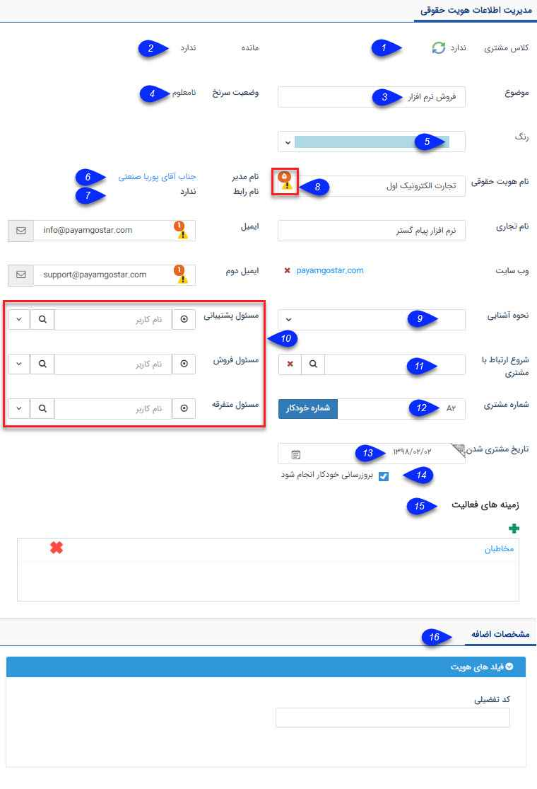

## مدیریت اطلاعات هویت

> مسیر دسترسی:  **بانک یکپارچه** >**بانک اطلاعاتی** > **صفحه‌ی اصلی هویت** > **مدیریت اطلاعات هویت** 

در این قسمت اطلاعات اصلی مرتبط با هویت نمایش داده می شود

>  نکته: لازم به ذکر است که شکل زیر  از پروفایل یک سرنخ حقوقی قرار داده شده است .

1. کلاس مشتری: کلاس مشتری را بر حسب خرید (میزان فاکتورها فروش، قراردادهای مالی) تعیین می کند. برای اطلاعات بیشتر می توانید به [ مدیریت کلاس بندی مشتریان](https://github.com/1stco/PayamGostarDocs/blob/master/help%202.5.4/Settings/Customer-classification-management/Customer-classification-management.md) رجوع کنید.

> نکته: قرار گیری مخاطبان در کلاس های مختلف به صورت خودکار و بر اساس تنظیمات مشخص شده توسط شما در مدیریت کلاس بندی مشتریان انجام می شود و امکان تغییر آن به صورت دستی وجود ندارد.

2. مانده: میزان مانده حساب مخاطبان در این قسمت نمایش داده می شود، مخاطبان در صورت ثبت سوابق فاکتور فروش/خرید، فاکتور برگشت از فروش/خرید، دریافت/پرداخت و قراردادهای مالی بدهکار یا بستانکار خواهند شد.

3. موضوع: در هویت هایی از نوع سرنخ باید موضوع آن سر نخ (برای مثال فروش کالای خاص یا تایید یک تامین کننده) را تعیین کنید. این موضوع در واقع کلید واژه ای است که برای پیگیری این سرنخ می تواند به شما کمک کند

4. وضعیت سرنخ:  زمانی که وضعیت سرنخ نامعلوم است، نشان دهنده ی آن است که  سر نخ هنوز در حال پیگیری می باشد یا هنوز به مرحله ی پیگیری نرسیده است.

وضعیت سرنخ می تواند به عدم کفایت تغییر کند که نشان دهنده ی مفید نبودن آن سرنخ است.

اگر سر نخ صلاحیت و کفایت لازم را داشته باشد، تبدیل به یک مخاطب خواهد شد.

5. انتخاب رنگ : میتوانید یک ویژگی کیفی از پیش تعیین شده در مجموعه ی خود (برای مثال میزان اهمیت مخاطب) برای هویت های خود در نظر بگیرید و به ان رنگ اختصاص دهید. (بطور مثال برای مشتریان VIP رنگ طلایی در نظر بگیرید یا رنگ قرمز را به مشتریان ناراضی اختصاص دهید)، علاوه بر مشخصات هویت این رنگ به عنوان زمینه تماس های دریافتی در پنجره های تماس تلفنی (CallerID) نمایان می شود.

> نکته: لازم به ذکر است رنگ انتخاب شده برای هویت مورد نظر، علاوه بر اینکه در پنجره تماس نمایان می شود در تمامی فیلدهایی از نوع شرکت/شخص در نرم افزار نیز پس از انتخاب هویت نمود پیدا می کند.

> نکته: برای تغییر رنگ ها و افزودن رنگ جدید می توانید به [مدیریت رنگ ها](https://github.com/1stco/PayamGostarDocs/blob/master/help%202.5.4/Basic-Information/Color-management/Color-management.md) مراجعه کنید.

6.  نام مدیر: در[  تب پرسنل ](https://github.com/1stco/PayamGostarDocs/blob/master/help%202.5.4/Integrated-bank/Database/Personnel%20%20Companies/Personnel-Companies.md)هویت ها، شخصی را که به عنوان مدیر تعیین کرده اید در این قسمت نمایان می شود.

7. نام رابط: در[  تب پرسنل ](https://github.com/1stco/PayamGostarDocs/blob/master/help%202.5.4/Integrated-bank/Database/Personnel%20%20Companies/Personnel-Companies.md)هویت ها، شخصی را که به عنوان رابط تعیین کرده اید در این قسمت نمایان می شود.

8. علامت هشدار: نشان می دهد که این نام و یا قسمتی از آن تکراری است و عدد کنار آن نمایانگر تعداد تکرار آن است. با کلیک بر روی علامت هشدار می توانید هویت های دیگری از بانک اطلاعاتی که اطلاعات مشابه دارند را مشاهده کنید.

9. نحوه آشنایی: می توانید نحوه جذب هویت به مجموعه خود را تعیین کنید تا در گزارشات و جستجو های نرم افزار از آن استفاده کنید. با پر کردن فیلد نحوه آشنایی می توانید گزارش دقیق تری از برجسته ترین روش های بازاریابی خود در قسمت گزارشات تحلیلی نرم افزار داشته باشید.

برای ویرایش گزینه های نحوه اشنایی و تمام فیلدهای از نوع لیست می توانید به[ مدیریت آیتم های سیستم](https://github.com/1stco/PayamGostarDocs/blob/master/help%202.5.4/Basic-Information/Management-of-system-items/Management-of-system-items.md) مراجعه کنید.

10. مسئول فروش، پشتیبانی و متفرقه: می توانید هر یک از کاربران سیستم را به عنوان یکی از این مسئولان مرتبط با این هویت تعیین کنید و از این مسئولان در گزارشات مختلف استفاده کرده و حتی بر اساس آنها محدودیت مشاهده مخاطبان اعمال کنید و یا در چرخه های کاری کارتابل ها را به آن ها اختصاص دهید.

> نکته: محدودیت مشاهده مخاطبان را می توانید از منوی[ امنیتی ](https://github.com/1stco/PayamGostarDocs/blob/master/help%202.5.4/Settings/General-settings/security/security.md)در تنظیمات کلی  اعمال کنید.

11. شروع ارتباط با مشتری: از این قسمت می توانید هویت را به یکی از کمپین های تبلیغاتی خود مرتبط کنید. برای اطلاعات بیشتر به قسمت "شروع ارتباط توسط" در  نوار ابزار مشخصاتمراجعه کنید. 

12. شماره مشتری: در صورتی که این هویت یکی از مشتریان شماست می توانید در این قسمت یک شماره مشتری به او اختصاص دهید، این شماره برای هر هویت منحصر بفرد است و نرم افزار از ثبت شماره تکراری جلوگیری خواهد کرد. شماره مشتری در واقع شناسه این مشتری در سازمان شماست.

 تخصیص شماره مشتری می تواند به صورت دستی یا با استفاده از دکمه شماره خودکار انجام شود، علاوه بر این امکان تخصیص شماره مشتری به صورت خودکار و توسط سیستم پس از تایید آیتم های پیش فاکتور، فاکتور، قرارداد و دریافت/پرداخت نیز وجود دارد.
 
 > نکته: شماره گذاری خودکار بر اساس بزرگترین شماره مشتری تخصیص داده شده، عمل می کند.

> نکته: در صورت ثبت دستی شماره مشتری از ثبت شماره های غیر معتبر خودداری کنید.

13. تاریخ مشتری شدن: همزمان با ثبت شماره مشتری برای یک مخاطب این تاریخ ثبت میشود اما شما می توانید تاریخی که در آن این مخاطب تبدیل به مشتری شما شده را تعیین کنید.

14. بروز رسانی خودکار: این گزینه تنها در مخاطبانی که در بانک اطلاعات مشاغل اول تجارت الکترونیک اول موجود است دیده می شود. با فعال بودن این گزینه هر بار که این بانک بروز رسانی می گردد تمامی اطلاعات که در آن درج شده را حذف کرده و با اطلاعات دریافت شده از سرورهای تجارت الکترونیک اول جایگزین می کند.

15. دسته بندی بانک اطلاعاتی: دسته بندی زمینه فعالیتی که این هویت در آن قرار گرفته است را نشان می ده

> نکته: یک هویت می تواند همزمان در چند دسته بندی باشد.

16. مشخصات اضافه: در قسمت مشخصات اضافه، پارامترهایی که شما با توجه به نیاز کسب و کار خود در ارتباط با مشتریان در قسمت شخصی سازی نرم افزار، از بخش [افزودن مشخصه ](https://github.com/1stco/PayamGostarDocs/blob/master/help%202.5.4/Settings/Personalization-crm/Overview/General-information/Add-features/Add-features.md)اضافه کرده اید، نمایش داده خواهند شد.

