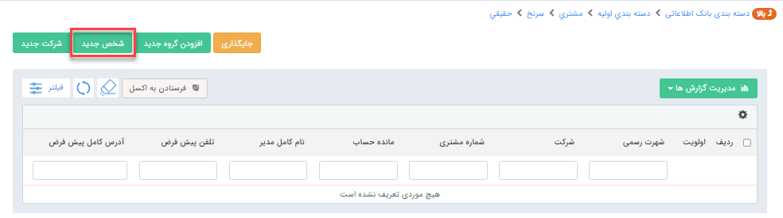
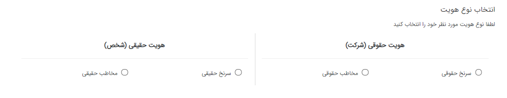
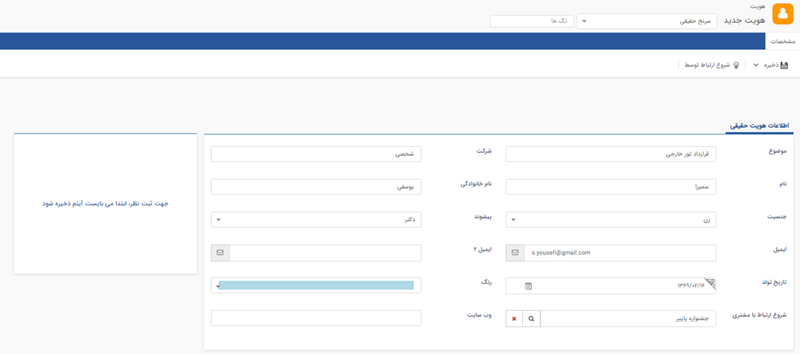
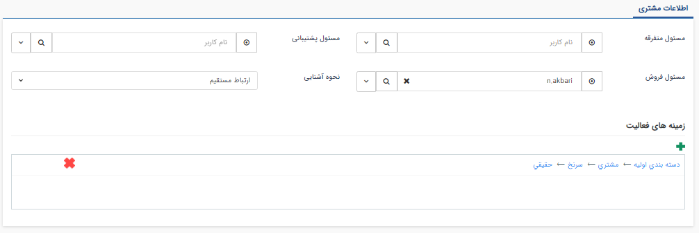
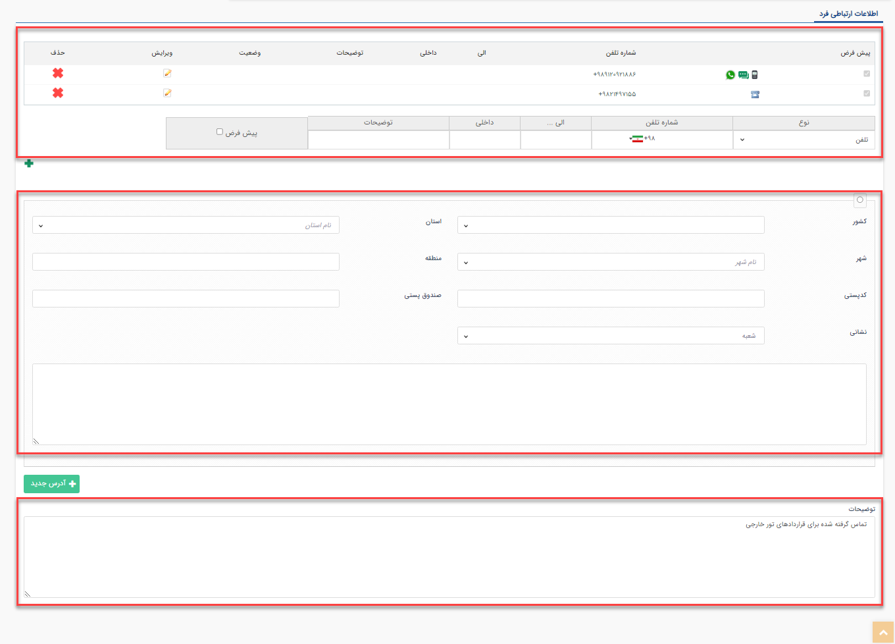

#  ایجاد سرنخ حقیقی جدید 

سرنخ‌ها اطلاعاتی هستند که شما برای بازاریابی و فروش خود جمع‌آوری کرده‌اید. روش‌های مختلفی مثل خرید بانک اطلاعاتی موبایل بر اساس مشاغل، مناطق، استان، جستجو از سایت‌ها، نظرسنجی‌ها و سایر منابع اطلاعاتی وجود دارند که می‌توانید این اطلاعات را بدست آورید. 
این سرنخ‌ها همیشه اطلاعات دقیق و شفافی ندارند و باید روند پایش و پرورش سرنخ انجام شود و بعد از تعیین کفایت سرنخ، روند فروش و مذاکرات صورت گیرد. 
بنابراین مسئولیت اصلی تیم فروش در مقابل سرنخ‌ها، تعیین کفایت و صحت اطلاعات سرنخ است. بعد از آن با مذاکرات و پیگیری‌های فروش سرنخ‌های بالقوه به سرنخ بالفعل تبدیل می‌شود . 
 

## برای ایجاد سرنخ حقیقی جدید طبق مراحل زیر عمل کنید:

1. در صفحه بانک اطلاعاتی، وارد **آخرین لایه دسته‌بندی** مورد نظر خود شوید.

2. گزینه **شخص جدید** را انتخاب کنید.

3. در این مرحله انواع هویت‌هایی که مجوز **ذخیره اولیه** آن را دارید به شما نمایش داده می‌شود. بر روی **سرنخ حقیقی** کلیک کنید.

پس از انتخاب زیرنوع مورد نظر، صفحه‌ای مطابق صفحه زیر باز شده و می‌توانید اطلاعات سرنخ مورد نظر را وارد کنید. 

## اطلاعات هویت در چهار بخش قرار میگیرند:

### مشخصات اولیه
اطلاعاتی که در این قسمت وارد می‌کنید به شناخت اولیه سرنخ کمک می‌کند. پس سعی کنید تاجایی که می‌توانید اطلاعات بیشتری وارد کنید. 

**موضوع**: موضوع فروش یا ارتباطی که با سرنخ خود میخواهید برقرار کنید را وارد کنید. 
به عنوان مثال: در یک آژانس مسافربری، فردی برای شرایط تور خارجی تماسی برقرار کرده است. کارشناس فروش تور خارجی باید این سرنخ را با موضوع **قرارداد تور خارجی** ثبت کند.

**شرکت:** نام شرکتی که این سرنخ به آن تعلق دارد را در این قسمت وارد کنید.

**نام:** نام فرد را در این قسمت وارد کنید.

**نام خانوادگی:** نام خانوادگی سرنخ حقیقی را وارد کنید. اگر نام خانوادگی سرنخ خود را ندارد، نام فرد را در این قسمت مجددا وارد کنید ولی حتما بعد از پیگیری سرنخ، اطلاعات صحیح آن را ثبت کنید.

**جنسیت:** جنسیت سرنخ را وارد کنید. این فیلد در گزارشاتی که بر اساس جنسیت نیاز دارید به شما کمک می‌کند. 
به طور مثال: به مناسبت روز زن، به گروهی از خانم‌هایی که در بانک اطلاعاتی خود دارید پیامک ارسال کنید.

**پیشوند:** اگر پیشوند مناسبی برای سرنخ خود انتخاب کنید، در ارتباطات آینده تأثیرگذار خواهد بود.

**ایمیل:** در اطلاعات سرنخ می‌توانید دو ایمیل وارد کنید. 

>**نکته** 
>درنظر داشته باشید که ایمیل اول، به عنوان **ایمیل پیش‌فرض** در نظر گرفته می‌شود.

**تاریخ تولد:** تاریخ تولد سرنخ حقیقی خود را در این قسمت وارد کنید. به کمک این فیلد می‌توانید **پیام تبریک تولد** برای افراد ارسال کنید.

**رنگ:** رنگی که برای اطلاعات هویت‌های خود انتخاب می‌کنید، مانند کدی عمل می‌کند که با یک نگاه بدانید این سرنخ در چه **موقعیتی** قرار دارد.  
به‌طور مثال: اگر سرنخی رنگ قرمز داشته باشد، یعنی سرنخ رد شده است.  
این فیلد بیشتر برای مدیریت اطلاعات مشتریان و مخاطبان کاربر دارد.

**شروع ارتباط با مشتری:** در این قسمت نام کمپینی را وارد کنید که از طریق آن این سرنخ بدست آمده است.

**وب سایت:** آدرس سایتی که به این سرنخ تعلق دارد را در این قسمت وارد کنید.

>**نکته** 
> فیلدهای **موضوع**، **شرکت** و **نام خانوادگی** هنگام ذخیره سرنخ حقیقی، الزامی هستند.

### اطلاعات مدیریت سرنخ

اطلاعاتی که در این قسمت وارد می‌کنید برای مدیریت بهتر سرنخ در تیم فروش سازمان شما 
است. 

**مسئولین پروفایل:** فیلدهای **مسئول پشتیبانی**، **مسئول فروش** و **مسئول متفرقه** تعیین می‌کند کدام یک از کاربران/پرسنل مجموعه شما مسئول پیگیری و پاسخگویی به این سرنخ می‌باشد.

**نحوه آشنایی:** از هر طریقی که **اولین ارتباط** با این سرنخ شکل گرفته است، نحوه آشنایی را تعیین می‌کند. به کمک این فیلد می‌توانید مؤثرترین منابع جذب سرنخ و مشتری سازمان خود را شناسایی کنید.

**زمینه‌های فعالیت:** در این قسمت نام **دسته‌بندی بانک اطلاعاتی‌ای** را وارد کنید که سرنخ را در آن ذخیره کرده‌اید. 

>**نکته** 
> دقت داشته باشید که امکان ذخیره سرنخ در چند دسته‌بندی به صورت همزمان وجود دارد ولی **هرگز این کار را انجام ندهید** زیرا سازماندهی و مدیریت اطلاعات سرنخ ها برایتان دشوار خواهد بود.

### مشخصات اضافه سرنخ

از طریق شخصی‌سازی اطلاعات هویت‌ها، می‌توانید فیلدهای اضافه در صفحه مشخصات سرنخ ایجاد کنید که اطلاعات بیشتری را در مورد سرنخ‌های خود جمع‌آوری کنید. 
در این مثال برای ثبت اطلاعات نوع رفتار و آشنایی قبلی، فیلدهای مربوطه ایجاد شده و اطلاعات موردنظر ثبت می‌شود.

[فیلدهای اضافه برای مشخصات سرنخ](Additional-Information.png)

### اطلاعات ارتباطی هویت

در قسمت اطلاعات ارتباطی، تلفن، موبایل، فکس و آدرس کامل سرنخ را می‌توانید ذخیره ‌کنید. برای هرکدام از این موارد می‌توانید چندین اطلاعات وارد کنید.  
به طور مثال اگر سرنخ چند شماره مبایل داشته باشد، شماره موبایلی که به عنوان شماره اصلی سرنخ است را پیش‌فرض در نظر گرفته و سایر شماره موبایل‌ها را در ادامه وارد کنید.
 
>**نکته** 
> هرکدام از اطلاعات تلفن، موبایل، فکس و آدرس امکان تعیین **پیش‌فرض** را دارند.

برای ثبت شماره جدید طبق مراحل زیر عمل کنید:
1. نوع شماره‌ای که می‌خواهید ثبت کنید را در ستون **نوع** تعیین کنید.
2. در ادامه اعداد ثبت شده در ستون شماره تلفنی، شماره را به همراه کد وارد کنید.
به طور مثال: 98912444444

>**نکته**
> کد ثبت شده در ستون شماره تلفن، بر اساس تنظیمات پیش‌فرض کد کشور در تنظیمات کلی، درج شده است. اگر کشور مربوط به سرنخ، با کشور شما تفاوت دارد، کد کشور آن را وارد کرده و در ادامه شماره همراه با کد استان یا موبایل را ثبت کنید.

3. توضیحات و اطلاعات اضافه مربوط به شماره را وارد کنید.

4. دکمه **+ سبز رنگ** را کلیک کنید. باید شماره جدید به لیست شماره‌های بالای جدول اضافه شود.

> **نکته** 
> اولویت نمایش اطلاعات ارتباطی (تلفن، فکس، ایمیل، موبایل، آدرس) هویت حقوقی در لیست و قالب چاپ، به صورت زیر می‌باشد: 
> 1- آدرس پیش‌فرض ثبت شده در مشخصات رابط 
> 2- آدرس غیرپیش‌فرض ثبت شده در مشخصات رابط 
> 3- آدرس پیش‌فرض ثبت شده در مشخصات هویت حقوقی 
> 4- آدرس غیرپیش‌فرض ثبت شده در مشخصات هویت حقوقی 
> 5- آدرس پیش‌فرض ثبت شده در مشخصات مدیر 
> 6- آدرس غیرپیش‌فرض ثبت شده در مشخصات مدیر 

