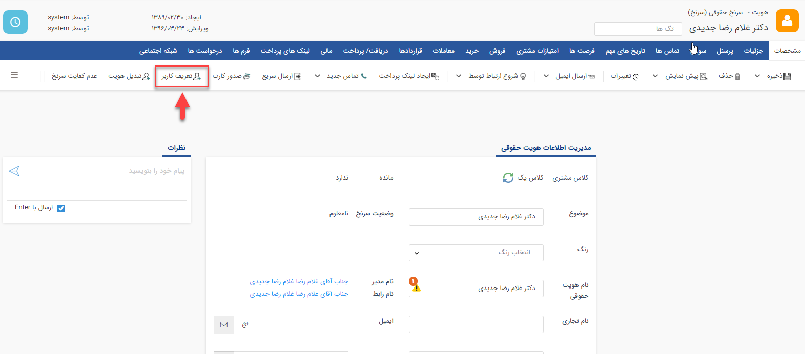

##   ایجاد کاربر باشگاه از هویت بانک اطلاعاتی

>    مسیر دسترسی:  **بانک اطلاعاتی** >**انتخاب هویت** > **نوار مشخصات هویت**> تعریف کاربر

در این روش می توانید به هر کدام از مشتریان خود نام کاربری و رمز عبور اختصاص دهید. مشتریان شما می توانند با این نام کاربری وارد داشبورد خود در قسمت باشگاه مشتریان نرم افزار شوند و لیست سوابق خود را مشاهده نمایند. به طور مثال فاکتورها، پرداخت ها و دیگر سوابق مربوط به خودشان را مشاهده کنند.

نکته : پس از ذخیره نام کاربری و رمز عبور برای مشتری، می توانید در دفعات بعدی با کلیک بر روی این بخش اطلاعات نام کاربری و رمز عبور ایجاد شده را از طریق ایمیل برای آن هویت ارسال نمایید.

نکته: در صورتی می توانید از ایجاد کاربر باشگاه استفاده کنید که ماژول باشگاه مشتریان را تهیه کرده باشید.

نکته : لازم به ذکر است مشتریانی که از این طریق برایشان نام کاربری و رمز عبور ایجاد کرده اید به صورت پیش فرض فعال هستند. لذا پیام فعالسازی برای آنها ارسال نمی گردد.در نظر داشته باشید، به منظور ایجاد نام کاربری از طریق ثبت نام در باشگاه مشتریان،این پیام جهت فعالسازی، برای مشتریان ارسال می شود.

برای توضیحات مربوط به پیام فعال سازی می توانید به قسمت [مدیریت پیام های سیستم](https://github.com/1stco/PayamGostarDocs/blob/master/help2.5.4/Basic-Information/Manage-system-messages/Manage-system-messages.md)
 مراجعه کنید.
