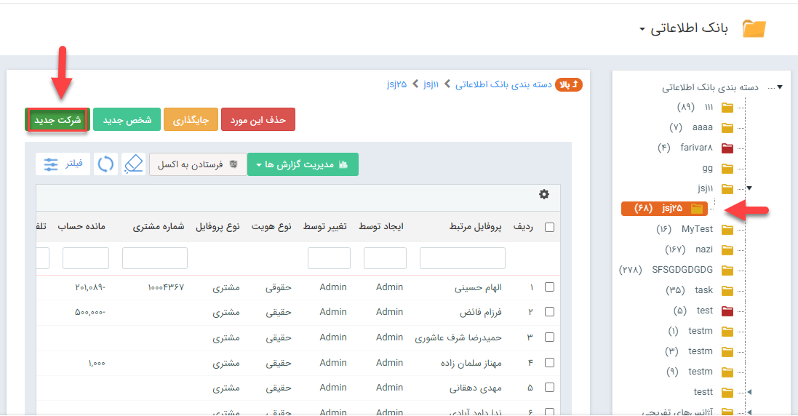
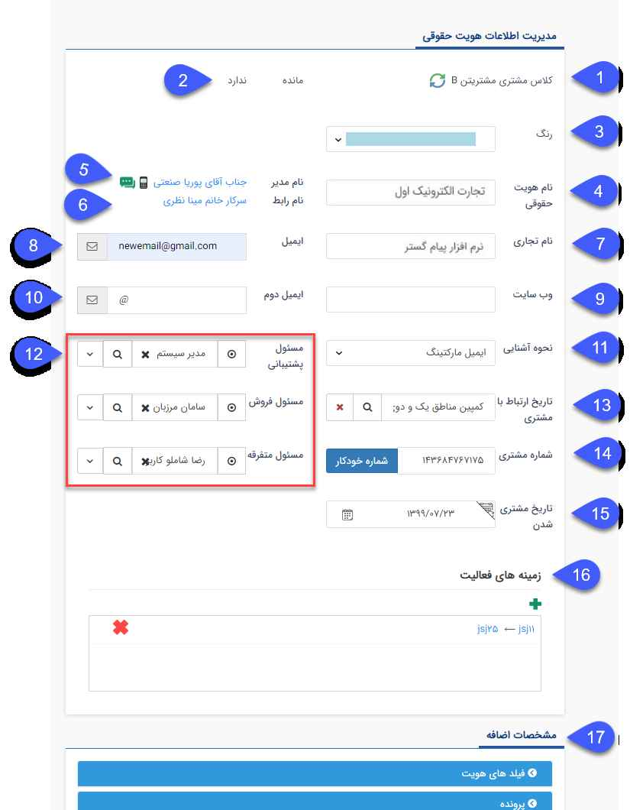
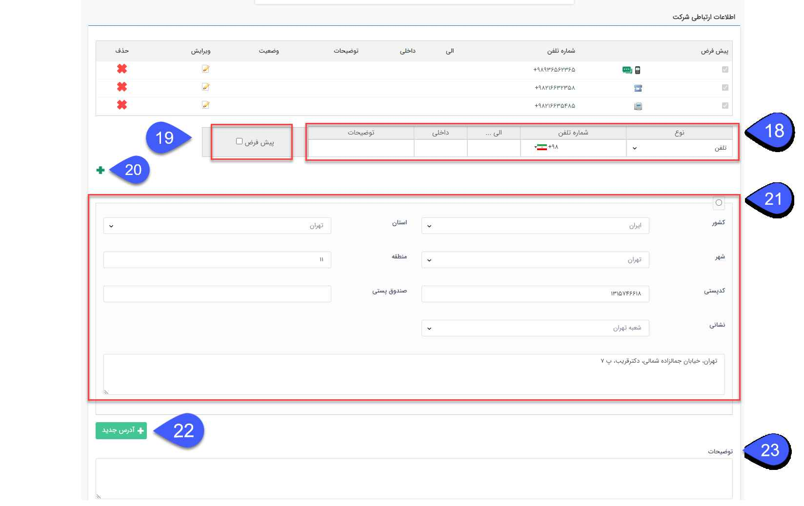
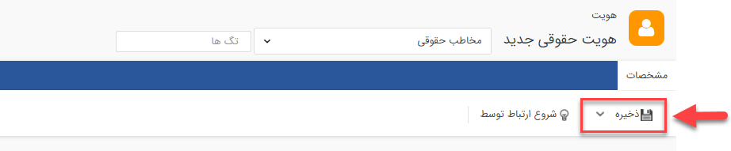

## ورود اطلاعات هویت حقوقی از طریق بانک اطلاعاتی

**مسیر دسترسی: بانک یکپارچه>بانک اطلاعاتی> شرکت جدید**

مطابق عکس زیر برای ورود اطلاعات هویت ها از طریق بانک اطلاعاتی وارد آخرین لایه دسته‌بندی‌ بانک اطلاعاتی شده و گزینه شرکت جدید را برای وارد کردن هویت حقوقی انتخاب کنید.

پس از انتخاب شرکت، صفحه زیر باز شده و می‌توانید در این صفحه زیرنوع هویت مورد نظرتان را انتخاب کنید.ساخت و ویرایش زیرنوع هویت‌ها را می‌توانید ازطریق [شخصی سازی]( https://github.com/1stco/PayamGostarDocs/blob/master/help2.5.4/Settings/Personalization-crm/Overview/General-information/General-information.md) هویت انجام دهید. 

  
پس از انتخاب زیرنوع مورد نظر، صفحه‌ای مطابق صفحه زیر باز شده و می‌توانید اطلاعات هویت حقوقی مورد نظر را وارد کنید.
 

 
1.کلاس مشتری: کلاس مشتری را بر حسب خرید (میزان فاکتورها فروش، قراردادهای مالی) تعیین می کند. برای اطلاعات بیشتر می توانید به [ مدیریت کلاس بندی مشتریان](https://github.com/1stco/PayamGostarDocs/blob/master/help2.5.4/Settings/Customer-classification-management/Customer-classification-management.md) رجوع کنید.

> نکته: قرار گیری مخاطبان در کلاس های مختلف به صورت خودکار و بر اساس تنظیمات مشخص شده توسط شما در مدیریت کلاس بندی مشتریان انجام می شود و امکان تغییر آن به صورت دستی وجود ندارد.

2.مانده: میزان مانده حساب مخاطبان در این قسمت نمایش داده می شود، مخاطبان در صورت ثبت سوابق فاکتور فروش/خرید، فاکتور برگشت از فروش/خرید، دریافت/پرداخت و قراردادهای مالی بدهکار یا بستانکار خواهند شد.

3.انتخاب رنگ : میتوانید یک ویژگی کیفی از پیش تعیین شده در مجموعه ی خود (برای مثال میزان اهمیت مخاطب) برای هویت های خود در نظر بگیرید و به ان رنگ اختصاص دهید. (بطور مثال برای مشتریان VIP رنگ طلایی در نظر بگیرید یا رنگ قرمز را به مشتریان ناراضی اختصاص دهید)، علاوه بر مشخصات هویت این رنگ به عنوان زمینه تماس های دریافتی در پنجره های تماس تلفنی (CallerID) نمایان می شود.

> نکته: لازم به ذکر است رنگ انتخاب شده برای هویت مورد نظر، علاوه بر اینکه در پنجره تماس نمایان می شود در تمامی فیلدهایی از نوع شرکت/شخص در نرم افزار نیز پس از انتخاب هویت نمود پیدا می کند.

> نکته: برای تغییر رنگ ها و افزودن رنگ جدید می توانید به [مدیریت رنگ ها](https://github.com/1stco/PayamGostarDocs/blob/master/help2.5.4/Basic-Information/Color-management/Color-management.md) مراجعه کنید.

4.نام هویت حقوقی: نام شرکت را وارد نمایید.

5.نام مدیر: در[  تب پرسنل

](https://github.com/1stco/PayamGostarDocs/blob/master/help2.5.4/Integrated-bank/Database/Personnel-Companies/Persenelmd.md)هویت ها، شخصی را که به عنوان مدیر تعیین کرده اید در این قسمت نمایان می شود.

6.نام رابط: در[  تب پرسنل ](https://github.com/1stco/PayamGostarDocs/blob/master/help2.5.4/Integrated-bank/Database/Personnel-Companies/Persenelmd.md)هویت ها، شخصی را که به عنوان رابط تعیین کرده اید در این قسمت نمایان می شود.

7.نام تجاری: در این قسمت نام برند تجاری، وارد خواهد شد

8.ایمیل: ایمیلی برای شرکت وارد نمایید.

9.وب‌سایت: وب¬سایت شرکت را وارد کنید.

10.ایمیل دوم: در صورت نیاز می توانید ایمیل دیگری را برای این شرکت تعریف نمایید

11.نحوه آشنایی: می توانید نحوه جذب هویت به مجموعه خود را تعیین کنید تا در گزارشات و جستجو های نرم افزار از آن استفاده کنید. با تکمیل فیلد نحوه آشنایی می توانید گزارش دقیق تری از برجسته ترین روش های بازاریابی خود در قسمت گزارشات تحلیلی نرم افزار داشته باشید.

برای ویرایش گزینه های نحوه اشنایی و تمام فیلدهای از نوع لیست می توانید به[ مدیریت آیتم های سیستم](https://github.com/1stco/PayamGostarDocs/blob/master/help2.5.4/Basic-Information/Management-of-system-items/Management-of-system-items.md) مراجعه کنید.

12.مسئول فروش، پشتیبانی و متفرقه: می توانید هر یک از کاربران سیستم را به عنوان یکی از این مسئولان مرتبط با این هویت تعیین کنید و از این مسئولان در گزارشات مختلف استفاده کرده و حتی بر اساس آنها محدودیت مشاهده مخاطبان اعمال کنید و یا در چرخه های کاری کارتابل ها را به آن ها اختصاص دهید.

> نکته: محدودیت مشاهده مخاطبان به کاربران مرتبط را می توانید از منوی [امنیتی](https://github.com/1stco/PayamGostarDocs/blob/master/help2.5.4/Settings/General-settings/security/security.md)
در تنظیمات کلی اعمال کنید

>  نکته: مجوزهای مورد نیاز جهت ویرایش مسئول فروش، پشتیبانی و متفرقه‌ی هویت به شرح ذیل می باشد

>  1)کاربر با مجوز مدیر پشتیبانی می‌تواند مسئول پشتیبانی،  با مجوز مدیر فروش می‌تواند مسئول فروش و با مجوز مدیر بانک اطلاعاتی و مدیر سیستم می‌تواند هر سه مسئول را ویرایش کند.

>  2)درصورت فعال بودن چک باکس " اجازه تخصیص کارشناس پروفایل به کاربران دیگر " در تنظیمات کلی، بخش امنیتی، هر کاربر که به عنوان مسئول هویت تعیین شده باشد می‌تواند برای خود جانشین تعیین کند.

>  3)کاربری که اولین بار این فیلدها را مقدار دهی کرده باشد می‌تواند این سه مسئول را ویرایش کند

13.تاریخ ارتباط با مشتری: از این قسمت می توانید هویت را به یکی از کمپین های تبلیغاتی خود مرتبط کنید. برای اطلاعات بیشتر به قسمت "شروع ارتباط توسط" در  نوار ابزار مشخصاتمراجعه کنید.

14.شماره مشتری: در صورتی که این هویت یکی از مشتریان شماست می توانید در این قسمت یک شماره مشتری به او اختصاص دهید، این شماره برای هر هویت منحصر بفرد است و نرم افزار از ثبت شماره تکراری جلوگیری خواهد کرد. شماره مشتری در واقع شناسه این مشتری در سازمان شماست.

 تخصیص شماره مشتری می تواند به صورت دستی یا با استفاده از دکمه شماره خودکار انجام شود، علاوه بر این امکان تخصیص شماره مشتری به صورت خودکار و توسط سیستم پس از تایید آیتم های پیش فاکتور، فاکتور، قرارداد و دریافت/پرداخت نیز وجود دارد.
 
 > نکته: شماره گذاری خودکار بر اساس بزرگترین شماره مشتری تخصیص داده شده، عمل می کند.

> نکته: در صورت ثبت دستی شماره مشتری از ثبت شماره های غیر معتبر خودداری کنید.

15.تاریخ مشتری شدن: همزمان با ثبت شماره مشتری برای یک مخاطب این تاریخ ثبت میشود اما شما می توانید تاریخی که در آن این مخاطب تبدیل به مشتری شما شده را تعیین کنید.

16.زمینه‌های فعالیت: دسته بندی زمینه فعالیتی که این هویت در آن قرار گرفته است را نشان می‌دهد.

> نکته: یک هویت می تواند همزمان در چند دسته بندی باشد.

17.مشخصات اضافه: در قسمت مشخصات اضافه، پارامترهایی که شما با توجه به نیاز کسب و کار خود در ارتباط با مشتریان در قسمت شخصی سازی نرم افزار، از بخش [افزودن مشخصه ](https://github.com/1stco/PayamGostarDocs/blob/master/help2.5.4/Settings/Personalization-crm/Overview/General-information/Add-features/Add-features.md)اضافه کرده اید، نمایش داده خواهند شد.

18.از این قسمت می توانید راه های ارتباطی با هویت ( اطلاعات تلفن، تلفن همراه، فکس و تلفکس ) را اضافه کنید.

19.پیش فرض: می توانید یک شماره را برای هر نوع از راه های ارتباطی(تلفن، موبایل و فکس) به عنوان پیشفرض تعیین کنید. در صورتی که بخواهید برای این هویت یک پیام کوتاه یا فکس از طریق نرم افزار ارسال کنید، این پیام به شماره پیشفرض تعیین شده در این قسمت ارسال خواهد شد. همچنین در صورت قرار دادن پارامتر هوشمند تلفن، موبابل یا فکس در هریک از قالب های چاپی آیتم ها، مقدار مرتبط با شماره پیشفرض درج خواهد شد.

> نکته: در هنگام افزودن شماره تماس ها امکان انتخاب پیش شماره کشور وجود دارد.(در صورتی که در تنظیمات کلی،  بخش تماس ها پیش شماره کشور وارد شده باشد در این قسمت بصورت پیش فرض آن پیش شماره نمایش داده خواهد شد.

20.استفاده از این گزینه می توانید اطلاعاتی که در قسمت ۱ وارد کرده اید را به اطلاعات ارتباطی هویت اضافه کنید و یک ردیف اطلاعاتی ارتباطی جدید بازکنید.

21.آدرس: می توانید  با تکمیل پارامتر های آدرس، اقدام به ثبت آدرس مورد نظر خود کنید.

> نکته: میتوان برای ویرایش لیست کشور، استان و یا شهر به[ مدیریت شهر ها ](https://github.com/1stco/PayamGostarDocs/blob/master/help2.5.4/Basic-Information/Management-of-countries-provinces-and-cities/Management-of-countries-provinces-and-cities.md)مراجعه کنید.

22. آدرس جدید: با استفاده از این گزینه می توانید یک آدرس دیگر  (برای مثال آدرس دفتر مرکزی و یا انبار) برای این هویت ایجاد کنید.

23. توضیحات: می توانید توضیحاتی که در خصوص این هویت مورد نیاز است را در این قسمت وارد کنید. (مانند حوزه فعالیت و یا خدماتی که این مخاطب ارائه می دهد.

مطابق تصویر زیر پس از اتمام وارد کردن اطلاعات هویت حقوقی، از طریق نوار ابزار بالای صفحه با زدن دکمه ذخیره، ذخیره اطلاعات را انجام دهید.

 
