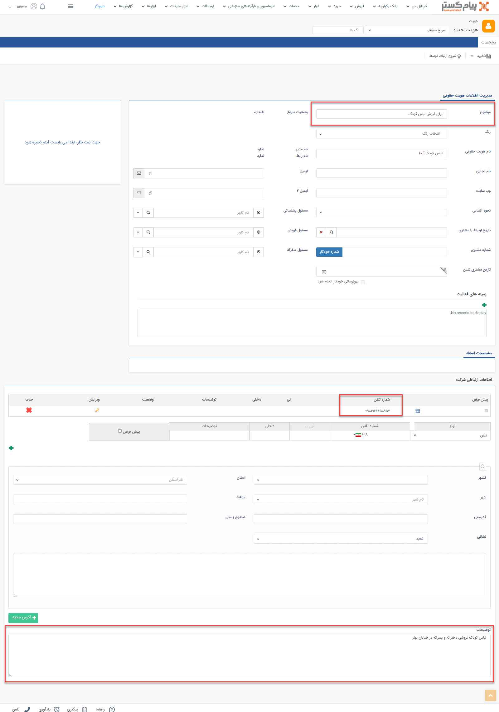

## ایجاد سرنخ

مطابق عکس زیر برای ورود اطلاعات هویت ها از طریق بانک اطلاعاتی وارد آخرین لایه دسته‌بندی‌ بانک اطلاعاتی شده و گزینه شرکت جدید را برای وارد کرد سرنخ حقوقی و گزینه شخص جدید را برای وارد کردن سرنخ حقیقی انتخاب کنید.

پس از انتخاب شرکت، صفحه زیر باز شده و می‌توانید در این صفحه زیرنوع هویت مورد نظرتان را انتخاب کنید.ساخت و ویرایش زیرنوع هویت‌ها را می‌توانید ازطریق [شخصی سازی]( https://github.com/1stco/PayamGostarDocs/blob/master/help2.5.4/Settings/Personalization-crm/Overview/General-information/General-information.md) انجام دهید.

پس از انتخاب زیرنوع مورد نظر، صفحه‌ای مطابق صفحه زیر باز شده و می‌توانید اطلاعات سرنخ مورد نظر را وارد کنید.

لازم بذکر است با توجه به مفهوم و در دست نداشتن اطلاعات لازم و کافی در مورد سرنخ، اطلاعات اولیه درباره سرنخ می‌تواند تنها شامل یک راه ارتباطی مثل تلفن یا ایمیل باشد و در قسمت موضوع؛ زمینه همکاری با سرنخ یا موضوعی مرتبط را می‌توان مشخص کرد. بعنوان مثال در این تصویر مربوط به سرنخی است که که تنها موضوع، تلفن و توضیحا تکمیلی ثبت شده است.

پس از اتمام تکمیل اطلاعات، بر روی ذخیره کلیک کنید.

