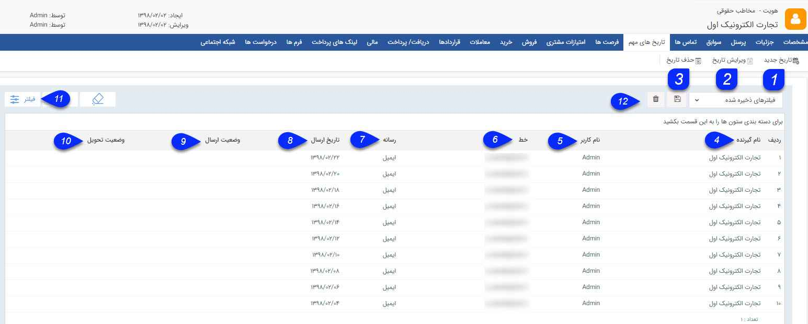

## تاریخ های مهم

> مسیر دسترسی:  **هویت** >**تب تاریخ‌های مهم** 

در صفحه لیست تاریخ تمام برنامه های ارسال پیام که برای این پروفایل از این قسمت تنظیم شده است نمایش داده می شود. همچنین می توانید یک تاریخ جدید برای ارسال پیام تنظیم کنید و یا برنامه های تنظیم شده در هریک از تاریخ ها را ویرایش یا حذف کنید.

1. تاریخ جدید: با استفاده از این گزینه می توانید برنامه ای برای ارسال یک یا چند پیام (پیامک، ایمیل، فکس و یا چاپ) برای مخاطب تنظیم کنید. ( برای اطلاع در خصوص نحوه تنظیم به[ اطلاعات مشترک ابزارها ](https://github.com/1stco/PayamGostarDocs/blob/master/help%202.5.4/Marketing/moshtarak-abzar/moshtarak-abzar.md)در قسمت[ تبلیغات](https://github.com/1stco/PayamGostarDocs/blob/master/help%202.5.4/Marketing/Marketing.md) مراجعه کنید.)

2. ویرایش تاریخ:  با استفاده از این گزینه می توانید یک برنامه ارسال پیام را ویرایش کنید.

3. حذف: با استفاده از این گزینه می توانید یک برنامه را حذف کنید.

4. نام گیرنده: نام گیرنده پیام را نشان می دهد.

5. نام کاربر: کاربر ایجاد کننده تاریخ مهم را نمایش می دهد .

6. خط: درگاه و شماره خطی که پیام از طریق آن ارسال شده است را نمایش می دهد .

7. رسانه: نوع رسانه (پیامک، ایمیل، فکس و ...) را نشان می دهد .

8. تاریخ ارسال: تاریخی که ارسال در آن صورت می گیرد را نشان میدهد .

9. وضعیت ارسال: وضعیت ارسال (در صف، ارسال شده به مرکز و ...) را نمایش می دهد .

10. وضعیت تحویل: وضعیت تحویل پیام را نشان می دهد .

11. فیلترهای پیشرفته: : می توانید برای پیدا کردن برنامه مورد نظر خود از[ فیلترهای پیشرفته ](https://github.com/1stco/PayamGostarDocs/blob/master/help%202.5.4/Customer-relationship-management/Advanced-filter/Advanced-filter.md)استفاده کنید.

12. نوع فیلتر: می توانید فیلترهای انتخاب شده را با یک نام مشخص ذخیره کرد تا بتوان به سرعت از آن استفاده کرد.