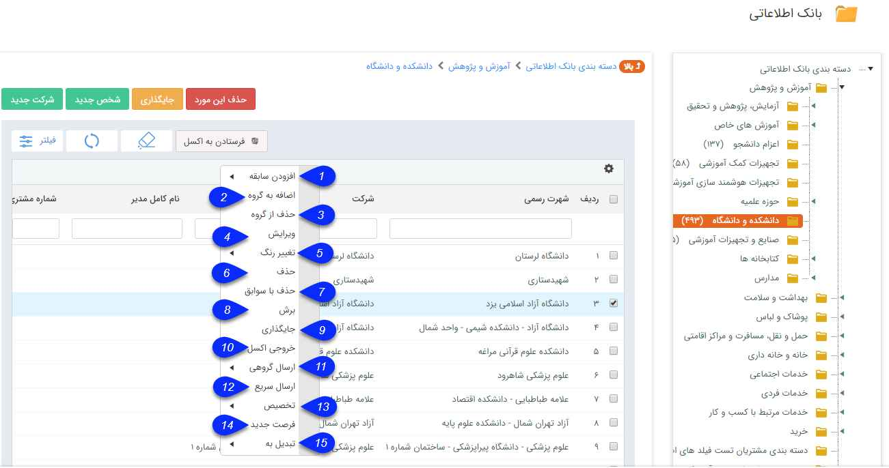

## کلیک راست بر روی هویت‌ها

> مسیر دسترسی:  **لیست هویت‌ها**  > **کلیک راست بر روی هویت‌ها/هویت‌ها** 

کلیک راست بر روی هویت ها، همانطور که در تصویر مشاهده می نمایید امکاناتی برای شما فراهم می نماید.

1. افزودن سابقه: برای هویت یا هویت های انتخاب شده می توانید سابقه جدیدی ( از انواع فاکتور جدید، قرارداد و .. ) را ایجاد کنید.

2. اضافه به گروه هدف:  هویت های انتخاب شده را می توانید به یک گروه هدف (مانند دعوت به نمایشگاه) اضافه کنید.

3.  حذف از گروه هدف:  هویت های انتخاب شده را می توانید از یک گروه هدف (مانند دعوت به نمایشگاه) حذف کنید.

4. ویرایش: هویت انتخاب شده را می توانید ویرایش کنید.

5. تغییر رنگ: با استفاده از این منو می توانید برای هویت های انتخاب شده رنگ از لیست رنگ های موجود تعیین کنید.

نکته: برای اضافه یا حذف کردن رنگ ها به قسمت مدیریت رنگ ها مراجعه کنید.

6. حذف: هویت(های) مورد نظر را حذف می کند.

7. حذف با سوابق: میتوانید با استفاده از این گزینه هویت یا هویت های انتخاب شده را به همراه سوابق ثبت شده برای آن/آنها حذف نمایید.

نکته : اگر یک هویت در فیلد یا فیلد هایی از نوع شخص/ شرکت استفاده شده باشد، امکان حذف با سوابق، برای آن هویت وجود ندارد.

8. برش: می توانید هویت یا هویت های انتخاب شده را برش زده (Cut) و در دسته بندی دیگری جایگذاری (Paste) کنید.

9. جایگذاری: هویت های برش زده شده را در این دسته بندی جایگذاری می کند.

10. خروجی اکسل: از اطلاعات هویت های انتخاب شده می توانید خروجی اکسل تهیه کنید.

11. ارسال گروهی: می توانید برای هویت های انتخاب شده، پیام گروهی (پیامک، ایمیل، فکس یا چاپ) تنظیم کنید.

12. ارسال سریع: می توانید یک پیام از طریق رسانه های مختلف، در لحظه برای مخاطبان انتخاب شده ارسال کنید.

13. تخصیص: میتوانید به هویت های انتخاب شده، مسئول ( کارشناس فروش، پشتیبانی و یا متفرقه ) تخصیص دهید.

14. فرصت جدید: برای هویت یا هویت های انتخاب شده می توانید یک فرصت فروش جدید ایجاد نمایید.

15. تبدیل به : در این بخش دو قابلیت تبدیل نوع هویت و تبدیل سرنخ به مخاطب وجود دارد. 
1.  تبدیل هویت : در این تبدیل در صورتیکه نوع پروفایل و نوع عملکرد هویت ها یکسان باشند، امکان تغییر نوع هویت وجود دارد. یعنی شما می توانید هویت های حقیقی را به حقوقی و سایر زیر نوع های هویت حقیقی تبدیل کنید یا هویت های حقوقی را به حقیقی و سایر زیر نوع های هویت حقوقی تبدیل کنید.
2. تبدیل سرنخ به مخاطب : برای این تبدیل، می بایست هویت های انتخاب شده تماماً از نوع سرنخ باشند. در نظر داشته باشید، سرنخ های حقیقی می توانند به مخاطبان حقیقی و حقوقی تبدیل شوند و سرنخ های حقوقی می توانند به مخاطبان حقوقی و حقیقی تبدیل گردند.

