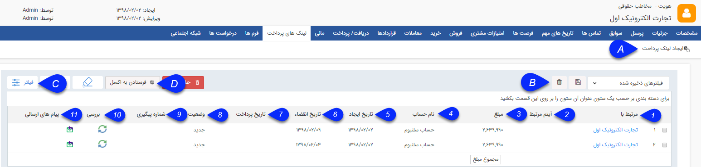

## لینک های پرداخت

> مسیر دسترسی:  **صفحه‌ی هویت** >**لینک‌های پرداخت** 

در این صفحه قادر خواهید بود لینک های پرداخت جدیدی برای مخاطب ایجاد و ذخیره نمائید. همچنین می توانید لیست لینک های پرداخت از قبل ایجاد شده را مشاهده کنید.

A. ایجاد لینک پرداخت: با فشردن دکمه[ ایجاد لینک پرداخت](https://github.com/1stco/PayamGostarDocs/blob/master/help%202.5.4/Integrated-bank/Database/Payment-links/Create-payment-link/Create-payment-link.md) می توانید لینک پرداختی برای مخاطب ایجاد کنید تا مخاطب بتواند با استفاده از لینک مذبور عملیات پرداخت را به آسانی انجام دهد . 

B. فیلتر:  میتوانید فیلتر های پر کاربرد خود را با انتخاب یک نام ذخیره کنید  تا بتوانید در دفعات بعدی با انتخاب آن فیلتر، سریعتر جستجو کنید.

امکان حذف این فیلتر های ذخیره شده از همین بخش نیز وجود دارد.

C. فیلترهای پیشرفته: برای جس تجوی مورد بخصوص می توانید از فیلتر های بیشتر موجود در این قسمت استفاده کنید .

D. فرستادن به اکسل : با استفاده از این دکمه می توانید از این لیست به صورت یک فایل اکسل، خروجی بگیرید.

1. مرتبط با : نام مخاطبی که لینک پرداخت برای او ایجاد شده است را نمایش می دهد. 

2. آیتم مرتبط:   نام هرسابقه مرتبط با این هویت که از طریق آن  اقدام به ایجاد لینک پرداخت شده باشد در این قسمت نمایش داده می شود  .

نکته: با کلیک بر روی این قسمت می توان به صفحه آیتم مرتبط وارد شد.

3. مبلغ:  مقدار مبلغ پرداختی مرتبط با لینک پرداخت را نمایش می دهد.

4. نام حساب:   نام حسابی که لینک پرداخت بر روی آن تنظیم شده است و مبلغ پرداختی توسط مشتری به آن واریز می شود را نمایش می دهد.

5. تاریخ ایجاد: تاریخی که لینک پرداخت در آن ایجاد شده است.

6. تاریخ انقضاء:  تاریخی که مخاطب فرصت انجام عملیات پرداخت از طریق لینک پرداخت مذبور خواهد داشت. این تاریخ در هنگام ایجاد لینک پرداخت توسط شما تعیین می شود.

7. تاریخ پرداخت:  تاریخ پرداخت مبلغ از طریق لینک پرداخت را نمایش می دهد.

8. وضعیت: وضعیت لینک های پرداخت می تواند یکی از سه حالت زیر باشد:

 -  جدید:زمانی که لینک پرداخت جدیدی را ایجاد می کنید وضعیت در لیست لینک های پرداخت پروفایل "جدید" خواهد بود.

 -  مشاهده شده: در صورتی که پیام ارسالی مرتبط با این لینک توسط مخاطب مشاهده شده باشد.

 -  پرداخت شده: در صورتی که پرداخت از طریق لینک توسط مخاطب انجام شده باشد.

9. شماره پیگیری:  با پرداخت مبلغ تعیین شده از طریق لینک پرداخت و انجام تراکنش مالی ، شماره پیگیری حاصل از این پرداخت در این قسمت ثبت خواهد شد.

10. بررسی: برای بروزرسانی آخرین تغییرات در وضعیت پرداخت از طریق لینک های پرداخت از دکمه موجود در این قسمت استفاده می شود.

11. پیام های ارسالی:  برای مشاهده ی جزئیات [پیام های ارسالی](https://github.com/1stco/PayamGostarDocs/blob/master/help%202.5.4/Integrated-bank/Database/Payment-links/List-messages-sent/List-messages-sent.md) لینک های پرداخت، از این دکمه استفاده می شود.