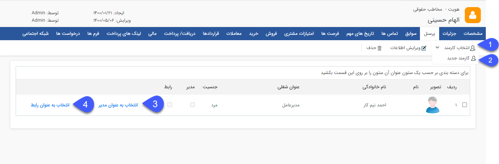
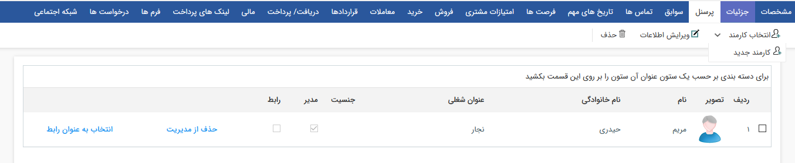

##  پرسنل

> مسیر دسترسی:  **بانک یکپارچه** >**بانک اطلاعاتی** > **صفحه‌ی اصلی هویت حقوقی** > **صفحه‌ی پرسنل** 

تب پرسنل: در بخش پرسنل امکان اضافه نمودن، حذف و ویرایش اطلاعات پرسنلی هر کدام از شرکت ها (هویتهای حقوقی) وجود دارد.
قابلیت ارتباط دادن هویت های حقیقی و حقوقی به یکدیگر از طریق این صفحه وجود دارد. این تب برای هویت های حقوقی با نام پرسنل و برای هویت های حقیقی با نام شرکت ها مشاهده می شود و در صورتی که در هر کدام از انواع هویت ارتباطی تعریف گردد، در هویت متناظر نیز به صورت خودکار نمایش داده می شود ( به طور مثال اگر برای یکی از شرکت ها، پرسنل تعریف کنید در پروفایل پرسنل تعریف شده نیز در تب شرکت ها، این ارتباط را مشاهده خواهید نمود)

1. انتخاب کارمند : می توانید یک هویت حقیقی که قبلا در بانک اطلاعاتی ذخیره شده است را در این قسمت برای اضافه شدن به پرسنل این شرکت انتخاب کنید. نام هویت مورد نظر را وارد کرده و سپس رده شغلی این شخص را در سازمان مشخص کنید، در صورت تمایل می توانید فیلدهای شعبه، دپارتمان و توضیحات را نیز تکمیل نمایید.

2. کارمند جدید: می توانید یک هویت حقیقی جدید تعریف کرده و این هویت را به عنوان پرسنل این شرکت تعیین کنید.
نکته: ایجاد کارمند جدید همانند ایجاد یک هویت حقیقی جدید است با این تفاوت که در اینجا قسمت مشخصات کارمند اضافه شده و فیلد رده شغلی الزامی است. 

3. انتخاب به عنوان مدیر: می توانید مدیر شرکت مورد نظر را نیز با استفاده از این گزینه تعیین نمایید پس از انتساب این شخص به این سمت امکان حذف از این سمت با گزینه حذف از مدیریت وجود دارد.

> نکته: شما می توانید پرسنل داخل یک پروفایل را به تنهایی عضو یک دسته‌بندی خاص در بانک اطلاعاتی کنید و از پروفایل شرکت جدا نمایید. همچنین می توانید به هر پرسنل شماره مشتری جداگانه ای اختصاص دهید. در واقع پرسنل تعریف شده هویت های حقیقی جداگانه ای هستند که تمامی امکانات یک هویت را دارا هستند.
4. انتخاب به عنوان رابط: در صورتی که با فرد خاصی در شرکت مورد نظر در ارتباط هستید می توانید پس از اضافه کردن آن کارمند با انتخاب گزینه " انتخاب به عنوان رابط" آن فرد را از سایر پرسنل متمایز نمایید زیرا ارتباط با هویت های حقوقی بصورت پیش فرض با رابط انجام می شود. 
همچنین میتوانید با انتخاب حذف از رابط  آن پرسنل را از سمت رابط بودن خارج کرد. 
هر کدام از پرسنل که به عنوان رابط انتخاب شود در صفحه[ مشخصات عمومی](https://github.com/1stco/PayamGostarDocs/blob/master/help%202.5.4/Integrated-bank/Database/General-specifications/General-specifications.md) به جای نام رابط نمایش داده می شود.

> نکته: توجه داشته باشید که تعیین کردن رابط از آن جهت اهمیت دارد که در بیشتر ارتباطات خودکار سیستم (مانند پیامک هایی که برای آن شرکت ارسال می شود) رابط مورد خطاب قرار می گیرد.

