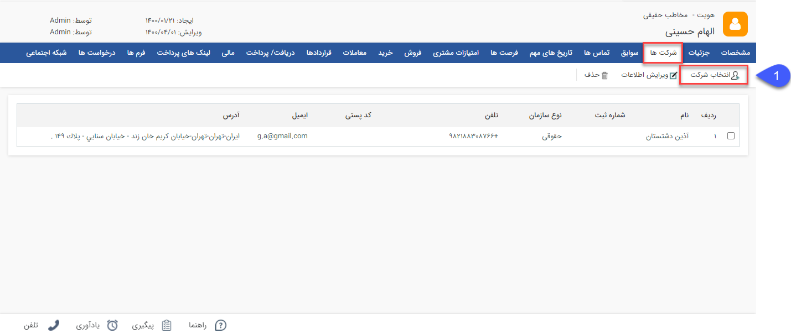

## شرکت ها

 مسیر دسترسی: بانک یکپارچه>بانک اطلاعاتی > صفحه‌ی اصلی هویت حقیقی>  شرکت‌ها

تب شرکت‌ها: در این بخش امکان اضافه نمودن، حذف و ویرایش اطلاعات شرکت ها برای هر کدام از مخاطبان حقیقی وجود دارد. به بیانی دیگر قابلیت ارتباط دادن هویت های حقیقی و حقوقی به یکدیگر از طریق این صفحه وجود دارد. این تب برای هویت های حقوقی با نام پرسنل و برای هویت های حقیقی با نام شرکت ها مشاهده می شود و در صورتی که در هر کدام از انواع هویت ارتباطی تعریف گردد، در هویت متناظر نیز به صورت خودکار نمایش داده می شود ( به طور مثال اگر برای یکی از مخاطبان حقیقی، شرکت تعریف کنید در پروفایل شرکت (مخاطب حقوقی) تعریف شده نیز در تب پرسنل، این ارتباط را مشاهده خواهید نمود) 

  

انتخاب شرکت: می‌توان یک مخاطب یا سرنخ حقوقی را که قبلا در بانک اطلاعاتی ذخیره شده است را در این قسمت به عنوان شرکتی که این مخاطب در آن عضو پرسنل است، انتخاب کرد. بدین منظور پس از انتخاب گزینه " انتخاب شرکت"، می¬بایست به شرح ذیل اقدام نمود:

1.شرکت مرتبط: در این قسمت شرکت مورد نظر را انتخاب کنید.

2.مشخصات کارمند: در این قسمت می‌توانید رده شغلی، شعبه و دپارتمانی که فرد در آن کار می‌کند را مشخص کنید و توضیحات لازم را نیز در این قسمت وارد کنید.   

