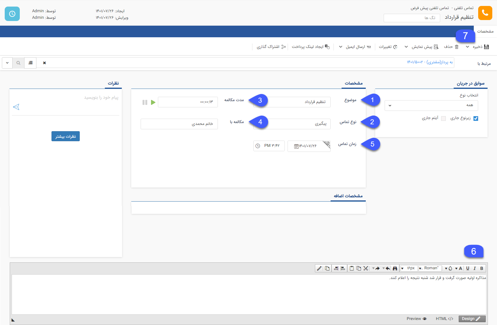

# ثبت سابقه تماس تلفنی

زمانی که با یک مشتری تماس حاصل می‌کنید یا مشتری با شما تماس می‌گیرد می‌توانید برای آن یک سابقه از نوع تماس تلفنی ثبت نمایید تا تاریخچه‌ای از زمان‌های تماس مشتری و مکالمات صورت‌گرفته، ایجاد شود. در مدیریت سوابق هویت، این آیتم از جایگاه ویژه‌ای برخوردار است.

برای ثبت سابقه تماس تلفنی مراحل زیر را انجام دهید:

**1.**  ابتدا موضوع تماس مشتری را در  **موضوع** ثبت کنید.

**2.** نوع تماس را با توجه به هدف آن در **نوع تماس** مشخص کنید. ردیف لیست‌های نمایش داده شده در  [مدیریت آیتم‌ها](https://github.com/1stco/PayamGostarDocs/blob/master/help%202.5.4/Basic-Information/Management-of-system-items/Management-of-system-items.md)  قابل تغییر است.

**3.** در قسمت  **مدت مکالمه**، با زدن دکمه  سبز رنگ Play   در ابتدای تماس و زدن دکمه توقف در پایان تماس، مدت مکالمه را ثبت کنید.

> **نکته** 
>در صورتی که از پنجره تماس در نرم افزار استفاده می کنید. نیازی به پر کردن این فیلد نیست.

**4.** نام شخصی را که مکالمه با آن صورت گرفته در **مکالمه با** وارد کنید.

**5.** تاریخ تماس به‌صورت خودکار تاریخ روز جاری را نشان می‌دهد، اما اگر تماس در تاریخ یا ساعت دیگری صورت گرفته است می‌توان آن را در **زمان تماس** تغییر داد.

**6**. خلاصه ای از مکالمات صورت‌گرفته با مخاطب را در این قسمت یادداشت کنید.

**7**. بر روی دکمه ذخیره کلیک کنید.

سابقه تماس تلفنی پس از ثبت، مطابق شکل زیر نمایش داده می‌شود.

>**نکته** 
 بعد از ذخیره انواع سوابق، سربرگ‌های مشترکی در تمام آنها نمایش داده می‌شود. برای توضیحات بیشتر [اطلاعات مشترک سوابق](https://github.com/1stco/PayamGostarDocs/blob/master/help%202.5.4/Integrated-bank/Database/Records/Joint-record-information/Joint-record-information.md) را مطالعه کنید.