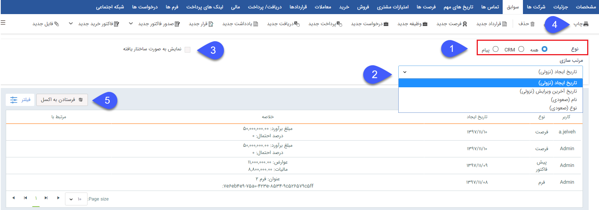
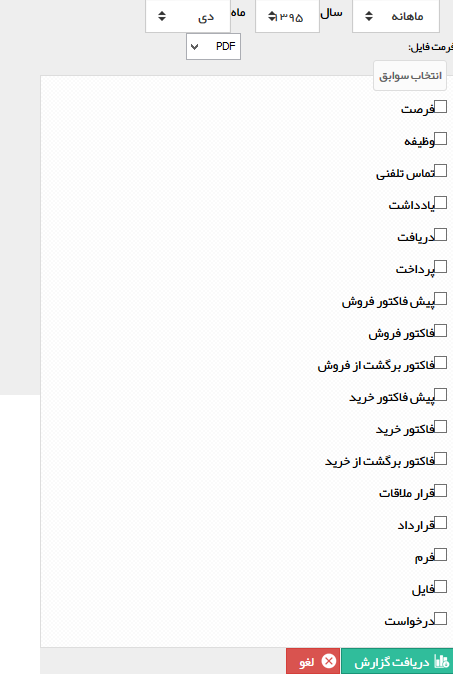

## سوابق

> مسیر دسترسی:  **بانک یکپارچه** >**بانک اطلاعاتی** > **صفحه‌ی اصلی هویت** > **صفحه‌ی سوابق** 

در این قسمت می توانید تمامی ارتباطات خود با مشتریان که در قالب موجودیت های crm بوده و در قسمت شخصی سازی تعریف شده اند را مشاهده و ثبت نمایید. علاوه بر این تمامی ارتباطات شما با هویت ها که از طریق پیام کوتاه، ایمیل و شبکه های اجتماعی انجام شده است نیز به صورت خودکار ثبت خواهد شد. لیست سوابق ثبت شده توسط تمامی کاربرانی که مجوز "مشاهده سوابق مشتری" را داشته باشند قابل مشاهده است

> نکته: سوابق مختص به هر آیتم (مانند سوابق ثبت شده در فرصت، فرم و ... ) به صورت زیر مجموعه آن نمایش داده میشوند.

1. فیلتر:با استفاده از فیلتر های موجود در این قسمت می توانید لیست سوابق مورد نظر خود را جستجو کنید، با کلیک بر روی گزینه "پیام" تمامی سوابق از نوع پیام کوتاه، ایمیل و پیام شبکه اجتماعی نمایش داده می شود و با کلیک بر روی گزینه CRM لیست سوابق از نوع موجودیت ها نمایش داده می شود و پس از آن می توانید یکی از انواع سوابق (به طور مثال فرم یا فرصت) را براساس پارامتر های مورد نظر ( مانند تاریخ ایجاد و سازنده و .. ) فیلتر کنید. 

2. مرتب سازی : امکان مرتب سازی سوابق بر اساس "تاریخ ایجاد" و "تاریخ آخرین ویرایش" و "نام" و " نوع" امکان پذیر است.

3. نمایش به صورت ساختار یافته: با فعال کردن این گزینه، سوابق مرتبط با هرآیتم به صورت درختی نمایش داده می شود.

4. چاپ:با زدن دکمه چاپ می توانید لیستی از سوابق ایجاد شده در مشتری با سفارشی سازی بر حسب نوع و تاریخ را پرینت بگیرید.

5.  خروجی اکسل:پس از اعمال فیلترهای مورد نظر خود می توانید از لیست سوابق خروجی اکسل تهیه کنید.

