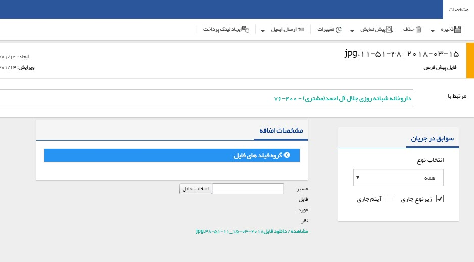

## فایل جدید

در صورت در اختیار داشتن فایلی از مشتری با هر فرمتی، می توانید با انتخاب گزینه فایل جدید، فایل را به پروفایل مشتری اضافه نمایید .

به طور مثال رزومه یا کاتالوگ یک شرکت و مواردی مشابه می تواند گزینه های خوبی برای پیوست به پروفایل شرکت باشد .

> نکته مهم: لطفا ابتدا قسمت[ اطلاعات مشترک سوابق ](https://github.com/1stco/PayamGostarDocs/blob/master/help%202.5.4/Integrated-bank/Database/Records/Joint-record-information/Joint-record-information.md)را مطالعه کنید.

