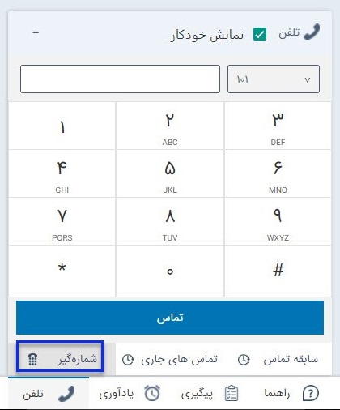

## شماره گیری از طریق نوار ابزار تلفن 

در نوار ابزار تلفن با استفاده از شماره گیر می‌توانید مستقیما از نرم افزار با شماره مدنظر خود تماس بگیرید.

این قابلیت فقط در سیستم های ویپ قابل استفاده است، همچنین کاربر باید دارای داخلی باشد و مجوز "برقراری تماس " را داشته باشد.(برای مطالعه در رابطه تعریف مجوز و تخصیص داخلی به کاربر به بخش [مدیریت گروه‌ها و کاربران](https://github.com/1stco/PayamGostarDocs/blob/master/help%202.5.4/Settings/Manage-groups-and-users/Manage-groups-and-users.md) مراجعه کنید.)

