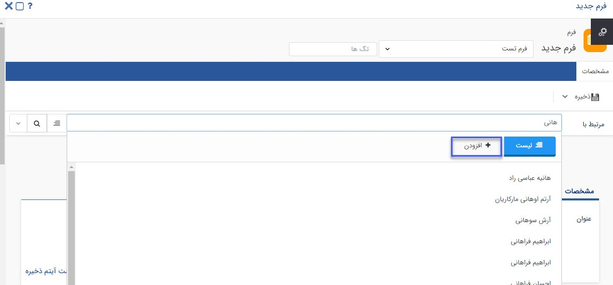
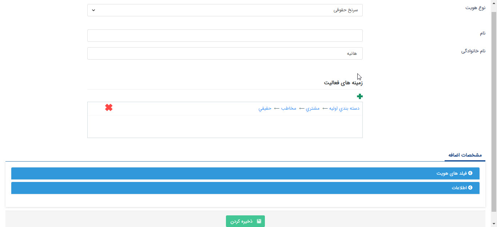
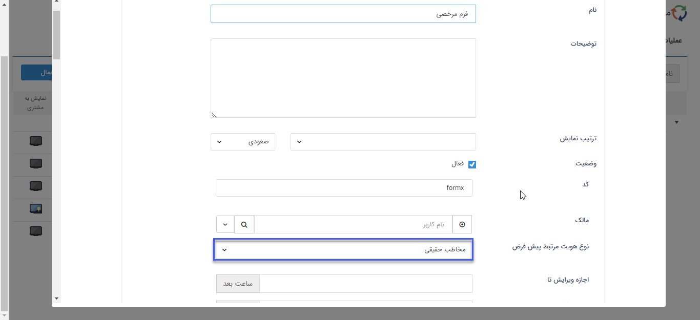
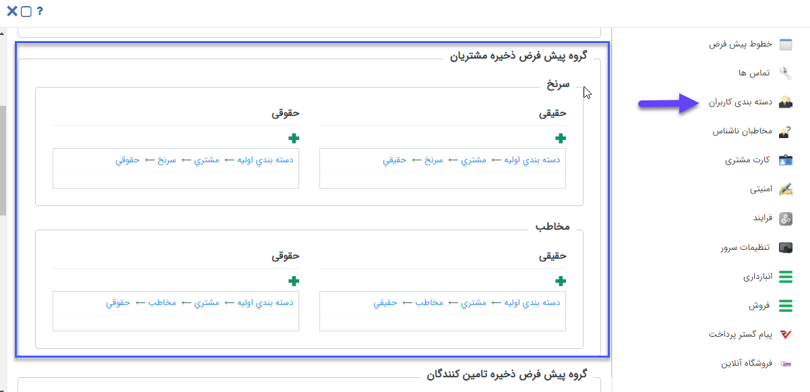

## ایجاد هویت چابک

در هنگام جستجوی "مرتبط با" در آیتم‎‌ها، اگر هویت موردنظر یافت نشد، می‌توان با استفاده از کلید **افزودن**،  هویت جدیدی  را ایجاد کرد،  که به آن هویت چابک گفته می‌شود. 

در این صفحه نوع هویت، نام، نام خانوادگی هویت حقیقی/نام هویت حقوقی، زمینه فعالیت(دسته بندی) و فیلدهای اضافه‌ شده آن قابل انتخاب می‌باشد. 

لازم به ذکر است نوع هویت پیش فرض نمایش داده شده در این بخش در تنظیمات شخصی سازی آن نوع آیتم انتخاب شده است که هنگام تعریف هویت چابک می توان نوع آن را تغییر داد.

همچنین زمینه فعالیت پیش فرض نمایش داده شده در هنگام تعریف این نوع هویت، در تنظیمات کلی، بخش دسته بندی کاربران مشخص شده که می توان آن را نیز ویرایش نمود.

