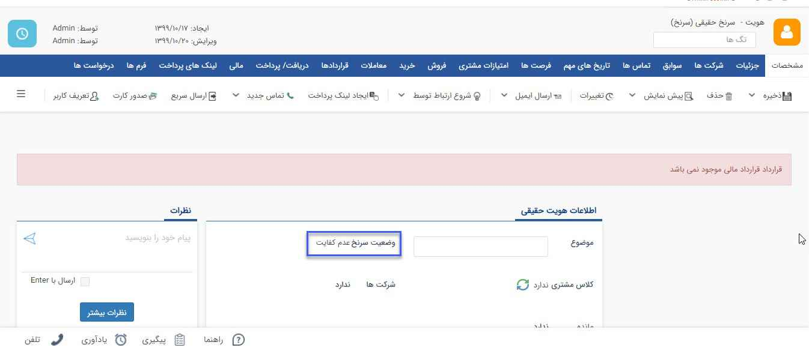

## تبدیل سرنخ به مخاطب 

> مسیر دسترسی:  **بانک یکپارچه** >**بانک اطلاعاتی** > **صفحه‌ی اصلی سرنخ** > **تبدیل سرنخ به مخاطب/عدم کفایت سرنخ** 

سرنخ مرحله ای پیش از ثبت مخاطب می‌باشد، یک سرنخ فقط اطلاعات تماس یک شخص یا شرکت است که اگر صلاحدید آن تایید شود به مخاطب تبدیل می‌شود.

برای تبدیل سرنخ به مخاطب باید از صفحه‌ی اصلی هویت کلید "تبدیل سرنخ به مخاطب" و برای رد صلاحیت سرنخ باید از کلید "عدم کفایت سرنخ" استفاده شود.

> **نکته:** لازم به ذکر است در تبدیل سرنخ به مخاطب، سرنخ حقیقی به مخاطب حقیقی و سرنخ حقوقی به مخاطب حقوقی تبدیل می‌شود.

> **نکته:** در صورت عدم کفایت سرنخ، این وصعیت در فیلد وضعیت سرنخ قابل مشاهده می‌باشد. 

> **نکته:** می توانید در قسمت [جستجوی پیشرفته](https://github.com/1stco/PayamGostarDocs/blob/master/help%202.5.4/Integrated-bank/Advanced-search/Advanced-search.md) لیست سرنخ هایی را که صلاحیت آن ها تایید شده است (تبدیل به مخاطب شده اند) را در اختیار داشته باشید. برای انجام این کار باید پارامتر "وضعیت سرنخ" را بر اساس گزینه "واجد شرایط" فیلتر کنید. 