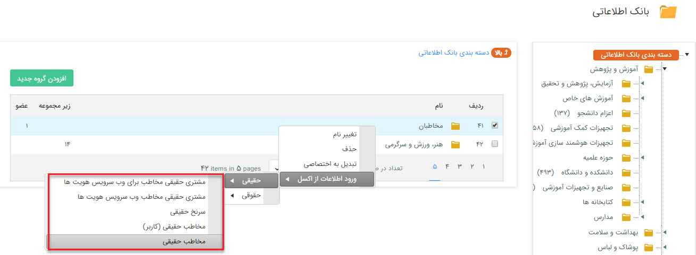
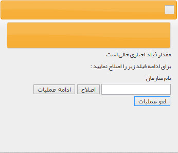
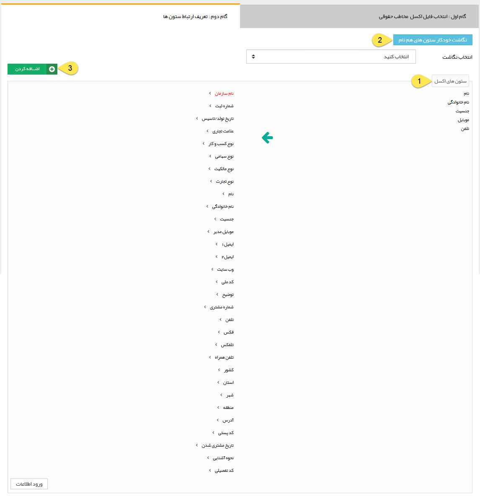

## ورود اطلاعات از اکسل (Excel)

با استفاده از این ابزار می توانید اطلاعات هویت هایی که در قالب فایل اکسل (Excel) درآورده اید را به راحتی به یکی از دسته بندی های  بانک اطلاعاتی اضافه کنید. و یا اطلاعات هویت هایی که قبلا وارد نرم افزار کرده اید را به صورت گروهی به روز رسانی کنید

برای ورود اطلاعات در داخل یک دسته بندی، بر روی آخرین سطح دسته بندی کلیک راست نموده و بسته به نوع هویت، یکی از دو نوع حقیقی و یا حقوقی را برگزینید، سپس تعیین کنید که می خواهید سرنخ یا مخاطب وارد کنید.

 جهت جلوگیری از ورود اطلاعات تکراری، از قسمت[  تنظیمات کلی بخش سیستم  ](https://github.com/1stco/PayamGostarDocs/blob/master/help%202.5.4/Settings/General-settings/system/system.md)تنظیمات مورد نظرتان را اعمال کنید.
 
 برای وارد کردن اطلاعات حتما فیلد های الزامی (نام خانوادگی در مخاطبان و سرنخ های حقیقی و نام شرکت در مخاطبان و سرنخ های حقوقی) در تمامی سطرهای فایل اکسل دارای مقدار باشند.
 
امکان واردکردن اطلاعات از طریق اکسل برای فیلدهای اضافه شده از طریق شخصی سازی  نیز در این بخش وجود دارد.  

 در هنگام ورود اطلاعات مخاطبان حقوقی از طریق فایلاکسل، تنها مدیر شرکت را می توان وارد کرد و امکان وارد کردن پرسنل دیگر وجود ندارد.
 

با انتخاب مسیر دسته بندی بانک اطلاعاتی، پنجره زیر نمایش داده می شود.

> نکته: در صورت باز نشدن خودکار پنجره از تنظیمات مرورگر خود Pop-Up Blocking را غیر فعال کنید.

گام اول: در این گام باید مسیر فایل اکسل آماده شده و شیوه ورود اطلاعات از اکسل را تعیین کنید و  پس از انجام تنظیمات مد نظر روی بخش بعدی کلیک کنید .  

1. انتخاب فایل اکسل: فایل اکسل مورد نظر را انتخاب (بارگذاری) کنید.

2. روش برخورد با خطا: میتوانید تعیین کنید که در صورت بروز خطا (تکراری بودن اطلاعات، خالی بودن فیلد اجباری و ...) نرم افزار چگونه عمل کند.

الف) اگر روی حالت سعی در اصلاح باشد، خطای پیش آمده را در حین ورود اطلاعات نمایش می دهد و می توانید یکی از گزینه های اصلاح(ویرایش خطا)، ادامه عملیات(در نظر نگرفتن این ردیف از اکسل و وارد کردن سایر ردیف ها) یا لغو عملیات (لغو ورود اطلاعات) را انتخاب کنید

ب) اگر روی وارد نکردن ردیف قرار بگیرد، ردیف های دارای خطا را نادیده می گیرد و پس از اتمام فرآیند ورود اطلاعات، یک اکسل دارای نام ردیف هایی که وارد نشده اند با دلیل وارد نشدن آنها در اختیار شما قرار می دهد.

3. فیلدهای تکراری: در صورت نیاز نرم افزار می تواند بر اساس یک فیلد مرجع (ایمیل، شماره مشتری، موبایل یا تلفن) تکراری بودن مخاطب وارد شده را کنترل کند و در صورت مواجه با این تکرار یکی از چهار رفتار زیر را به انتخاب شما انجام می دهد.

A. یک پنجره هشدار نمایش می دهد و از کاربر می خواهد که اطلاعات تکراری را تغییر دهد.

B. اطلاعاتی که در اکسل موجود است را بر روی اطلاعاتی که برای همان مخاطب در نرم افزار موجود است بازنویسی (replace) می کند.

C. اطلاعاتی که در اکسل موجود است را بر روی اطلاعاتی که برای همان مخاطب در نرم افزار موجود است بازنویسی (replace ) می کند اما فیلدهای از نوع شماره تلفن، موبایل، فکس، تلفکس و آدرس را تغییر نمی دهد و اطلاعات از این نوع در اکسل را به همان مخاطب اضافه می کند.

D. صرفا فیلدهایی که در اکسل مقدار دارند اما برای آن مخاطب در نرم افزار خالی هستند را پر می کند. (برای مثال در اکسل برای آن مخاطب ایمیل وارد شده اما در مخاطبی که برای او ساخته بودیم فیلد ایمیل خالی است.)

4. محدود کردن جستجوی تکراری به این دسته بندی: در صورت فعال کردن فیلدهای تکراری، نرم افزار برای یافتن مخاطب مشابه با اطلاعات ورودی از اکسل ، تنها در این دسته بندی که برای ورود اطلاعات در بانک انتخاب کرده اید جستجو می کند.

5. نوع هویت حقیقی برای مدیر: در صورتی که نوع مخاطب حقوقی را برای ورود اطلاعات از اکسل انتخاب کرده باشید این تنظیمات را مشاهده میکنید و  می توانید از طریق آن مشخص کنید که مدیری که برای این مخاطب حقوقی از اکسل وارد می شود، به عنوان یک سرنخ یا مخاطب حقیقی ذخیره شود .

گام دوم:

در گام دوم باید شیوه نگاشت ستون های اکسل خود با نرم افزار را تعیین کنید.

1. ستون های اکسل:   پارامتر های تعریف شده در فایل اکسل (Excel)  شما در ستون سمت راست نمایش داده می شود، می توانید تک تک پارامترها را با ماوس کشیده و در ستون سمت چپ (ستون فیلدهای پیام گستر ) قرار دهید و روی دکمه ورود اطلاعات کلیک کنید تا اطلاعات اکسل در پیام گستر وارد شود .

2. نگاشت خودکار ستون های هم نام: ستون هایی که نام آنها دقیقاً منطبق با فیلدهای نرم افزار باشد به صورت خودکار نگاشت می شوند و سر جای خود قرار می گیرند.

3. اضافه و ذخیره کردن نگاشت: اگر اکسلی که وارد می کنید تعداد ستون های زیادی دارد و نگاشت کردن آن در هر ورود زمان بر است، می توانید بعد از اینکه یکبار ستون ها را نگاشت کردید، در این قسمت نگاشت را ذخیره کرده و دفعات بعد تنها از لیست این قسمت، نام نگاشت ذخیره شده را انتخاب کنید.

قالب (فرمت) فایل اکسل:

در هنگام ساختن فایل باید توجه نمود که نیازی نیست عنوان ستون ها حتما همنام با پارامترهای سیستم باشد (برای مثال می توان برای ستون نام از کلمه "اسم" استفاده کرد) یا ترتیب ستونها به همان شکلی که در هنگام ورود از شما خواسته می شود، باشد.

فرمت پارامتر ها برای نگاشت بایستی به صورت زیر باشد

جنسیت: مقدار جنسیت را با اعداد 1 و 2 می توان تعیین کرد(1=مرد؛ 2=زن ).

شماره تلفن همراه: باید فرمت سلولهای تلفن همراه به صورت TEXT باشند و هر شماره تلفن همراه با عدد صفر شروع شود. برای جدا کردن چند شماره تلفن همراه از علامت نقطه ویرگول ";" استفاده کنید.

تلفن: فرمت وارد کردن شماره تلفن به شکل "(داخلی)الی~شماره تلفن-پیش شماره " است. برای جدا کردن چند شماره تلفن همراه از علامت نقطه ویرگول ";" استفاده کنید.

تاریخ: فرمت وارد کردن تاریخ به شکل "روز/ماه/سال " باید باشد.

کشور، استان، شهر: با توجه به اینکه اطلاعات کشور، استان و شهر یک لیست مرتبط و بر اساس اطلاعات وارد شده در قسمت[ مدیریت کشورها، استان ها و شهرها ](https://github.com/1stco/PayamGostarDocs/blob/master/help%202.5.4/Basic-Information/Management-of-countries%2C%20provinces-and-cities/Management-of-countries%2C%20provinces-and-cities.md)می باشد، در صورت تمایل به وارد کردن این اطلاعات از طریق فایل اکسل، باید هر سه به طور همزمان وارد شوند

آدرس: تنها امکان اضافه کردن یک آدرس از اکسل وجود دارد.

