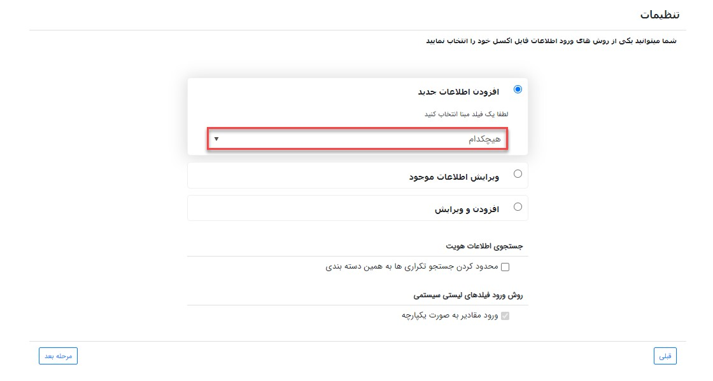
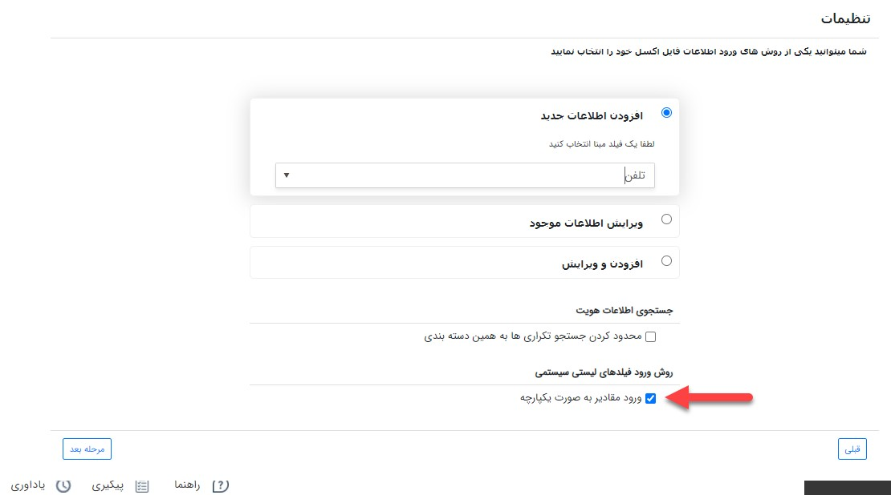
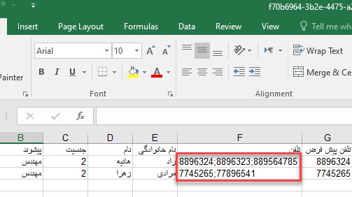

# ورود اطلاعات مخاطب از طریق اکسل

برای ورود اطلاعات هویت‌ها از طریق اکسل ابتدا می‌بایست با فرمت صحیح ورود اطلاعات اکسل آشنا شوید و سپس  مراحل ورود را طبق توضیحات و نکاتی که درادامه گفته شده است انجام دهید. 

## 1)	فرمت صحیح ورود اطلاعات از طریق اکسل

•	**فیلد تاریخ:** روز/ماه/سال

•**فیلد چک باکس:** true /false، بلی/خیر، yes/no، 0/1

•	**فیلد کاربر:** نام کاربری یا کلید کاربر

•	**فیلد رنگ:**  نام رنگ

•	**شماره مشتری:** براساس قالب شماره گذاری آن نوع موجودیت

•	**فیلد جنسیت:** مرد/ زن، female /male و 1/ 2 (1: مرد، 2: زن)

•	**فیلدهای مربوط به تلفن:** "نوع تلفن" )تکمیل با مقادیر تلفن،
موبایل، فکس و تلفکس)، "شماره تلفن"، "الی"، "داخلی"، "توضیحات" و "پیش‌فرض" (تکمیل با مقادیر true/false،yes/no،1/0)

•	**فیلدهای مربوط به آدرس:** "نوع آدرس"(نشانی)، "منطقه"، "صندوق پستی"، "کد پستی"، "آدرس"، "کشور، استان و شهر"( ورود هر 3 فیلد کشور، استان و شهر به صورت همزمان) و "پیش فرض"(تکمیل با مقدار true/false)

•	**فیلد‌های لیستی:** 

همانطور کهمی‌دانید فیلد لیستی فیلدی ست که  این امکان را به شمامی‌دهد که بیش از یک مقدار به فیلد مورد نظرتان اختصاص دهید. در واقع از این طریق، لیستی از مقادیر مرتبط با فیلد در آیتم ذخیرهمی‌شود. مثال فیلد لیستی: لیست عدد، لیست متن، اطلاعات تماس و آدرس‌های هویت

**ورود این نوع فیلد در هویت‌ها به دو صورت به شرح ذیل امکان پذیر است:**

### ورود مقادیر به صورت یکپارچه: 
 
 در این روش برای اضافه کردن چند شماره تماس یا چند آدرس برای یک هویت، بایستی شماره تماس‌ها و آدرس‌‎ها با کاراکتر ";" از یک دیگر جدا شوند.(این روش تنها برای ورود اطلاعات فیلدهای لیستی شماره تماس‌ها شامل تلفن، موبایل، فکس، تلفکس و آدرس‌ها کاربرد دارد.)
 
 درنظر داشته باشید که در این روش اولین شماره و اولین آدرس به عنوان پیش فرض خواهند بود. همچنین در این حالت فقطمی‌توان "شماره تلفن" وارد کرد و در صورت نیاز به ورود "داخلی و الی" باید از ورود مقادیر به صورت جداگانه در ردیف‌های اکسل استفاده نمود.

### ورود مقادیر به صورت جداگانه در ردیف‌های اکسل:
 
می‌بایست به ازای هر مقدار لیست، رکورد مربوطه در فایل اکسل تکرار گردد. همچنین در این حالت، اطلاعات فیلد رکورد آخر به همراه تمام مقادیر فیلد لیستی آن که در رکوردهای مربوطه وارد شده است، در سیستم وارد می‌گردد. 

## 2)	مراحل ورود اطلاعات از طریق اکسل 

### مرحله اول(بارگذاری فایل)

در گام اول، نوع و زیر نوع آیتم انتخاب شده نمایش داده می‌شود که می‌توان آن را ویرایش کرد.

در این مرحله می‌توانید فایل اکسل نمونه‌ای را دانلود کنید، این فایل شامل تمامی فیلدهای نوع آیتم انتخاب شده می‌باشد که با وارد کردن اطلاعات خود در فایل نمونه و ایمپورت آن می‌توانید ورود اطلاعات از طریق اکسل را با فرمت صحیح انجام دهید.

> نکته: فیلدهای اضافه از نوع Html، برچسب، تصویر، رنگ، فایل، کمپین، فیلدهای لیستی و فیلد آیتم‌های crm (جز فیلد شرکت/شخص) در فایل نمونه قابل مشاهده نمی‌باشند.

در این مرحله فایل اکسل خود را انتخاب یا از طریق drag & drop آپلود کنید، با کلیک بر روی مرحله بعد وارد مرحله دوم شوید.

### مرحله دوم(تنظیمات)

**1) افزودن اطلاعات جدید:** با انتخاب این روش آیتم‌های موجود در فایل اکسل به نرم‌افزار اضافه می‌شوند.
در این مرحله می‌توانید یکی از فیلدهای شماره مشتری، تلفن، موبایل و ایمیل را به عنوان مبنای شناسایی انتخاب کنید. تا براساس آن جستجوی تکراری بودن انجام شود، در صورت تکراری نبودن مقدار مبنای انتخاب شده، آن آیتم به نر‍‌م‌افزار اضافه می‌شود.
همچنین در این روش امکان انتخاب گزینه‌ی هیچکدام به عنوان مبنا وجود دارد، در صورت انتخاب هیچکدام به عنوان مبنای شناسایی، تمامی هویت‌های موجود در اکسل به بانک اطلاعاتی اضافه خواهد شد و بررسی تکراری بودن اطلاعات تنها از طریق تنظیمات اعمال شده در تنظیمات کلی بخش سیستم انجام خواهد شد. 

**2) ویرایش اطلاعات موجود:** در این روش براساس فیلدی که به عنوان مبنا انتخاب شده است، جستجوی تکراری بودن انجام می‌شود و در صورت تکراری بودن مقدار مبنای انتخاب شده، آیتم دارای این اطلاعات ویرایشمی‌شود.
با انتخاب چک باکس " فقط فیلد‌های خالی پر شوند " تنها فیلدهای خالی آیتم در حال ویرایش مقداردهی می‌شوند.

**3) افزودن و ویرایش:** در این روش براساس فیلد مبنای انتخاب شده جستجو انجام میشود، در صورت تکراری بودن اطلاعات آن فیلد، آیتم دارای این اطلاعات ویرایش می‌شود و در صورت تکراری نبودن، آیتم جدید به نرم‌افزار اضافهمی‌شود.
با انتخاب چک باکس " فقط فیلد‌های خالی پر شوند " تنها فیلدهای خالی آیتم در حال ویرایش مقدار دهی می‌شوند.

#### روش ورود فیلدهای لیستی سیستمی:

همانطور که در بخش "فرمت صحیح ورود اطلاعات از طریق اکسل" توضیح داده شد، با فعال کردن چک باکس "ورود مقادیر به صورت یکپارچه"  امکان ورود اطلاعات فیلدهای لیستی شماره تماس‌ها و آدرس‌ها به صورت یکپارچه با استفاده از کاراکتر ";" فراهم می‌گردد.

لازم به ذکر است در صورت استفاده از این روش دیگر فیلدهای تلفن، موبایل، فکس، تلفکس و آدرس به عنوان فیلدهای لیستی درنظر گرفته نخواهند شد و در گام سوم در فیلدهای ماشین نمایش داده می‌شوند.
همچنین در این روش نیز اگر فیلد تلفن یا موبایل به عنوان مبنا انتخاب شده باشد، باید ستونی با نام تلفن پیش‌فرض یا موبایل پیش‌فرض در اکسل تعریف 
گردد  تا مبنای جستجوی تکراری‌ها قرار گیرد.

توجه شود که در صورت عدم فعالسازی چک باکس " ورود مقادیر به صورت یکپارچه "،  ورود اطلاعات فیلدهای شماره تماس‌ها و آدرس‌ها باید از روش "ورود مقادیر به صورت جداگانه در ردیف‌های اکسل" انجام شود.

### مرحله سوم(نگاشت فیلدها)

در مرحله سوم سرستون‌های فایل اکسل در بخش فیلدهای شما نمایش دادهمی‌شود و فیلدهای موجود در آیتم در بخش فیلدهای ماشین شما نمایش دادهمی‌شود.
با drag & drop فیلدها، امکان نگاشت آنها با فیلد‌های سیستم وجود دارد.
فیلدهای هم نام به صورت خودکار نگاشت می‌شوند و همچنین با انتخاب "نگاشت فیلدهای هم نام" امکان نگاشت وجود دارد.
شما می‌توانید نگاشت مورد نظر خود (به جز نگاشت فیلدهای لیستی) را با استفاده از "ذخیره نگاشت" ذخیره کنید و درصورت نیاز از لیست نگاشت‌ها آن را انتخاب کنید.
در لیست نگاشت‌های من امکان ویرایش یا حذف نگاشت ذخیره شده وجود دارد.

لازم به ذکر است امکان نگاشت "یک" فیلد لیستی در هر بار ورود اطلاعات وجود دارد، برای این کار فیلد لیستی مورد نظر را از لیست انتخاب کرده و نگاشت فیلد را انجام دهید، اما در صورت ورود مقادیر فیلدهای لیستی به صورت یکپارچه، در این مرحله دیگر امکان انتخاب آن‌ها از لیست وجود ندارد بلکه این فیلدها، در بخش فیلدهای ماشین قابل مشاهده می‌باشند.

> نکته: در صورتیکه فیلدی در سیستم دارای مقدار پیش فرض باشد در این بخش قابل مشاهده و ویرایش می‌باشد، همچنین می‌توانید برای فیلدها در این بخش مقدار پیش‌فرض تعریف کنید تا در صورت خالی بودن این فیلد در فایل اکسل، در نرم‌افزار فیلد با این مقدار پیش‌فرض، مقداردهی شوند.

### مرحله چهارم(شروع بارگذاری)

در صورت مشکل در بارگذاری اطلاعات، خطای مرتبط در این گام نمایش داده می‌شود و فایل اکسلی شامل آیتم‌های دارای خطا قابل دریافت می‌باشد، که پس از اصلاح خطاها بارگذاری مجدد فایل انجام شود.

در منوی گزارش‌ها، بخش وضعیت عملیات انبوه می‌توان نتایج ورود اطلاعات را مشاهده کرد، همچنین در صورت بروز خطا،می‌توان از این بخش فایل اکسلی شامل آیتم‌های دارای خطا و علت خطای رخ داده دریافت نمود.

## 3)	نکات مربوط به ورود اطلاعات هویت از طریق اکسل

•	امکان ورود اطلاعات فیلدهای از نوع فایل، تصویر، html، کمپین، برچسب، لیست مرتبط، فیلد آیتم‌های سی آر ام (جز فیلد شخص/شرکت)، فیلد اضافه از نوع رنگ، فیلد لیستی از نوع فایل، فیلد لیستی از نوع کاربر/گروه و فیلد لیستی آیتم سی آر ام از طریق اکسل وجود ندارد.

•	در صورت انتخاب گزینه‌ی "هیچکدام" در قسمت مبنا، امکان افزودن فیلد لیستی وجود ندارد. زیرا مبنایی برای شناسایی هویت انتخاب نشده است، به همین دلیل با انتخاب هیچ کدام، در گام دوم، گزینه "ورود مقادیر به صورت یکپارچه" برای ورود فیلدهای لیستی شماره تماس‌ها و آدرس‌ها به صورت خودکار فعال می‌گردد. 

•	برای فیلدی که به عنوان مبنا انتخاب شده است و فیلدهای اجباری آن آیتم،می‌بایست حتما نگاشت انجام شود و در فایل اکسل مقدار دهی هم شده باشند، در غیر این صورت، روند با خظا رو به رو می‌شود.

•	اگر جلوگیری از ثبت اطلاعات تکراری در تنظیمات کلی انجام شده باشد (برای مثال جلوگیری از ثبت تلفن تکراری) در هنگام ورود اطلاعات از طریق اکسل علاوه بر فیلد مبنا، این اطلاعات هم بررسی می‌گردد و در صورت تکراری بودن، ورود اطلاعات انجام نمی‌شود.
	هنگامیکه ایمیل، تلفن، موبایل یا شماره مشتری به عنوان مبنا انتخاب شوند، باید در اکسل نام آن‌ها به صورت ایمیل پیش فرض، تلفن پیش فرض، موبایل پیش فرض و شماره مشتری باشد.

•	در حالتی که می‌خواهید یک یا چند تلفن را به صورت کامل(الی و ...) وارد نمایید، باید از فیلد لیستی تلفن استفاده کنید، در این حالت، اگر فیلد مبنا را تلفن قرار دهید، نیاز است یکی از شماره تلفن‌ها را هم در ستون "تلفن پیش فرض" برای همه ردیف‌های مربوط به این هویت ثبت نمایید، تا مبنای جستجو و شناسایی هویت قرار گیرد. این موارد برای موبایل نیز صدقمی‌کند.

•	با توجه به این که اطلاعات کشور، استان و شهر یک لیست مرتبط و براساس اطلاعات وارد شده در قسمت مدیریت کشورها، استان‌ها و شهرها می‌باشند، برای ورود اطلاعات باید هر سه بطور همزمان در اکسل وارد شوند، همچنین در صورت عدم وجود اطلاعات تعریف شده، این اطلاعات به مدیریت کشور، استان و شهر اضافه می‌شود.

•	فیلدهایی از نوع لیست کشویی پیش‌فرض (فیلدهای موجود در مدیریت آیتم‌های سیستم) مانند نحوه آشنایی باید مطابق مقادیر موجود در نرم‌افزار مقدار دهی شوند، همچنین اگر در این فیلدها دو مقدار همنام وجود داشته باشد، هنگام بارگذاری اطلاعات اگر این مقدار همنام در اکسل تعریف شده باشد، آن فیلد در نرم‌افزار مقداردهی نمی‌شود و خطا می‌دهد.

•	در صورت انتخاب هویت از نوع حقوقی، در مرحله‌ی دوم امکان انتخاب نوع هویت حقیقی برای ورود اطلاعات مدیر(نام، نام خانوادگی، جنسیت، موبایل و کد ملی) وجود دارد. در هنگام ویرایش نیز، اگر هویت دارای مدیر بود تنها نام، نام خانوادگی و کد ملی مدیر قبلی با اطلاعات مدیر جدید ویرایش می‌شود.

•	در هنگام ویرایش، باید زیر نوع آیتم در حال ویرایش و زیر نوع آیتم انتخاب شده در گام اول یکسان باشد، در غیر این صورت بارگذاری انجام نمی‌شود.

•	در حالت ویرایش، اگر براساس مبنای انتخاب شده، چندین آیتم در نرم‌افزار وجود داشته باشد و هیچ فیلد لیستی نگاشت نشده باشد، هیچکدام از آیتم‌ها ویرایش نمی‌شوند.

•	در زمان ویرایش، مقادیر لیستی جایگزین مقادیر قبلی می‌شوند، بنابراین در صورتیکه نیاز است مقادیر جدید اضافه شوند، بایستی مقادیر قبلی نیز در اکسل تکرار گردند و در صورت عدم تکرار مقادیر قبلی، آن مقادیر از نرم‌افزار حذف می‌گردند. 

## 4)	مجوزهای مورد نیاز برای ورود اطلاعات از طریق اکسل

### مجوز افزودن شماره مشتری:

برای افزودن و ویرایش شماره مشتری کاربر باید مجوز تغییر شماره مشتری را روی نوع هویت مربوطه داشته باشد. در غیر این صورت، اگر این فیلد نگاشت شده باشد، مقدار این فیلد افزوده یا ویرایش نمی‌شود.

### مجوز افزودن و ویرایش رنگ هویت:

برای افزودن و ویرایش رنگ، کاربر باید مجوز ویرایش رنگ را روی آیتم داشته باشد.

### مجوز افزودن شماره تماس‌ها:

برای افزودن شماره جدید یا ویرایش شماره‌ها کاربر باید مجوز اضافه کردن شماره تماس را روی نوع هویت مربوطه داشته باشد.
در ویرایش هویت به دلیل اینکه شماره‌های جدید جایگزین شماره‌های قبلی می‌شوند، کاربر علاوه بر این مجوز، باید مجوز حذف شماره تماس هم داشته باشد.
کاربر با مجوز تغییر حالت پیش فرض تماس یا نشانی می‌تواند شماره تماس یا آدرس پیش فرض را از طریق اکسل تعیین کند.

### مجوز افزودن نشانی:

برای افزودن نشانی جدید یا ویرایش نشانی‌ها کاربر باید مجوز اضافه کردن نشانی داشته باشد.
در ویرایش هویت به دلیل اینکه نشانی‌های جدید جایگزین نشانی‌های قبلی می‌شوند، کاربر علاوه بر این مجوز، باید مجوز حذف نشانی‌ هم داشته باشد.

### مجوز افزودن اطلاعات جدید:

 برای افزودن اطلاعات جدید در مرحله دوم کاربر باید مجوز ذخیره اولیه آیتم را درنوع آیتم انتخاب شده داشته باشد.

### مجوز ویرایش اطلاعات موجود:

 برای ویرایش اطلاعات موجود در مرحله دوم کاربر باید مجوز ویرایش آیتم را در نوع آیتم انتخاب شده داشته باشد.

### مجوز افزودن و ویرایش:

برای افزودن و ویرایش اطلاعات در مرحله دوم کاربر باید مجوز ذخیره اولیه آیتم و ویرایش آیتم را روی نوع آیتم انتخاب شده داشته باشد.

