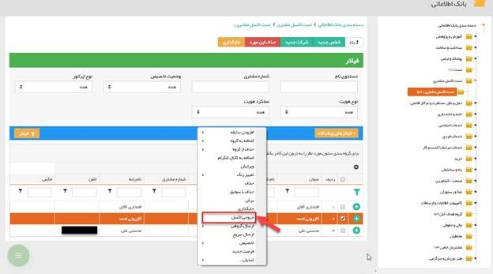

## خروجی اکسل

برای گرفتن خروجی از اطلاعاتی که خود در نرم افزار وارد نموده اید، کافیست به دسته بندی مورد نظر وارد شده و اطلاعاتی را که می خواهید از آن ها خروجی تهیه نمایید انتخاب کنید. سپس با کلیک راست و انتخاب گزینه خروجی اکسل، فایل خروجی را تهیه نمایید.

امکان دریافت خروجی اکسل از لیست ایتم های مختلف با گزینه فرستادن به اکسل وجود دارد.

> نکته: لازم به ذکر است  تنها کاربران دارای مجوز  "دریافت خروجی کامل آیتم ها" بر روی انواع هویت یا مدیر سیستم قابلیت خروجی گرفتن از هویت های  بانک اطلاعاتی را دارا هستند.

> نکته : کاربر برای دریافت خروجی اکسل بایستی مجوز مشاهده آیتم را داشته باشد، در این صورت تنها آیتم هایی که خود ایجاد کرده است را مشاهده و دریافت میکند(به غیر از هویت، زیرا برای دریافت خروجی از هویت ها باید بر روی نوع هویت ها مجوز دریافت خروجی کامل آیتم ها را داشته باشد) .همچنین برای دریافت خروجی اکسل از تمام آیتم های ثبت شده، کاربر بایستی مجوز مشاهده لیست روی آن آیتم داشته باشد.

نکته: هنگام خروجی گرفتن از هویت ها، علاوه بر  نمایش فیلدهای لیستی سیستمی آدرس، انواع تلفن (تلفن، موبایل، فکس، تلفکس)، امکان نمایش فیلد‌های اضافه لیستی از نوع لیست .محصول، لیست متن، لیست عدد، لیست مبلغ، لیست لینک، لیست کاربر، لیست مشتری، لیست سمت، لیست دپارتمان، لیست تاریخ شمسی و میلادی  در اکسل وجود دارد

بدین منظور، درصورتیکه در یک آیتم بیش از یک فیلد لیستی داشته باشید، هنگام خروجی گرفتن از آن، صفحه ای نمایش داده می‌شود که می توان از این طریق فیلد لیستی موردنظر جهت نمایش در خروجی اکسل را انتخاب نمود. لازم به ذکر است در هر بار خروجی گرفتن تنها می‌بایست یک مورد انتخاب گردد. نحوه نمایش مقادیر فیلد لیستی در فرمت اکسل نیز به این صورت می‌باشد که به ازای هر تعداد مقادیر لیستی، رکوردی در ردیف اکسل ایجاد خواهد شد که مقادیر فیلد لیستی در آن نمایش داده می‌شود.

توجه: در نظر داشته باشید برای نمایش فیلد اضافه از نوع لیستی در هویت ها، می بایست در بانک اطلاعاتی زیرنوع هویت مشخص گردد تا فیلد لیستی مربوطه، هنگام خروجی گرفتن قابل انتخاب باشد.در نظر داشته باشید، به هنگام خروجی گرفتن از هویت‌ها در صورت انتخاب گزینه هیچ کدام،مقادیر فیلدهای لیستی سیستمی در یک سلول، در کنارهم قرار گرفته و با کاما ازهم جدا می شوند.

> نکته : کاربر در صورت دارا بودن مجوز دریافت خروجی کامل آیتم ها روی هر آیتم، می تواند تمامی فیلد های موجود در آن آیتم را در خروجی اکسل دریافت کند، درصورت نداشتن این مجوز در خروجی تمامی فیلد ها نمایش داده می شود اما فیلد هایی دارای مقدار هستند که در لیست آیتم قابل مشاهده است. 

> نکته: امکان خروجی گرفتن از همه پرسنل شرکت ها در خروجی اکسل وجود ندارد و تنها اطلاعات مدیر و رابط نمایش داده می شود.

> > نکته: امکان خروجی گرفتن از بانک فهرست مشاغل اول که توسط نرم افزار ارائه می شود، وجود ندارد.

> نکته: در خروجی اکسل از هویت های حقیقی، نام شرکت هایی که در آنها فعالیت دارند نمایش داده می شود

با زدن دکمه خروجی اکسل، باید مسیر ذخیره فایل Excel    را مشخص نمایید.

