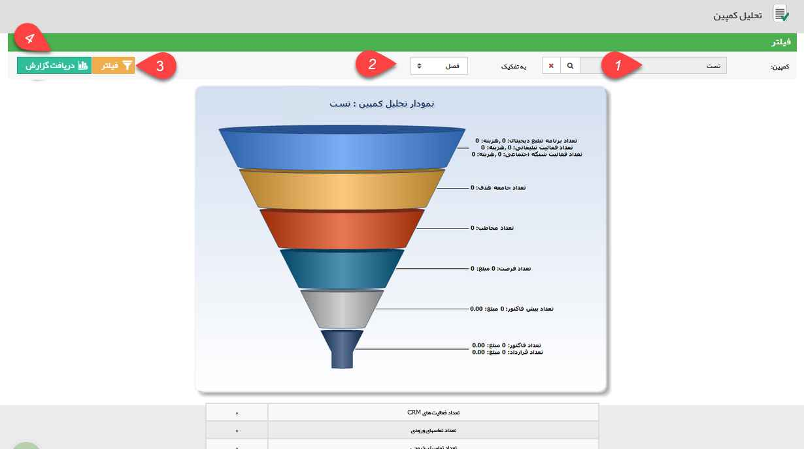
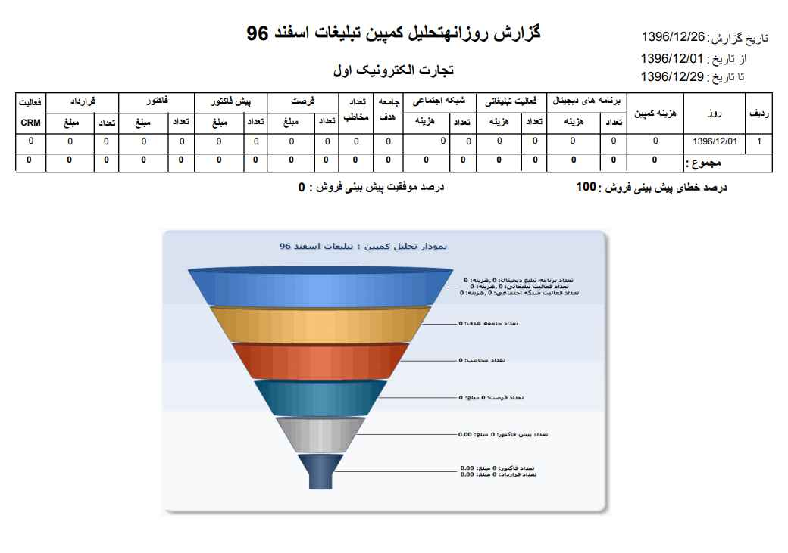

## نمودار تحلیل کمپین

> مسیر دسترسی:  **مدیریت و گزارشات** >**گزارشات تحلیلی** > **تحلیل کمپین** 

نکته : لازم به ذکر است کاربر برای دریافت این گزارش بایستی مجوز مدیر فروش یا مدیر تبلیغات را داشته باشید.

می توانید از نمودار تحلیلی کمپین پس از انتخاب کمپین و بازه زمانی یک گزارش جامع بگیرید. با زدن دکمه فیلتر، در نمودار تحلیل کمپین، اطلاعات کلی کمپین به شما نمایش داده می شود و با زدن دکمه دریافت گزارش، مانند شکل دوم، می توانید یک گزارش جامع در قالب PDF از آن کمپین بگیرید.

گزارش نمایش داده شده شامل نمودار تحلیل آن کمپین، تعداد فعالیت های crm، تعداد تماس های ورودی و خروجی و از دست رفته در بازه زمانی زمانی کمپین تعیین شده است.

1. کمپین: کمپین تبلیغاتی مورد نظر را انتخاب کنید.

2. تفکیک: بازه زمانی که گزارش بر اساس آن تفکیک می شود را تعیین کنید. (روز، ماه، فصل و سال)

3. فیلتر کردن:  با کلیک بر روی این گزینه کمپین مورد نظر نمایش داده می شود.

4. دریافت گزارش: می توانید گزارش این کمپین تبلیغاتی را به صورت یک فایل پی دی اف (Pdf) دریافت کنید.

