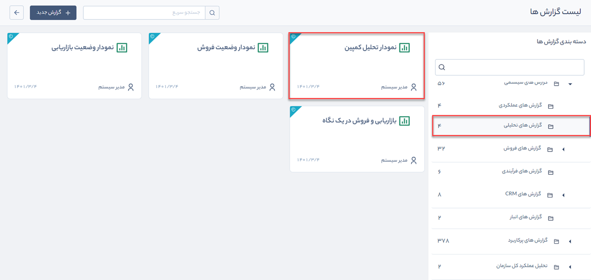
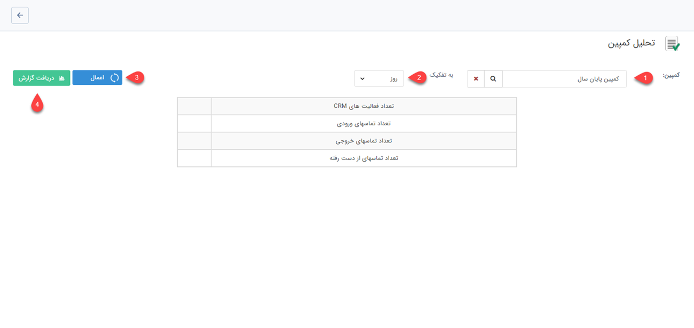

# گزارش نمودار تحلیل کمپین 
 گزارش نمودار تحلیل کمپین از مسیر گزارش‌های سیستمی > گزارش‌های تحلیلی قابل‌دسترسی است.

**نکته:**  کاربر برای دریافت گزارش نمودار تحلیل کمپین بایستی مجوز مدیر فروش یا مدیر تبلیغات را داشته باشد.

برای تهیه گزارش نمودار تحلیلی کمپین به صورت زیر عمل کنید:

1.	کمپین تبلیغاتی موردنظر خود را در **کمپین** انتخاب کنید.
2. 	بازه زمانی را که گزارش بر اساس آن تفکیک می‌شود (روز، ماه، فصل و سال) در فیلد **به تفکیک** مشخص کنید.
3.	برای دریافت اطلاعات کلی کمپین موردنظر بر روی دکمه **اعمال** .کلیک کنید
4.	برای دریافت یک گزارش جامع از کمپین در قالب PDF بر روی **دریافت گزارش** کلیک کنید.

گزارش نمایش داده شده شامل نمودار تحلیل کمپین موردنظر، تعداد فعالیت‌های CRM، تعداد تماس‌های ورودی، خروجی و از دست رفته در بازه زمانی  تعیین‌شده است.

