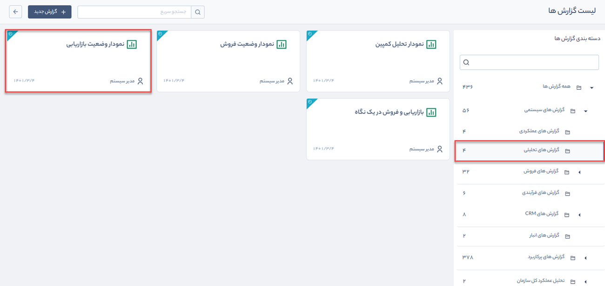

# گزارش نمودار وضعیت بازاریابی
 گزارش نمودار وضعیت بازاریابی از مسیر **گزارش‌های سیستمی** > **گزارش‌های تحلیلی** قابل‌دسترسی است.

 

> **نکته:**  کاربر برای دریافت گزارش نمودار تحلیل کمپین بایستی مجوز **مدیر فروش** یا **مدیر تبلیغات** و همچنین مجوز **مشاهده گزارش** را داشته باشد.

در این گزارش با توجه به بازه مشخص‌شده می‌توان به‌صورت دقیق درصد نحوه آشنایی مخاطبان را مشاهده و برای برنامه‌های تبلیغاتی به‌صورت دقیق برنامه‌ریزی کرد.

برای دریافت گزارش نمودار وضعیت بازاریابی به صورت زیر عمل کنید:

1. بازه زمانی گزارش را تعیین کنید.
2. با انتخاب گزینه ساختاریافته، نرم افزار تنها آمار مربوط به مخاطبان، فرصت‌ها، پیش‌فاکتور و فاکتورهایی را در گزارش نمایش  می‌دهد که با یکی از کمپین‌های تبلیغاتی مرتبط باشند. از این طریق می‌توان هزینه‌ها و منافع کلی یک کمپین تبلیغاتی را به‌خوبی ارزیابی کرد.

> **نکته:**   
> - با کلیک بر روی هرکدام از ردیف‌های قیف وضعیت بازاریابی، 
 می‌توانید جزئیات مربوط به آن را در یک جدول مشاهده کنید.
> -  با کلیک بر روی لینک موجود در هریک از ردیف‌های این جدول، جزئیات برنامه تبلیغاتی یا آیتم مربوطه (فرصت، پیش‌فاکتور، فاکتور و...) نمایش داده می‌شود.

