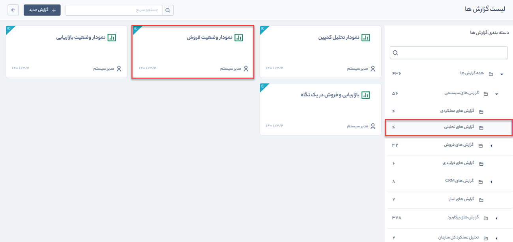
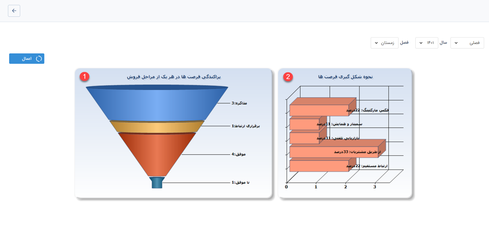

# گزارش نمودار وضعیت فروش
  گزارش نمودار تحلیل کمپین از مسیر گزارش‌های سیستمی > گزارش‌های تحلیلی قابل‌دسترسی است.
> **نکته:**    کاربر برای دریافت این گزارش باید مجوز مدیر فروش را داشته باشد.

گزارش وضعیت فروش به شما کمک می‌کند تا با استفاده از نمودارهای منبع فرصت (نحوه آشنایی) و مراحل فرصت‌ها، بتوانید بازار هدف خود را شناسایی و روش‌های بازاریابی را در بازه زمانی مشخص بهتر برنامه‌ریزی کنید. نمودار شماره 1 (پراکندگی فرصت‌ها در  مراحل فروش) تعداد فرصت‌های هر مرحله را نمایش داده و به شما کمک می‌کند تا گلوگاه‌ها را شناسایی کنید. نمودار شماره 2 (نحوه شکل‌گیری فرصت‌ها) منابع شکل‌گیری فرصت‌های فروش را به تفکیک درصد با یکدیگر مقایسه می‌کند.

> **نکته:**  می‌توانید با استفاده از فیلترهای موجود، گزارش وضعیت فروش را بر اساس بازه زمانی دلخواه خود فیلتر کنید.

