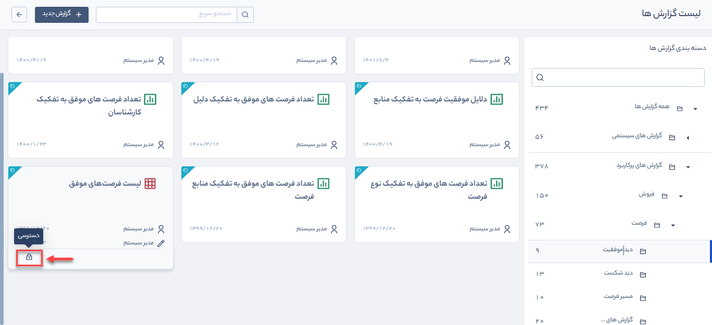
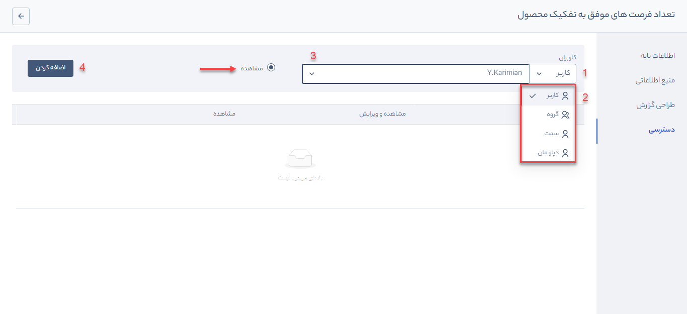

# تنظیمات دسترسی به گزارش‌ها
همانطور که در بخش‌های قبلی گفته شد، گزارش‌های پرکاربرد و سیستمی توسط تیم تولید پیام‌گستر ساخته شده‌اند و کاربر با دسترسی **مدیر سیستم** تنها امکان **مشاهده**، **تعیین دسترسی به سایر کاربران** و **دریافت خروجی** از گزارش را دارد.  

> **نکته** 
> این گزارش‌ها قابل ویرایش نبوده و در صورت نیاز به گزارشی با ساختار متفاوت، لازم است از قسمت **گزارش جدید** اقدام نمایید.

برای تعیین دسترسی کاربران به گزارش‌ها طبق مسیر زیر پیش بروید: 
1. گزارش مورد نظر خود را از لیست گزارش‌ها انتخاب نمایید.
2. موس را روی کارت گزارش نگه دارید، کادری با آیکن **قفل** نمایش داده می‌شود. روی آیکن قفل کلیک کنید تا وارد محیط تعیین دسترسی گزارش شوید.

3.  در این بخش می‌توانید به روش‌های مختلف **کاربر**، **گروه کاربران**، **سمت** و **دپارتمان** مجوز مشاهده را به کاربران تخصیص دهید.

طبق تصویر بالا و مراحل تعیین شده عمل کنید: 
   1. روی کلمه **کاربر** کلیک کنید. 
   2. تعیین کنید که به کدام روش می‌خواهید به کاربر/کاربران سیستم روی این گزارش دسترسی دهید (کاربر، گروه، سمت یا دپارتمان).
   3. در هرکدام از  حالت‌ها، لیستی به شما نمایش داده می‌شود. اگر کاربر را انتخاب کنید لیستی از **کاربران فعال** سیستم در اختیار شما قرار می‌گیرد که باید کاربر مورد نظر خود را انتخاب کنید.
   4. در نهایت روی دکمه **اضافه کردن** کلیک کنید تا کاربر انتخاب شده به جدول پایین صفحه اضافه شود.

