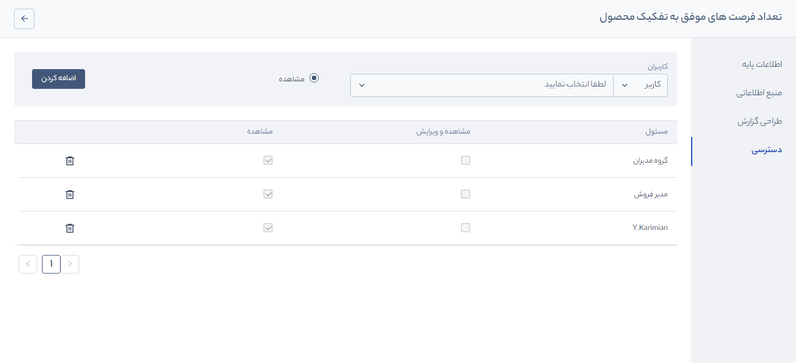

# تنظیمات دسترسی به گزارش‌ها
گزارش های پرکاربرد به صورت پیش فرض در پیام‌گستر وجود دارند  و تنها **مدیر سیستم** امکان **مشاهده**، **تخصیص دسترسی به سایر کاربران**  و **دریافت خروجی** از گزارش را دارد.  

> **نکته** 
> این گزارش‌ها قابل ویرایش نیست و در صورت نیاز به گزارشی با ساختار متفاوت، لازم است از قسمت **گزارش جدید** اقدام کنید.

برای تخصیص دسترسی به گزارش‌ها  مطابق زیر عمل کنید: 
1. گزارش موردنظر خود را انتخاب کنید و
 موس را روی کارت آن نگه دارید تا آیکون **قفل** ظاهر شود، سپس بر روی آن کلیک کنید تا وارد محیط تخصیص دسترسی شوید.

2. در این بخش می‌توانید **کاربر**، **گروه**، **سمت** و  **دپارتمان**  و موردنظر خود را انتخاب کنید و با کلیک بر روی دکمه  **اضافه کردن**،  آنها را به جدول تخصیص دسترسی اضافه کنید. 

