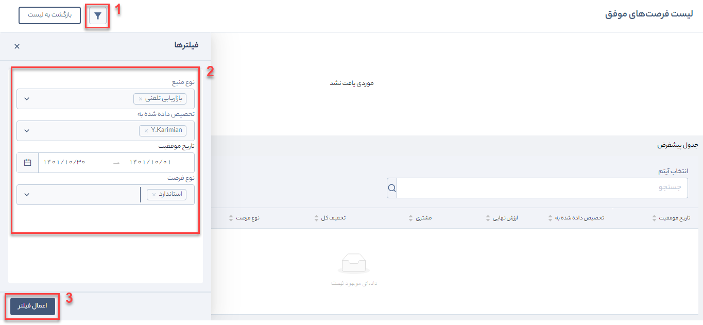

# مشاهده و اعمال فیلتر روی گزارش
با کلیک روی دسته‌بندی مورد نظر، در سمت چپ نرم‌افزار لیست  گزارش‌های آن بخش به صورت کارتی نمایش داده می‌شود. 

 

برای یافتن گزارش مورد نظر خود می‌توانید پس از تعیین دسته‌بندی اصلی، نام گزارش را در قسمت **جستجوی سریع** بیابید. در غیر این صورت از بین لیست گزارش‌ها، آن را انتخاب کنید. 

*به عنوان مثال* 
برای دریافت «گزارش لیست فرصت‌های موفق» طبق مسیر زیر پیش می‌رویم: 
**گزارش‌های پرکاربرد** > **فروش** > **فرصت** > **دید موفقیت** > **لیست فرصت‌های موفق**

به اطلاعاتی که روی کارت گزارش درج شده دقت کنید. **آیکن** کنار عنوان گزارش نشان دهنده نوع گزارش است. اگر شکل **نموداری** داشت گزارش به یکی از حالت‌های میله‌ای، دایره‌ای، خطی، تراکم و یا ترکیبی از این‌هاست. اگر هم **آیکن جدول** درج شده بود یعنی خروجی گزارش به صورت لیستی و در جدول خواهد بود. به این صورت با یک نگاه می‌توانید متوجه شوید گزارش مورد نظر شما در چه قالبی تهیه شده است.

1. این شکل، نشان دهنده نوع گزارش است (نمودار میله‌ای، نمودار دایره‌ای، نمودار پراکندگی، نمودار خطی، جدول، کارت). 
2. عنوان گزارش 
3. این علامت را فقط روی گزارش‌های پیش‌فرض سیستم مشاهده خواهید کرد. گزارش‌هایی که توسط شما ساخته شده‌اند این علامت آبی رنگ را ندارند.
4. در این قسمت نام کاربر و تاریخی که این گزارش ایجاد و ویرایش شده است نشان می‌دهد.
5. علامت قفل یعنی شما حتی با دسترسی «مدیر سیستم» امکان ویرایش این گزارش را ندارد. این علامت روی تمامی گزارش‌های پرکاربرد و سیستمی (که پیش‌فرض سیستم هستند) قرار دارد.

## مشاهده گزارش
روی عنوان گزارش کلیک کنید. در این مثال (لیست فرصت‌های موفق) اگر فرصتی در سیستم ثبت نشده باشد پیغام «موردی یافت نشد» نمایش داده میشود. در غیر این صورت گزارش را به صورت کلی  خواهید.

> **نکته** 
> در برخی گزارش‌ها به محض ورود به صفحه گزارش، به دلیل حجم و تنوع بالای اطلاعات، اعمال فیلتر برای مشاهده گزارش **الزامی** است.

## اعمال فیلتر روی گزارش
سمت چپ گزارش روی **آیکن فیلتر** کلیک کنید. متناسب با هر گزارش، فیلدهایی را برای فیلتر در اختیار دارید. در این مثال، بر اساس نحوه آشنایی (فیلد منبع در فرصت)، کارشناس مرتبط فرصت (فیلد تخصیص داده شده به)، تاریخ موفقیت و نوع فرصت (فیلد نوع در فرصت) می‌توانید فیلتر مورد نظر خود را اعمال کنید.

