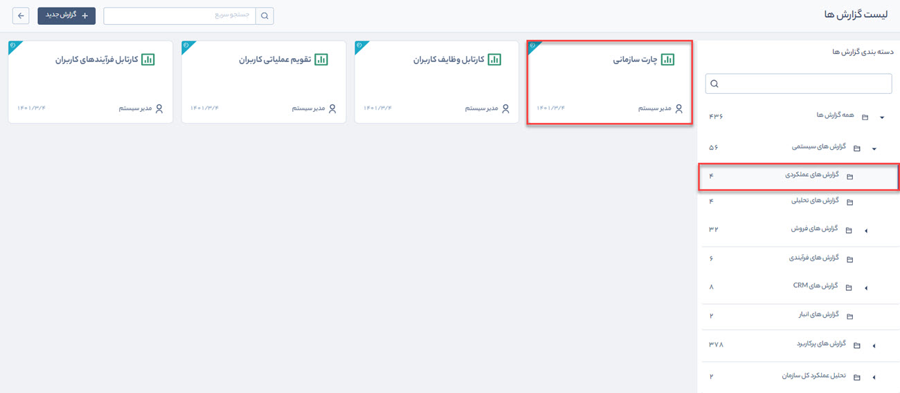
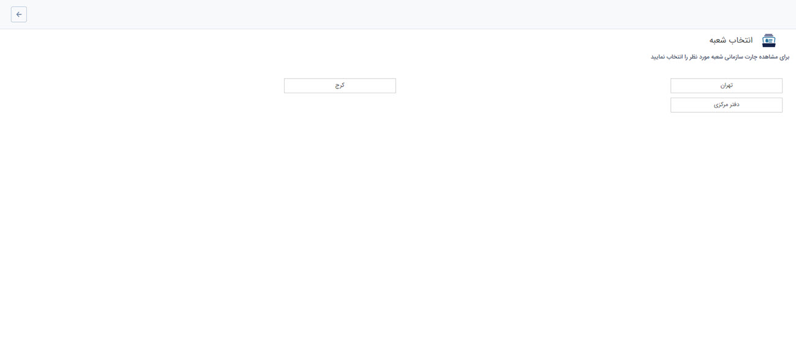
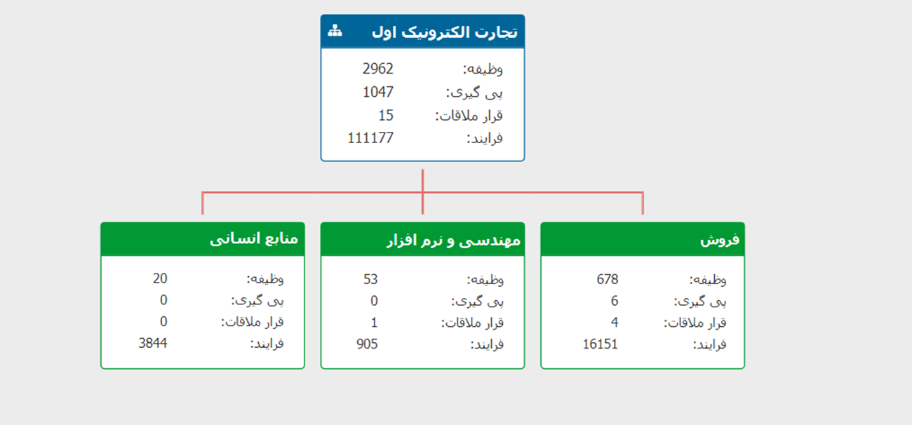

 گزارش چارت سازمانی از مسیر گزارش‌های سیستمی > گزارش‌های عملکردی قابل‌دسترسی است.

 

> **نکته:**  برای دریافت این گزارش بایستی مجوز مدیریت شعب و دفاتر را داشته باشید.

 برای مشاهده چارت سازمانی، شعبه موردنظر خود را انتخاب کنید.

 

 تنظیمات و ویرایش چارت سازمانی از طریق منوی[ مدیریت شعب، دپارتمان و سمت](https://github.com/1stco/PayamGostarDocs/blob/master/help2.5.4/Basic-Information/branches-department/branches-department.md) صورت می‌گیرد. مجموع تعداد وظایف، پیگیری‌ها،
 قرارملاقات‌ها و فرآیندهای هر دپارتمان‌ در یک چارت نمایش داده می‌شود.

> **نکته:**   توجه داشته باشید که آیتم‌های وظیفه، پیگیری، قرار ملاقات و فرایند موجود در کارتابل کاربرانی که به آنها حکم سازمانی تخصیص نداده‌اید در محاسبات این گزارش لحاظ نخواهد شد.

