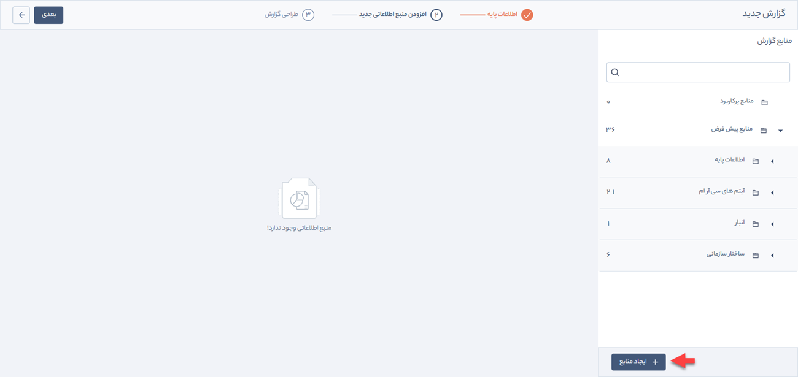
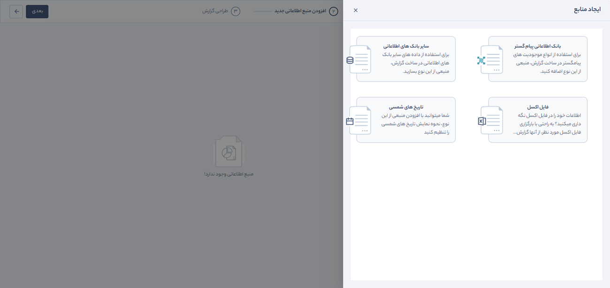
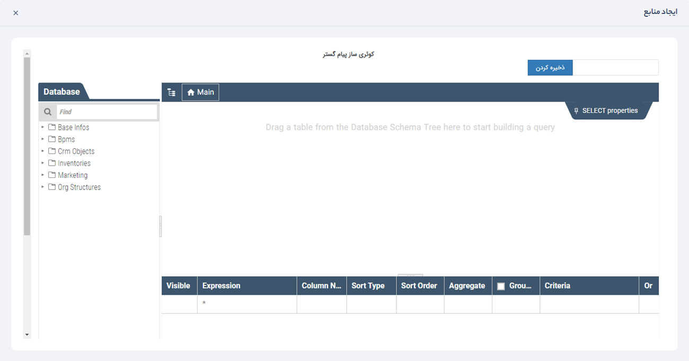
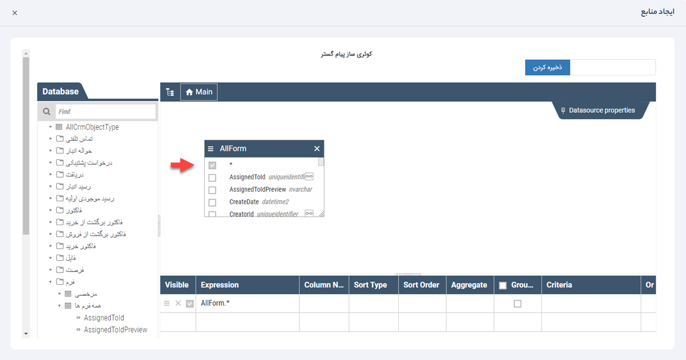
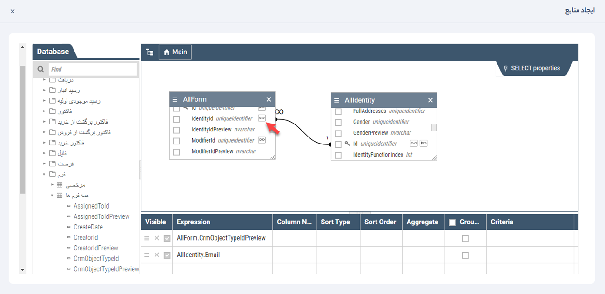
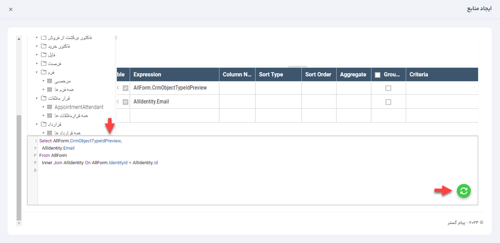
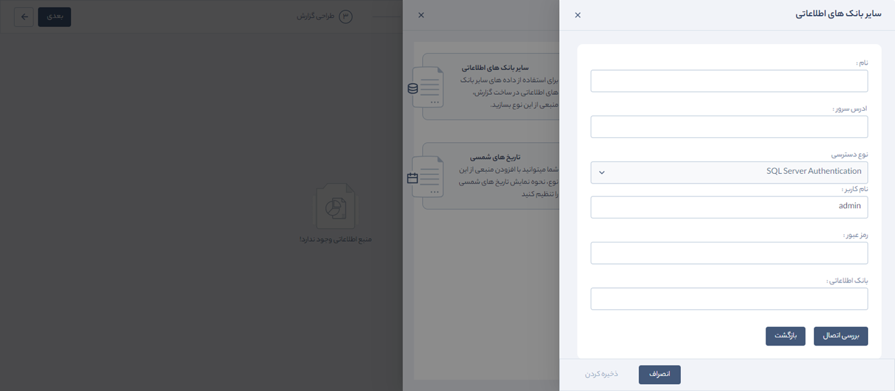
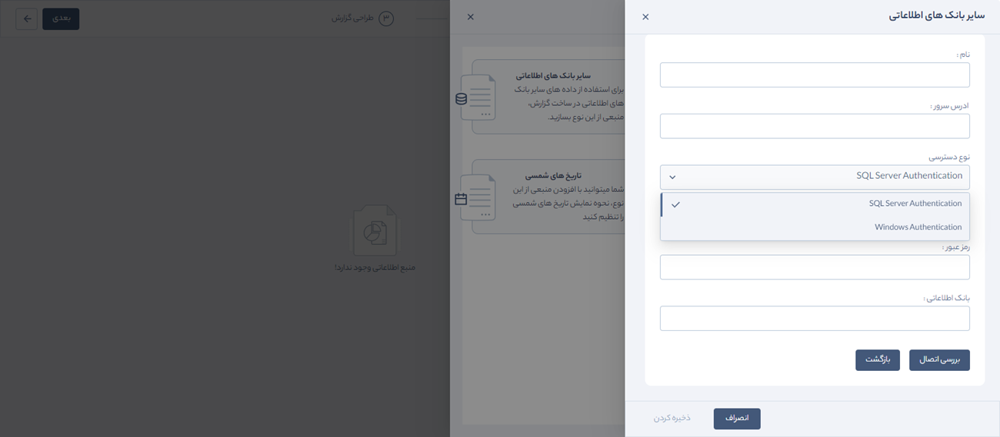
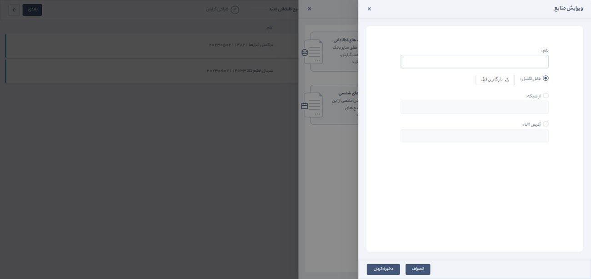

# افزودن منبع اطلاعاتی جدید
در صورت داشتن ماژول گزارش‌ساز پیشرفته می‌توان از منابع مختلف برای تهیه گزارش استفاده کرد. برای این منظور بر روی کلید **ایجاد منابع** کلیک کنید.       

 منبع موردنظر خود را برای تهیه گزارش از بین گزینه‌های زیر انتخاب کنید.

## 1.بانک اطلاعاتی پیام‌گستر
از منابع پیام‌گستر زمانی استفاده می‌شود که بخواهیم علاوه بر موجودیتی که در حال گزارش‌گیری از آن هستیم از  تمام موجودیت‌های و بخش‌های دیگر پیام گستر نیز در گزارش خود استفاده کنیم.

در این بخش امکان انتخاب منابع اطلاعاتی پیام گستر فراهم شده است. شما می‌توانید منبع و فیلدهای موردنظر خود در آن را از بین دسته‌بندی‌های زیر انتخاب کنید تا در مرحله بعد برای گزارش‌گیری مورد استفاده قرار گیرد:

- Base Infos:  در این منبع اطلاعاتی جدول‌های مربوط به لاگ تماس، کمپین‌های تبلیغاتی، تاریخ شمسی، گروه‌های محصولات، مشخصات محصول، مشخصات محصولات انبار به اضافه سریال و گارانتی، نام اتاق‌ها، سابقه ورود و خروج و تغییرات هر مرحله فرایندها و گروه‌های هدف قرار دارد.
- Bpms: جدول‌های مربوط به وضعیت فرایندها، تاریخچه گردش فرایند، جزئیات اقدامات هر فرایند و اطلاعات کارتابل فرایند در این منبع اطلاعاتی قرار دارد.
- Crm Objects: جدول‌های اطلاعات موجودیت‌های سی‌آرام مانند تماس تلفنی، پیش‌فاکتور، فاکتور، دریافت، پرداخت، رسید و حواله انبار، فرم، فرصت، قرار ملاقات و ... در این منبع اطلاعاتی قرار دارد.
- Inventories: جدول‌های مربوط به انبار، گروه‌های انبار و تراکنش‌های آن در این منبع اطلاعاتی قرار دارد.
- Marketing: در این منبع جدول‌های داده‌های مربوط به بازاریابی مانند لیست ایمیل‌ها، فکس، پیامک‌های تبلیغاتی،ارسال گروهی و جامعه هدف قرار دارد.
- Org Structures: جدول مربوط به اطلاعات چارت سازمانی، دپارتمان، حکم‌های پرسنلی و سمت در این منبع اطلاعاتی قرار دارد.

>  **نکته:**  در این قسمت موجودیت‌ها و فیلد‌هایی نمایش داده می‌شود که برای آنها در شخصی‌سازی CRM کلید کاربر تعریف شده باشد. بنابراین در نسخه قدیمی پیام گستر به‌دلیل تعریف نشدن کلید کاربر، این موجودیت‌ها و فیلدهای آنها نمایش داده نمی‌شود.

### نحوه ایجاد ارتباط بین منابع اطلاعاتی پیام گستر

برای ایجاد ارتباط بین منابع اطلاعاتی، از منوی Database موجودیت(های) موردنظر خود را انتخاب کنید، لیست فیلد‌های آن(ها) در منوی Main به‌صورت جدول، نمایش داده می‌شود. فیلدهای موردنیاز در هر جدول با فعال کردن چک باکس آنها قابل انتخاب است. در صورتی که تمام فیلدها مورد نیاز است چک باکس ستاره (*) را تیک بزنید.

همه موجودیت‌های CRM در جدول خود فیلدهای مربوط به هویت دارند، مانند ایجادکننده آیتم (CreatorId)، هویت مرتبط (IdentityId)، مسئول مرتبط (AssignedToId) و ویرایش‌کننده آیتم (ModifierId). برای استفاده از اطلاعات هویتی هر کدام از این موارد (مانند موبایل یا ایمیل)، باید جدول هویت (Identity) را نیز به Data set اضافه و Id آن را به Id هرکدام از فیلدهای ذکرشده (مانند CreatorId) متصل کنید. 
برای این منظور با کلیک بر روی علامت مشخص‌شده در تصویر، جدول ویژگی‌های آن فیلد باز می‌شود و می‌توان اطلاعاتی را که از هویت موردنیاز است انتخاب و به موجودیت متصل کرد. برای مثال ایمیل هویت مرتبط با فرم انتخاب‌شده را مطابق شکل زیر در گزارش خواهیم داشت.

  
   در انتهای صفحه ایجاد منابع، ستون‌هایی برای مدیریت فیلدها قرار دارد که در ادامه شرح داده می‌شوند:

**visible:** در این بخش امکان انتخاب و یا حذف فیلد‌های انتخاب‌شده وجود دارد. 
**expression:** در این قسمت نام فیلدها قابل مشاهده است. همچنین نام موجودیت به‌صورت پیشوند در کنار فیلدها قرار می‌گیرد تا مشخص شود هر فیلد از کدام آیتم انتخاب شده است. 
**column Name:** نام مربوط به هر فیلد که در مرحله بعد برای گزارش‌گیری نمایش داده می‌شود. 
**sort type:** در این ستون، نوع مرتب‌سازی (صعودی یا نزولی) مشخص می‌شود. 
**criteria:**  در این بخش می‌توان فیلترهای موردنظر را بر روی هر فیلد اعمال کرد. برای هر فیلد سه فیلتر قابل تعریف است. در صورت نیاز به استفاده از تعداد فیلترهای بیشتر، باید از طریق کدنویسی در محیط SQL پایین صفحه اقدام کرد. با استفاده از کدنویسی در محیط SQL کاربر می‌تواند از روش‌های پیشرفته‌تری گزارش تهیه کند، فیلتر‌های مشخصی را اعمال و یا بر اساس المانی فیلد‌ها را مرتب‌سازی کند. 
هنگام استفاده از این محیط پس از اضافه کردن تغییرات موردنظر حتماً باید کلید به‌روز رسانی زده شود، تا موارد اعمال شده در جدول قرار گیرد.

## 2.سایر بانک‌های اطلاعاتی
استفاده از قابلیت بانک اطلاعاتی این امکان را به کاربر می‌دهد تا برای ساخت گزارش مدنظر خود اطلاعات موردنیازش را از بانک‌های اطلاعاتی دیگر به منابع گزارش اضافه کند. به‌عنوان مثال کاربر می‌تواند از دیتابیس نرم‌افزار حسابداری، موجودیت‌های حسابداری موردنظر خود را به پیام‌گستر متصل کند و گزارشی داخل پیام‌گستر داشته باشد. 
فرض کنید می‌خواهید گزارشی از دستمزد کاربران داشته باشید. کاربران در پیام‌گستر و حقوق کاربران در سیستم حسابداری تعریف شده است. با استفاده از این امکان می‌توان اطلاعات موردنظر را از سیستم حسابداری به این گزارش منتقل کرد.

برای افزودن بانک اطلاعاتی به منابع گزارش لازم است فیلدهای زیر تکمیل شود:

**نام:**  یک نام برای منبع بانک اطلاعاتی انتخاب کنید. 
**آدرس سرور:** در این بخش آدرس سرور بانک اطلاعاتی را وارد کنید. 
**نوع دسترسی:**  دسترسی به دیتابیس موردنظر به دو روش امکان‌پذیر است:

1. **Windows Authentication:**      از طریق کاربری که لاگین است.
2. **SQL Server Authentication:** از طریق نام کاربری و رمز عبور مشخص‌شده در دیتابیس.

**بانک اطلاعاتی:** نام بانک اطلاعاتی موردنظر باید وارد شود، زیرا ممکن است در آدرس واردشده چندین بانک اطلاعاتی وجود داشته باشد. 
**بررسی اتصال:** صحت اطلاعات ثبت‌شده موجودیت‌های بانک اطلاعاتی دیگر نیز مانند منبع بانک اطلاعاتی پیام‌گستر بررسی می‌شود. کاربر با توجه به نیاز، موجودیت‌های موردنظر خود را برای ایجاد گزارش انتخاب می‌کند. 

##  3.تاریخ‌های شمسی
با استفاده از اضافه‌کردن بانک تاریخ‌های شمسی می‌توان نحوه نمایش فیلد‌های تاریخی موجود در گزارش را مشخص کرد.
به‌عنوان‌مثال می‌توان نحوه نمایش تاریخ ایجاد آیتم را مشخص کرد که چندمین روز از سال شمسی است.

## 4. فایل اکسل
با استفاده از این قابلیت امکان اضافه‌کردن فایل اکسل به‌عنوان منبع به گزارش فراهم شده است. به‌عنوان مثال زمانی که کاربر برای تهیه گزارش خود به اطلاعات موجود در یک فایل اکسل نیاز دارد می‌تواند از این قابلیت استفاده کند.

> **نکته:**  توجه داشته باشید عنوان ستون‌های اکسل باید حتما انگلیسی و بدون فاصله باشد.
 به‌عنوان مثال عنوان ستون کارشناس فروش باید SalesPerson باشد.

برای افزودن فایل اکسل به منابع گزارش مراحل زیر را انجام دهید:
1. در فیلد **نام**، منبع را نام‌گذاری کنید.

2. فایل اکسل را با استفاده از یکی از روش‌های زیر اتصال دهید:

-   بارگذاری فایل اکسل به‌صورت مستقیم 
-   انتخاب مسیر فایل اکسل زمانی که در شبکه بارگذاری شده است

-  از طریق آدرس url

اولین ردیف فایل اکسل، به‌عنوان سرستون انتخاب می‌شود. سرستون‌ها به‌عنوان فیلدهای گزارش در نظر گرفته می‌شود.

3. بر روی **ذخیره‌کردن** کلیک کنید.

> **نکته:**   در گزارش‌گیری از فایل اکسل، اطلاعات موجود در فایل اکسل در همان لحظه گزارش داده می‌شود، نه زمانی که فایل اکسل به گزارش اضافه شده است.

