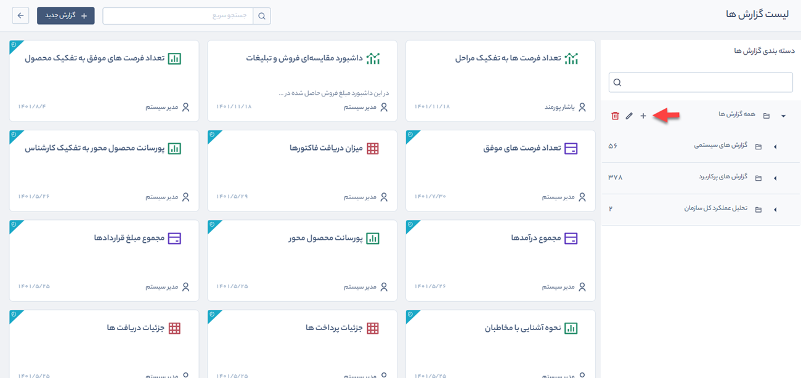
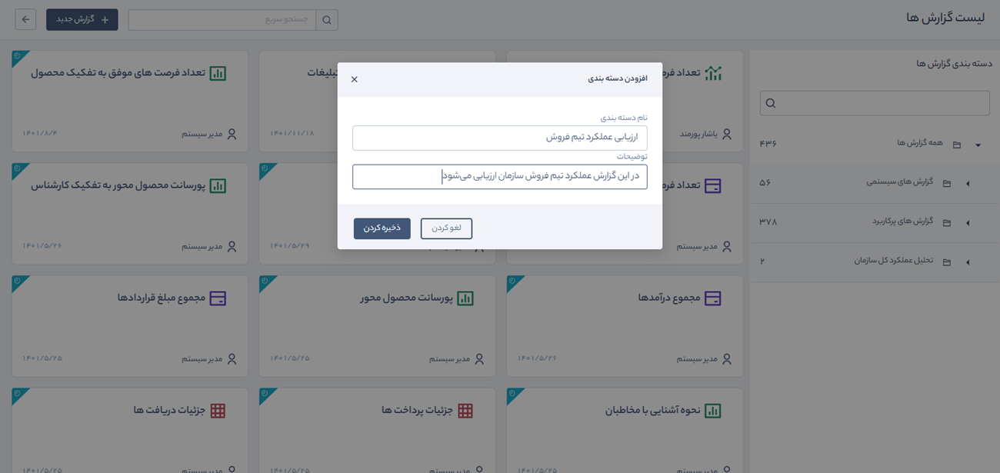
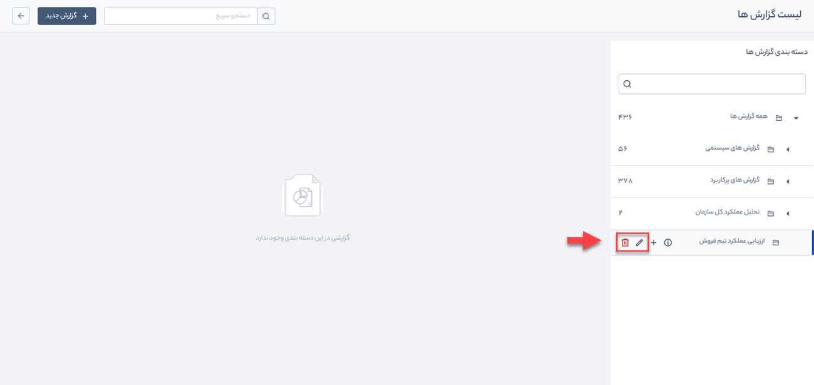
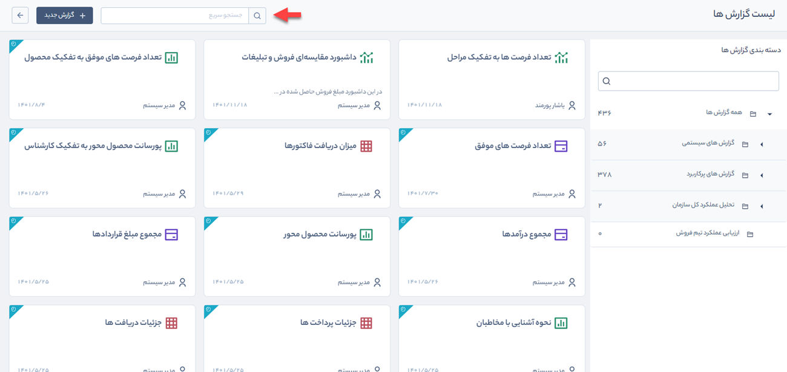

# ایجاد دسته‌بندی جدید در گزارش‌ها
در این قسمت امکان ایجاد دسته‌بندی جدید برای ساخت گزارش بر اساس نیاز شما و همچنین ویرایش و حذف آنها وجود دارد. برای ایجاد دسته‌‌بندی جدید به صورت زیر عمل کنید.  
 
 1.  در دسته‌بندی اصلی **همه گزارش‌ها** بر روی **+** کلیک کنید.

 

2.  در پنجره‌ای که باز می‌شود نام دسته‌بندی و توضیحات موردنظر خود را وارد و بر روی **ذخیره‌کردن** کلیک کنید.

3. با قرار گرفتن بر روی نام دسته‌بندی ایجادشده و کلیک بر روی آیکون‌های مربوطه امکان حذف و ویرایش نام دسته‌بندی وجود دارد.

4. در این قسمت می‌توانید بر اساس نام گزارش جستجو را انجام دهید.

>**نکته** 
کاربر در صورت دارا بودن **مجوز مدیریت گزارش‌های ساخته‌شده**،  می‌تواند تمامی گزارش‌های ایجادشده را مشاهده، ویرایش و حذف کند. همچنین امکان تعیین مجوز بر روی گزارش‌ها را دارد.

