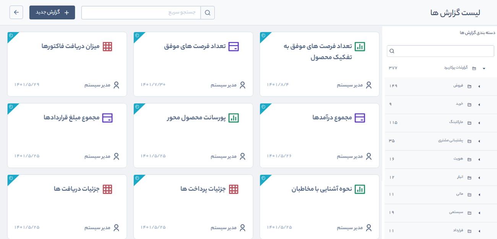
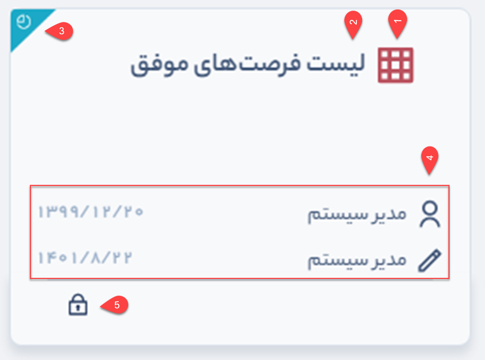
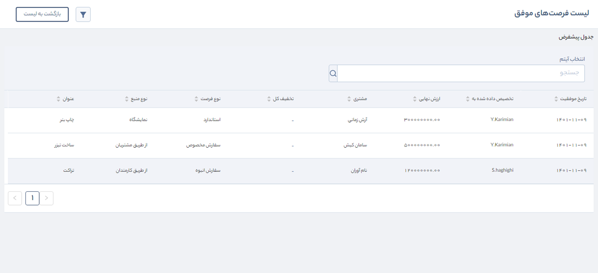
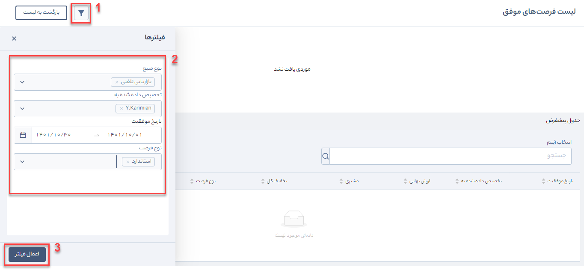

# استفاده از گزارش‌های پرکاربرد
برای دسترسی به لیست گزارش‌ها از مسیر **گزارش‌ها** > **لیست گزارش‌ها** وارد صفحه اصلی شوید. 
### انتخاب دسته‌بندی گزارش‌های پرکاربرد
سمت راست صفحه در بخش **دسته‌بندی گزارش‌ها** > **همه گزارش‌ها**، تمامی دسته‌بندی‌های پیش‌فرض نرم‌افزار و ساخته شده توسط شما قرار گرفته است.
- **دسته‌بندی گزارش‌های سیستمی** 
   در این بخش تمامی گزارش‌های پیش‌فرضی که از گذشته در نرم‌افزار ایجاد شده بودند، قرار دارد و در نسخه جدید تنها نمایش نمودار درختی آن  تغییر کرده است.
- **گزارش‌های پرکاربرد** 
   با توجه به نیاز کسب‌وکارها، بر روی آیتم‌های CRM، ابزارهای ارتباطی، پیگیری‌ها، اطلاعات هویت‌ها و سایر اطلاعات ثبت شده در نرم‌افزار، پرکاربردترین گزارش‌ها در 9 دسته‌بندی مجزا طراحی و به صورت آماده در این بخش پیاده‌سازی شده است.  
   تفاوتی که این بخش با گزارش‌ساز دارد در این است که دیگر نیازی به ساخت یا انتخاب منابع اطلاعاتی، انتخاب نوع گزارش (نموداری یا جدولی) و استفاده از دستورات RDL نیست. یعنی شما به عنوان کاربر با توجه به سمت سازمانی خود لازم است تنها مجوز **مشاهده** را روی گزارش مورد نظر خود داشته باشید؛ در نهایت با اعمال فیلتر بر روی گزارش و انتخاب فرمت مورد نظر، گزارش را دریافت نمایید.

### نمایش لیست گزارش‌های پرکاربرد
زمانی که روی دسته‌بندی **گزارش‌های پرکاربرد** کلیک کنید نمودار درختی به تفکیک موضوعات مختلف باز شده و در سمت چپ نرم‌افزار لیست تمامی گزارش‌ها به صورت کارتی نمایش داده می‌شود.

 

### انتخاب گزارش مورد نظر
در هر یک از دسته‌بندی‌ها، تعدادی گزارش آماده وجود دارد که با کلیک بر روی هر کارت به صفحه گزارش منتقل می‌شود.  
به عنوان مثال، می‌خواهیم از گزارش **لیست فرصت‌های موفق** خروجی بگیریم. طبق مراحل زیر پیش می‌رویم:
1. از دسته‌بندی گزارش‌های پرکاربرد، **دسته‌بندی فروش** > **فرصت** > **دید موفقیت** را کلیک کنید.
2. در لیست گزارش‌های نشان داده شده در سمت چپ نمودار گزارش با عنوان **لیست فرصت‌های موفق** را بیابید و بر روی نام آن کلیک کنید.

> **نکته** 
> به کمک **فیلد جستجوی** بالای لیست گزارش‌ها، می‌توانید گزارش مورد نظر خود را با عنوان آن، جستجو کنید. لازم به ذکر است باید دسته‌بندی گزارش را از قبل انتخاب نمایید سپس گزارش را جستجو نمایید.

3. به اطلاعاتی که روی کارت گزارش درج شده دقت کنید. **آیکن** کنار عنوان گزارش نشان دهنده نوع خروجی گزارش است. اگر شکل **نمودار** بود یعنی گزارش به صورت نمودار میله‌ای، دایره‌ای، خطی، تراکم و یا ترکیبی از این‌هاست. اگر هم **آیکن جدول** درج شده بود یعنی خروجی گزارش به صورت لیستی و در جدول خواهد بود. به این صورت با یک نگاه می‌توانید متوجه شوید گزارش مورد نظر شما در چه قالبی تهیه شده است.

4. روی عنوان گزارش کلیک کنید. در این مثال (لیست فرصت‌های موفق) اگر فرصتی در سیستم ثبت نشده باشد پیغام «موردی یافت نشد» نمایش داده میشود. در غیر این صورت گزارش را به صورت کلی  خواهید.

5. **اعمال فیلتر روی گزارش**
   بعد از کلیک روی عنوان گزارش، اطلاعات به صورت پیش‌فرض و در قالب تعیین شده، نمایان می‌شوند. سمت چپ گزارش 

