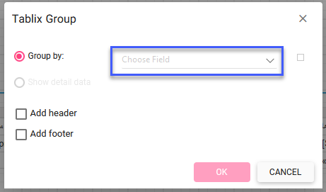
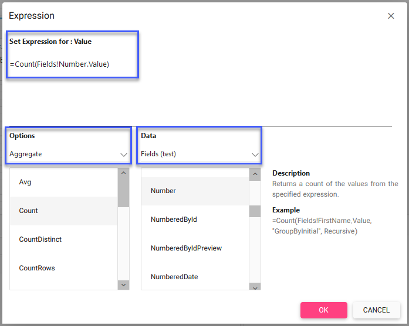
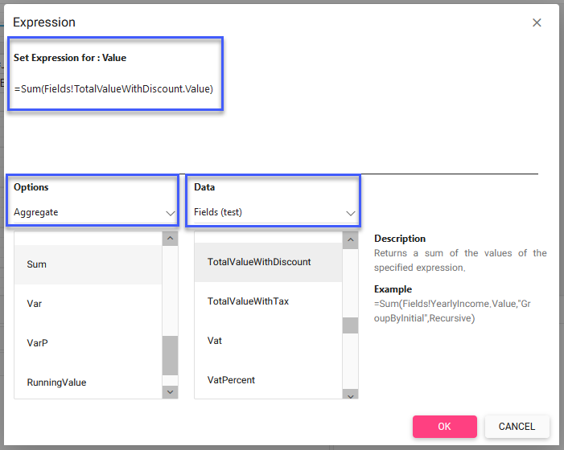

# موارد پرکاربرد در ساخت گزارش

## گروه‌بندی مقادیر مرتبط

برای مثال لیست تمامی فاکتورها صادر شده به‌ازای هر کارشناس را در نظر بگیرید، برای تهیه این لیست ابتدا روی سلول موردنظر از جدول کلیک راست کرده و Row Group را انتخاب و روی  Paren Group کلیک کنید 

در صفحه باز شده از قسمت Choose Field  فیلد موردنظر را انتخاب کنید. در این حالت باتوجه‌به فیلد انتخاب شده، گروه‌بندی مقادیر انجام شده و لیست مرتب شده را نمایش می‌دهد.
 

##  Aggregate توابع

### (Count) شمارش تعداد آیتم‌ها

برای مثال شمارش تعداد فاکتورها را در نظر بگیرید برای شمارش کافی است در صفحه Expression از منوی options  روی Aggregate کلیک کرده و Count را انتخاب کنید و از لیست data  روی فیلد موردنظر کلیک کنید. در این حالت باتوجه‌به فیلد انتخاب شده، تعداد را محاسبه و مقدار آن را نمایش می‌دهد.

###  (Sum) جمع‌کردن مقادیر فیلدها

برای مثال مجموع قیمت فاکتورها را در نظر بگیرید برای شمارش کافی است در صفحه Expression از منوی options  روی Aggregate کلیک کرده و Sum را انتخاب کنید و از لیست data  روی فیلد موردنظر کلیک کنید. در این حالت باتوجه‌به فیلد انتخاب شده، مقادیر فیلد را با هم جمع کرده و مقدار آن را نمایش می‌دهد.
 

