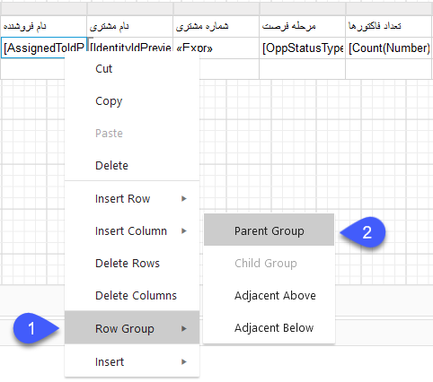

# موارد پرکاربرد در ساخت گزارش

## شمارش تعداد آیتم‌ها

برای مثال شمارش تعداد فاکتورها را در نظر بگیرید برای شمارش کافی است در صفحه Expression از منوی options  روی Aggregate کلیک کرده و Count را انتخاب کنید و از لیست data  روی فیلد موردنظر کلیک کنید. در این حالت باتوجه‌به فیلد انتخاب شده، تعداد را محاسبه و مقدار آن را نمایش می‌دهد.

## جمع‌کردن مقادیر فیلدها

برای مثال مجموع قیمت فاکتورها را در نظر بگیرید برای شمارش کافی است در صفحه Expression از منوی options  روی Aggregate کلیک کرده و Sum را انتخاب کنید و از لیست data  روی فیلد موردنظر کلیک کنید. در این حالت باتوجه‌به فیلد انتخاب شده، مقادیر فیلد را با هم جمع کرده و مقدار آن را نمایش می‌دهد.
 

## گروه‌بندی مقادیر مرتبط

برای مثال لیست تمامی فاکتورها صادر شده به‌ازای هر کارشناس را در نظر بگیرید برای تهیه این لیست کافی است روی سلول موردنظر از جدول کلیک راست کرده و Row Group را انتخاب کنید و از منو روی  Paren Group کلیک کنید و در Choose Field  فیلد موردنظر را انتخاب کنید. در این حالت باتوجه‌به فیلد انتخاب شده، گروه‌بندی مقادیر انجام شده و لیست مرتب شده را نمایش می‌دهد.
 
