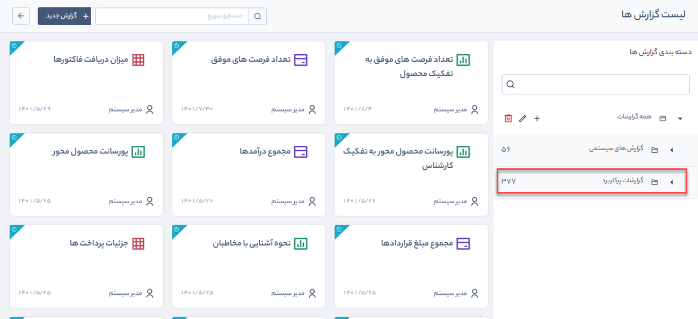

#  معرفی گزارش‌های پرکاربرد (گزارش‌های آماده)
در **لیست گزارش‌ها** علاوه بر دسته‌بندی گزارش‌های سیستمی و گزارش‌هایی که شما در بخش گزارش‌ساز جدید ایجاد کرده‌اید، دسته‌بندی جدیدی با نام **گزارش‌های پرکاربرد** اضافه شده است. 
گزارش‌های پرکاربرد آن دسته از گزارش‌هایی هستند که در قالب نمودار، جدول و کارت بر روی آیتم‌های CRM (فرصت، هویت، آیتم‌های فروش ...) توسط تیم تولید پیام‌گستر، طراحی و پیاده‌سازی شده است. 
این گزارشات به صورت آماده در 9 گروه **فروش**، **خرید**، **مارکتینگ**، **پشتیبانی مشتری**، **هویت**، **انبار**، **مالی**، **سیستمی** و **قرارداد** تهیه شده‌اند که دیگر نیازی به ساخت منابع اطلاعاتی، فرمول نویسی و تنظیمات ندارد و شما تنها با داشتن مجوز **مشاهده** گزارش، می‌توانید از هر یک از آن‌ها گزارش مد نظر خود را در فرمت‌های متنوع دریافت نمایید   

