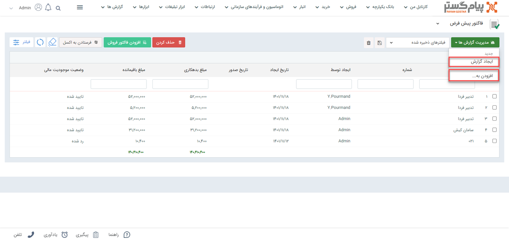
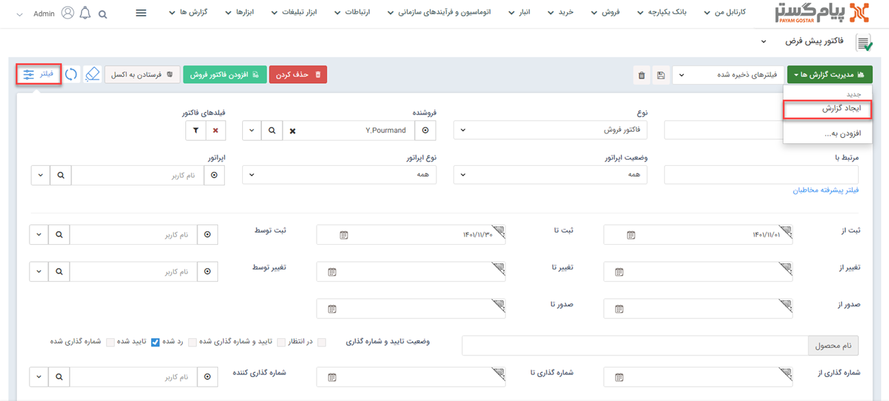
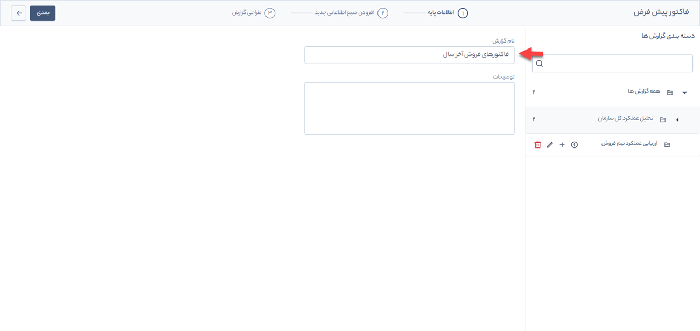
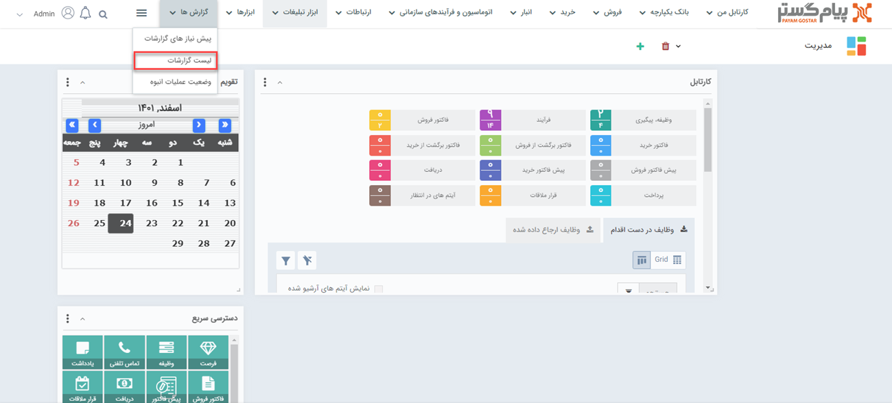
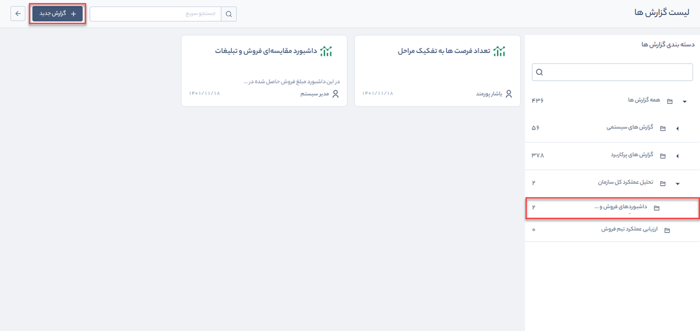
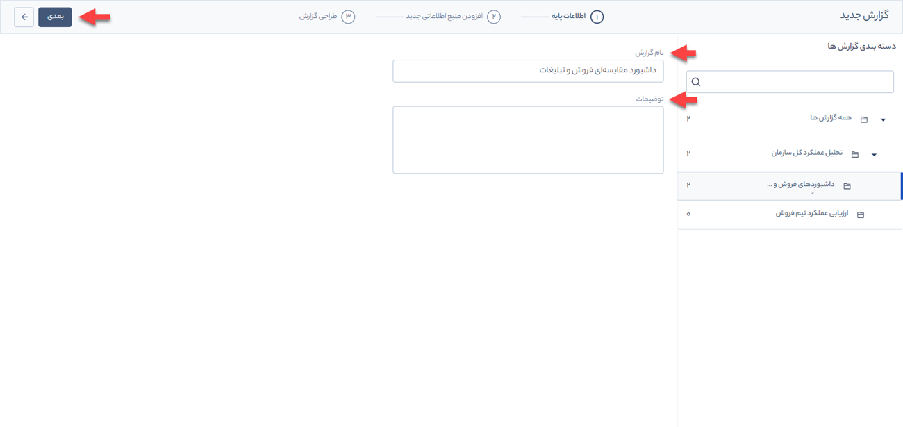

# ورود اطلاعات پایه گزارش
اولین مرحله در ایجاد گزارش جدید ورود اطلاعات پایه است که از دو مسیر آیتم‌ها و منوی گزارش‌‌ها صورت می‌گیرد. در ادامه جزئیات ورود اطلاعات از طریق این دو مسیر بررسی می‌شود. 
## ورود اطلاعات پایه از مسیر آیتم‌ها
برای ایجاد گزارش از آیتم موردنظر باید در لیست آن آیتم روی   **مدیریت گزارش‌ها** و گزینه **ایجاد گزارش** کلیک کنید.
> **نکته** 
در صورت داشتن ماژول گزارش‌ساز پیشرفته، امکان افزودن  این گزارش به گزارش‌های ساخته‌شده قبلی از طریق دکمه **افزودن به** وجود دارد.

برای ایجاد گزارش بر اساس پارامترهای مدنظرتان می‌توانید از **فیلتر** استفاده کنید. پس از انتخاب پارامترها، روی گزینه **ایجاد گزارش** کلیک کنید تا داده‌های گزارش فیلتر شود.

در ادامه صفحه‌ای نمایش داده می‌شود که می‌توان در آن نام گزارش را ویرایش و توضیحات لازم را به آن اضافه کرد. 

## ورود اطلاعات پایه از مسیر منوی گزارش‌ها 
برای ورود اطلاعات پایه با استفاده از این روش، در منوی **گزارش‌ها** بر روی **لیست گزارش‌ها** کلیک کنید.

 دسته‌بندی موردنظر خود را انتخاب و بر روی **گزارش جدید** کلیک کنید. 

نام گزارش و در صورت لزوم توضیحات خود را وارد و بر روی دکمه **بعدی** کلیک کنید.

