## گزارش‌گیری با استفاده از گزارش ساز

سند پیشرو دربردارنده شرح و توضیح موتور گزارش سازی است که به‌صورت Plug in در گزارش ساز نرم‌افزار CRM مورداستفاده قرار گرفته است. برای استفاده از این امکان لازم است مهارت‌های زیر را در سطح گزارش‌های مدنظر خود کسب کنید: 

- درک مناسبی از مدل‌های داده‌ای مورداستفاده و ارتباط داده‌ای: به طور مثال باید بدانیم که در گزارش مدنظر به چه اطلاعاتی از "فرصت"‌های ثبت شده در سیستم نیاز داریم و همچنین درصورتی‌که به داده‌های "هویت"‌های مرتبط این فرصت‌ها نیز نیاز داریم، باید بدانیم که داده‌های مربوط به فرصت‌ها و هویت‌ها در دو جدول مختلف نگهداری می‌شوند و با یک خصوصیت مشترک (کلید) به هم متصل می‌شوند. به‌این‌ترتیب و با تعمیم این دیدگاه می‌توان یک پایگاه‌داده رابطه‌ای (Relational ) را متصور شد که همه جداول آن با کلید‌های متعدد با هم در ارتباط هستند. 

- آشنایی ابتدایی با زبان RDL (Report Definition Language): در واقع Plug in یاد شده با استفاده از این زبان داده‌ها را از منابع داده‌ای در دسترس انتخاب کرده و در خروجی گزارش در اختیار شما قرار می‌دهد. این Plug in محیط نوشتار و ویرایشگری دستورات این زبان را در اختیار قرار می‌دهد. 

### شروع کار با گزارش ساز

برای آغاز به کار با گزارش ساز باید قبل از هر اقدامی مشخص کنید که قصد دریافت گزارش از چه داده‌هایی را دارید. در اصطلاح باید Date Set موردنظر خود را مشخص کنید. [1]

شما می‌توانید با انتخاب دکمه "مدیریت گزارش‌ها" و سپس با "ایجاد گزارش جدید" در لیست همه‌ی آیتم‌ها (موجودیت‌ها) اقدام به ایجاد گزارش جدید کنید. 

> نکته: برای دریافت این گزارش کاربر بایستی مجوز مشاهده گزارش‌های ساخته شده را داشته باشد. 

در صورت دارابودن ماژول گزارش ساز پیشرفته، امکان افزودن این گزارش به گزارش‌های ساخته شده قبلی از طریق دکمه "افزودن به" وجود دارد.

### ایجاد گزارش جدید

برای ایجاد گزارش جدید از آیتم موردنظر بایستی در لیست آن آیتم روی گزینه ایجاد گزارش کلیک کنید. اگر می‌خواهید بر اساس پارامتر یا پارامتر‌های خاصی این گزارش را بسازید می‌توان ابتدا بر اساس پارامتر‌های مد نظرتان این لیست را فیلتر کنید و سپس روی گزینه ایجاد گزارش کلیک کنید که این راه یک راه برای فیلتر دیتاهای گزارش مورد نظرتان است.

با کلیک بر روی ایجاد گزارش مراحل ایجاد گزارش آغاز می‌شود .

**A.افزودن هویت‌های مرتبط:** برای ساخت گزارش جدید در گام اول، امکان افزودن فیلد‌های، هویت‌های مرتبط با آیتم در اختیار کاربر قرار می‌گیرد و به‌این‌ترتیب کاربر می‌تواند این داده‌ها را نیز به مجموعه‌داده‌های موردنظر برای دریافت گزارش بیفزاید.

به‌عنوان‌مثال شما می‌توانید با استفاده از این امکان، شماره موبایل هویت مرتبط با آیتم موردنظر را در گزارش داشته باشید.

**B. افزودن منابع:** در صورت دارابودن ماژول گزارش ساز پیشرفته با استفاده از این کلید، این امکان به کاربر داده شده است که از منابع مختلفی برای تهیه گزارش موردنظر استفاده کرد که پیش‌تر دررابطه‌با این موارد توضیح داده خواهد شد .

**C. آدرس سرویس:**  در صورت دارابودن ماژول گزارش ساز پیشرفته و همچنین سازمانی بودن نسخه نرم‌افزار می‌توان از دیتای این گزارش در نرم‌افزار پیشرفته‌ی PowerBi   استفاده کرد. برای این منظور باید آدرس موجود در این بخش را در نرم‌افزار PowerBI در Get Data قسمت web  جای‌گذاری کنید، سپس با استفاده از فرمول‌های مختلف، گزارشات موردنظر خود را در این نرم‌افزار ایجاد نمایید. 

> نکته: در نسخه استاندارد امکان استفاده از powerBi وجود ندارد.

**D.ویرایش:** با استفاده از این قسمت می‌توان دیتا سورس انتخاب شده برای گزارش‌گیری را ویرایش کرد و آیتم دیگری را برای گزارش موردنظر انتخاب کرد .

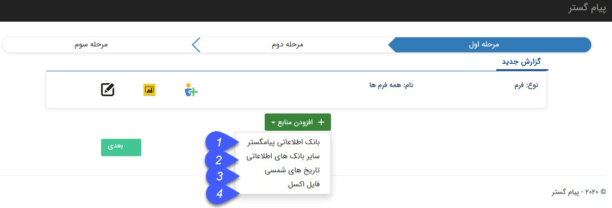

**1.بانک اطلاعاتی پیام‌گستر:** از منابع پیام‌گستر زمانی استفاده می‌شود که بخواهیم علاوه بر موجودیتی که در حال گزارش‌گیری آن هستیم از موجودیت‌های دیگری در این گزارش استفاده کنیم.

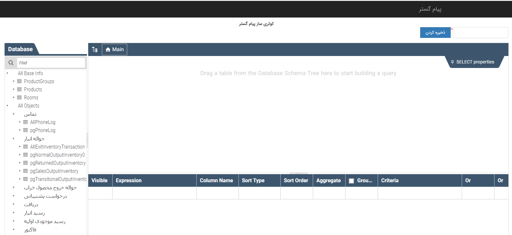

در این بخش امکان انتخاب موجودیت‌های اصلی (مثلاً تمام فرم‌ها) و یا زیر نوع تعریف شده برای موجودیت (مثلاً فرم مرخصی) را فراهم می‌کند. در اصل در این قسمت فیلد‌های موردنیاز از هر موجودیت انتخاب می‌شود تا در مرحله بعد برای گزارش‌گیری مورداستفاده قرار گیرد.

>  نکته: در این قسمت موجودیت‌ها و فیلد‌هایی نمایش داده می‌شود که کلید کاربر برای آنها در شخصی‌سازی CRM تعریف شده باشد و همچنین با استفاده از منابع بانک اطلاعاتی پیام‌گستر علاوه بر موجودیت‌های پیام‌گستر می‌توان از لیست محصولات، محصولات و همچنین اتاق‌ها گزارش داشت.

از منوی database، موجودیت(های) موردنظر خود را انتخاب کنید، لیست فیلد‌های آن در منو Main به‌صورت جدول، نمایش داده می‌شود. می‌توان تمام فیلد‌ها و یا فیلد‌هایی که برای گزارش نیاز است را از این بخش انتخاب نمود . 

در انتخاب فیلد موجودیت‌ها، برای فیلد‌هایی که از جنس هویت هستند (مانند مرتبط با (identityid) و یا ایجادکننده آیتم (creatorid) و ...  ) اگر بخواهیم فیلد خاصی از آن هویت رو در این منبع داشته باشیم تا در گزارش استفاده کنیم، می‌توانیم با بازکردن ویژگی‌های آن فیلد (1) اطلاعاتی که از آن هویت نیاز است را انتخاب و به آن موجودیت متصل کنیم، در گزارش داشته باشیم .

 برای مثال می‌خواهیم طبق تصویر،‌ایمیل هویت مرتبط با این فرم رو در گزارش داشته باشیم از این روش استفاده می‌کنیم.
  
 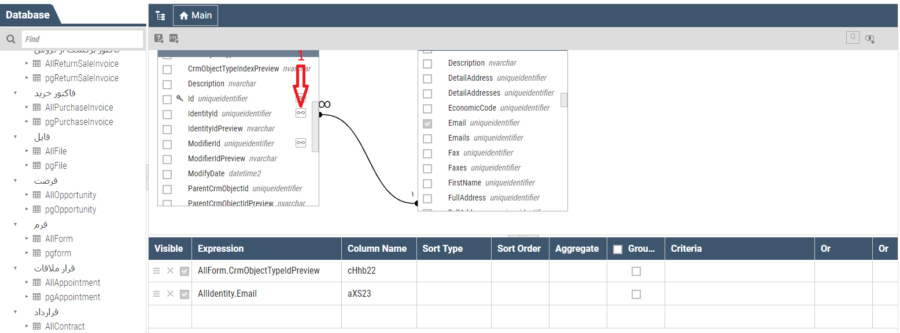
  
**visible:** از این بخش امکان انتخاب و یا حذف فیلد‌های انتخاب شده وجود دارد.

**expression:** در این قسمت نام فیلد‌ها نمایش داده می‌شود و اسم آن موجودیت را به‌صورت پیشوند به فیلد‌ها اضافه می‌کند تا مشخص شود هر فیلد از کدام آیتم انتخاب شده است .

**column Name:** اسم مربوط به هر فیلد که در مرحله بعد برای گزارش‌گیری نمایش داده می‌شود

**sort type:** می‌توانید المانی را برای مرتب‌سازی فیلد‌ها انتخاب کنید.

**criteria:**  می‌توان از این بخش فیلتر‌های موردنظر بر روی هر فیلد اعمال کرد (در این مرحله برای هر فیلد می‌شود تا سه مرحله فیلتر تعریف کرد، اگر بخواهیم بیش از سه فیلتر استفاده شود باید از طریق کدنویسی در محیط SQL  پایین صفحه استفاده کرد.) 
اگر کاربر بخواهد از روش پیشرفته‌تری گزارش داشته باشد می‌تواند از طریق کدنویسی در محیط   SQL  استفاده کند، با استفاده از این روش می‌تواند فیلتر‌های مشخصی را اعمال و یا بر اساس المانی فیلد‌ها را مرتب‌سازی کند.

هنگام استفاده از این محیط پس از اضافه نمودن تغییرات موردنظر حتماً باید کلید بروز رسانی زده شود، تا موارد اعمال شده در جدول قرار گیرد .
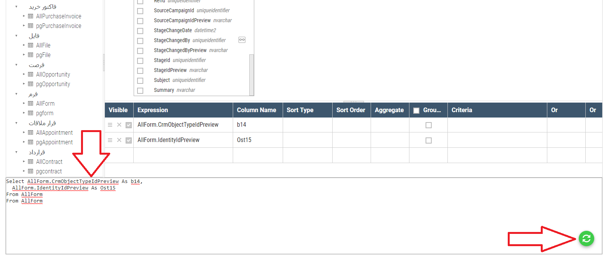

**2.سایر بانک‌های اطلاعاتی:** استفاده از این قابلیت، این امکان را به کاربر خواهد داد تا برای ساخت گزارش مدنظر اطلاعات موردنیاز خود از سایر بانک‌های اطلاعاتی دیگر به منابع این گزارش اضافه کند.

به‌عنوان‌مثال کاربر می‌تواند از دیتابیس نرم‌افزار حسابداری موجودیت‌های حسابداری موردنظر رو به پیام‌گستر متصل کند و گزارشی داخل پیام‌گستر داشته باشد .

برای نمونه می‌خواهید گزارشی از دستمزد کاربران داشته باشید، کاربران در پیام‌گستر و حقوق کاربران در سیستم حسابداری تعریف شده است، با استفاده از این امکان می‌تواند اطلاعات موردنظر برای این گزارش را از سیستم حسابداری به این گزارش منتقل کند.

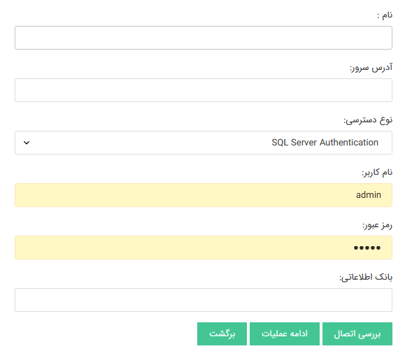

**نام:**  یک نام برای این منبع بانک اطلاعاتی انتخاب کنید.

**آدرس سرور:** در این بخش آدرس سرور بانک اطلاعاتی را وارد کنید.

**نوع دسترسی:**  دسترسی به دیتابیس موردنظر از دو طریق امکان‌پذیر است:

**1. Windows Authentication:**      از طریق user که لاگین است .

**2. SQL Server Authentication:** از طریق user و پسورد مشخص دیتابیس .

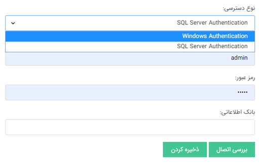

**بانک اطلاعاتی:** نام بانک اطلاعاتی موردنظر باید وارد شود، زیرا ممکن است در آن آدرس وارد شده چندین بانک اطلاعاتی وجود داشته باشد .

**بررسی اتصال:** امکان بررسی صحت اطلاعات ثبت شده

موجودیت‌های بانک اطلاعاتی دیگر هم مانند منبع بانک اطلاعاتی پیام‌گستر، نمایش داده می‌شود که کاربر باتوجه‌به نیاز موجودیت‌های موردنظر خود را برای ایجاد گزارش انتخاب می‌کند .

**3.تاریخ‌های شمسی:**

با استفاده از اضافه‌کردن بانک تاریخ‌های شمسی می‌توان نحوه نمایش فیلد‌های تاریخی موجود در گزارش را مشخص کرد.

به‌عنوان‌مثال می‌توان نحوه نمایش تاریخ ایجاد آیتم را مشخص کرد که چندمین روز از سال شمسی است .

**4. فایل اکسل:**

با استفاده از این قابلیت این امکان فراهم می‌شود تا فایل اکسلی به‌عنوان منبع به گزارش اضافه شود .

به‌عنوان‌مثال کاربر برای تهیه گزارش خود به اطلاعات موجود در فایل اکسلی نیاز دارد، با استفاده از این قابلیت این امکان فراهم می‌گردد که فایل اکسل موردنظر را به گزارش اضافه کند.

**نام:**  یک نام برای این بانک اطلاعاتی در نظر بگیرید.

اتصال فایل اکسل به گزارش از سه طریق قابل انجام است

**1)**  انتخاب فایل اکسل به‌صورت مستقیم

**2)**  انتخاب مسیر فایل اکسل زمانی که در شبکه بارگذاری شده است

**3)**  از طریق آدرس url

اولین ردیف فایل اکسل، به‌عنوان سرستون انتخاب می‌شود، سر ستون‌ها به‌عنوان فیلدهای موردنظر برای گزارش در نظر گرفته می‌شود .

> نکته:  در گزارش‌گیری از فایل اکسل، اطلاعات موجود در فایل اکسل در همان لحظه گزارش داده می‌شود، نه زمانی که فایل اکسل به گزارش اضافه شده است.

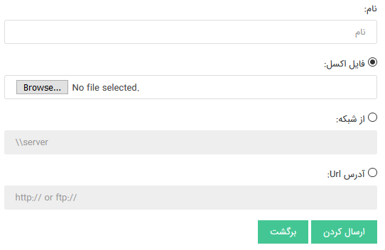

پس از انتخاب منابع موردنیاز با دکمه "بعدی" وارد گام دوم از ساخت گزارش می‌شوید:

شما با کلیک کردن بر روی تب(1) Data می‌توانید منابع داده‌ای اضافه شده به این گزارش را مشاهده کنید.

محیطی که در اختیار دارید محیط طراحی گزارش می‌باشد و امکانات زیر را در اختیار خواهید داشت:

برای فعال‌سازی Header   و  Footer به گزارش، می‌توان از آیکون‌های زیر استفاده نمود:

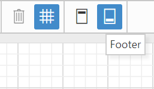

  برای ایجاد یک نمونه گزارش لیستی از ToolBox   بخش  DataRegions می‌توان یک  grid به صفحه اضافه کرد.
 
  
 
  برای پرکردن grid که به صفحه افزوده‌اید، باید روی تب Properties(1)  کلیک کرده سپس از منوی باز شده روی بخش Data(2)  کلیک کنید

در بخش Data، داده‌های مربوط به موجودیتی که روی آن اقدام به گزارش سازی کرده‌ایم، نمایش داده می‌شود و یا می‌توان از (1) منابع اضافه شده به گزارش را برای تهیه گزارش انتخاب نمود. برای برقراری ارتباط بین منبع‌های افزوده شده جلوتر توضیح داده خواهد شد.

 این داده‌ها در دو بخش زیر نمایش داده می‌شوند: 

**1.Measures**
در این گروه تمام فیلد‌هایی که ماهیت عدد و پول داشته باشند نمایش داده می‌شوند.

**2.Dimensions**
در این گروه تمام فیلد‌هایی با ماهیت غیر عددی نمایش داده می‌شوند.

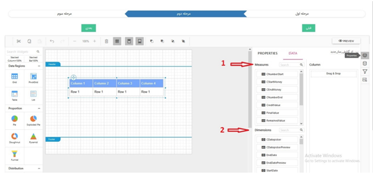

قابل‌ذکر است که داده‌های مربوط به هویت‌ها در این مرحله در دسترس نیستند و در بخش Expression در دسترس قرار خواهند گرفت. این بخش توضیح داده خواهد شد.

تنها فیلد‌های اضافه‌ای که دارای کلید کاربر هستند در داده‌های قابل گزارش‌گیری قابل‌مشاهده و استفاده هستند.

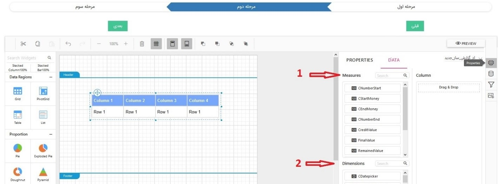

> . نکته: برخی فیلد‌ها به دو صورت قابل‌استفاده‌اند:

 استفاده از مقدار آنها و یا مقدار نمایشی آنها؛ بنابراین برای تمایز بین این مقادیر کلمه preview به انتهای فیلد نمایشی اضافه شده است.

مثال: فیلد‌های IdentityId و IdentityIdPreview  در مورد هویت‌ها، در ادامه از فیلد  IdentityPreview زمانی استفاده می‌کنیم که بخواهیم نام هویت مرتبط با آیتم جاری را نمایش دهیم. 

 

لازم به ذکر است، زمانی فیلد Identity   مورداستفاده قرار می‌گیرد که قصد ایجاد ارتباط بین هویت‌ها و سایر آیتم‌ها را داشته باشیم. به‌این‌ترتیب این فیلد تحت عنوان یک کلید مورداستفاده است.

در ادامه چگونگی برقراری این ارتباط را در استفاده از بخش Expression توضیح داده خواهد شد.

  یک مثال:

فرض کنید قصد داریم رنگ هویت‌های مرتبط با لیست موجودیت انتخاب شده را در گزارش به‌عنوان خروجی دریافت کنیم.

برای اینکه مشخص کنیم چه ستون‌های داده‌ای قرار است در گزارش نمایش داده شوند و یا از کدام ستون‌ها برای نوشتن از عبارات RDL استفاده خواهیم کرد، ستون‌های مدنظر را به بخش Column می‌افزاییم.

به‌این‌ترتیب در این مثال ستون IdentityId و سایر ستون‌هایی که در عکس مشاهده می‌کنید را در بخش Column قرار می‌دهیم.

برای دسترسی به داده‌های هویت و همچنین برقراری ارتباط و در دسترس قراردادن داده‌های ترکیبی، باید از نوشتن عبارات RDL استفاده کنیم. برای این کار، روی چرخ‌دنده کنار فیلد کلیک کرده و روی گزینه Experssion  کلیک می‌کنیم. 

با کلیک روی گزینه Expression، فرم زیر را در اختیار خواهیم داشت: 

در قسمت اول در بالای صفحه (3)، می‌توان دستورات RDL را وارد کرد . 

در قسمت Data، امکان انتخاب دیتاهای موردنظر را در اختیار کاربر قرار می‌گذارد، در بخش 1 امکان انتخاب نوع موجودیت و از بخش 2 امکان انتخاب فیلد‌های آن موجودیت وجود دارد، در این مثال این داده‌ها مربوط به هویت(1) می‌باشند. به‌این‌ترتیب تمام فیلد‌های هویت در بخش (2) در اختیار قرار می‌گیرند. 

ذکر دو نکته الزامی است: 

**1**. باوجوداینکه IdentityId از فیلد‌های هویت می‌باشد، در لیست داده‌های اولیه در اختیار بود. این به این دلیل است که این فیلد یک کلید برای ارتباط می‌باشد؛ بنابراین می‌دانیم که در مدل‌های ارتباطی، ستون‌هایی که کلید هستند، در داده‌های اولیه مربوط به لیستی که روی آن اقدام به گزارش سازی کرده‌ایم موجود می‌باشند. 

**2**. کلیه منابع داده‌های افزوده شده به گزارش، در پنجره Expression و در بخش Data برای استفاده در اختیار قرار دارند. 

 

برای دریافت رنگ همه هویت‌های مرتبط با آیتم‌های لیست اولیه، می‌توان از نوشتن عبارت زیر در بخش Set Expression For Column استفاده کرد: 

	=LookUp (Fields!IdentityId.Value, Fields!Id.Value, Fields!ColorIdPreview.Value, “همه_هویت_ها”)
	

این عبارت یک LookUp می‌سازد. LookUp در واقع یک لیست از داده‌هایی است که طبق شرایط خاصی ساخته شده و در اختیار قرار می‌گیرد. قسمت اول، دوم و چهارم این عبارت همیشه ثابت است و تنها قسمت سوم پرانتز می‌باشد که به فراخور نیاز دربردارنده ستون‌های مختلفی از هویت می‌باشد. 
این عبارت هویت‌هایی که ستون Id آنها با ستون IdentityId آیتم‌های لیست اولیه برابر است را پیدا کرده و مقدار رنگ آنها را بازگردانده و در یک لیست قرار می‌دهد و این لیست را به‌عنوان یک lookup در اختیار قرار می‌دهد. 

**Data:** لیست تمامی منابع گزارش از این بخش قابل‌مشاهده است. 

**Parameters:** با استفاده از کلید new parameter می‌توان پارامتر جدیدی را برای فیلتر گزارش و یا مرتب‌سازی گزارش استفاده کرد. نحوه استفاده از این پارامتر برای فیلتر و مرتب‌سازی گزارش جلوتر توضیح داده خواهد شد. 

برای دسترسی به داده‌های هویت و همچنین برقراری ارتباط و در دسترس قرار دادن داده‌های ترکیبی، باید از نوشتن عبارات RDL استفاده کنیم. برای این کار، روی چرخ دنده کنار فیلد کلیک کرده و روی گزینه Experssion  کلیک می‌کنیم. 

با کلیک روی گزینه Expression، فرم زیر را در اختیار خواهیم داشت:

در قسمت اول در بالای صفحه (3)، می‌توان دستورات RDL را وارد کرد .

در قسمت Data، امکان انتخاب دیتاهای موردنظر را در اختیار کاربر قرار می‌گذارد، در بخش 1 امکان انتخاب نوع موجودیت و از بخش 2 امکان انتخاب فیلد‌های آن موجودیت وجود دارد، در این مثال این داده‌ها مربوط به هویت(1) می‌باشند. به‌این‌ترتیب تمام فیلد‌های هویت در بخش (2) در اختیار قرار می‌گیرند.

ذکر دو نکته الزامی است:

**1**. باوجوداینکه IdentityId از فیلد‌های هویت می‌باشد، در لیست داده‌های اولیه در اختیار بود. این به این دلیل است که این فیلد یک کلید برای ارتباط می‌باشد؛ بنابراین می‌دانیم که در مدل‌های ارتباطی، ستون‌هایی که کلید هستند، در داده‌های اولیه مربوط به لیستی که روی آن اقدام به گزارش سازی کرده‌ایم موجود می‌باشند. 

**2**. کلیه منابع داده‌های افزوده شده به گزارش، در پنجره Expression و در بخش Data برای استفاده در اختیار قرار دارند.

 

برای دریافت رنگ همه هویت‌های مرتبط با آیتم‌های لیست اولیه، می‌توان از نوشتن عبارت زیر در بخش Set Expression For Column استفاده کرد:

	=LookUp (Fields!IdentityId.Value, Fields!Id.Value, Fields!ColorIdPreview.Value, “همه_هویت_ها”)

این عبارت یک LookUp می‌سازد. LookUp در واقع یک لیست از داده‌هایی است که طبق شرایط خاصی ساخته شده و در اختیار قرار می‌گیرد. قسمت اول، دوم و چهارم این عبارت همیشه ثابت است. و تنها قسمت سوم پرانتز می‌باشد که به فراخور نیاز در بردارنده ستون‌های مختلفی از هویت می‌باشد.

این عبارت هویت‌هایی که ستون Id آنها با ستون IdentityId آیتم‌های لیست اولیه برابر است را پیدا کرده و مقدار رنگ آنها را بازگردانده و در یک لیست قرار می‌دهد و این لیست را به‌عنوان یک lookup در اختیار قرار می‌دهد.

**Data:** لیست تمامی منابع گزارش از این بخش قابل‌مشاهده است.

**Parameters:**  با استفاده از کلید new parameter میتوان پارامتر جدیدی را برای فیلتر گزارش و یا مرتب سازی گزارش استفاده کرد. نحوه استفاده از این پارامتر برای فیلتر و مرتب سازی گزارش جلوتر توضیح داده خواهد شد.  

**Name:**  نام پارامتر موردنظر خود را به انگلیسی وارد کنید.

**Prompt:**  نامی که برای دسترسی به این پارامتر می‌خواهید تعریف کنید را وارد کنید.

**Data type:**  نوع پارامتر موردنظر را انتخاب کنید. (لازم به ذکر است نوعی که برای پارامتر انتخاب می‌کنید با نوع فیلدی که می‌خواهید بر اساس آن فیلتر و یا مرتب‌سازی انجام دهید باید یکسان باشد) 

**Allow blank value:**  اگر می‌خواهید در صورت خالی بودن پارامتر، جستجو انجام شود می‌توانید این چک باکس را فعال کنید.

**Allow null value:**  اگر می‌خواهید در صورت null پارامتر جستجو انجام شود، می‌توانید این چک باکس را فعال کنید.

**Allow multiple values:** اگر می‌خواهید این پارامتر با چند مقدار جستجو انجام دهد می‌توانید این چک باکس را فعال کنید .

**Visibility:** تنظیمات نمایش این پارامتر را می‌توانید از این قسمت انجام دهید.

**Assign value:**  برای اینکه این پارامتر دارای مقادیر مشخص برای فیلتر یا مرتب‌سازی باشد می‌توان از این بخش استفاده کرد.

#### تعریف فیلتر برای گزارش: 

پس از انتخاب فیلد‌های موردنظر برای گزارش‌گیری از تب data، از بخش properties می‌توان فیلتر و یا نحوه مرتب‌سازی خود را تعریف کنید

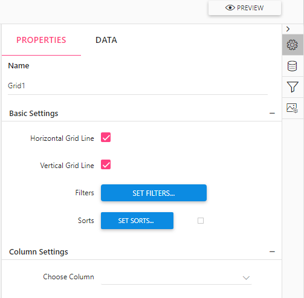

**Set filters:** با کلیک بر روی دکمه add می‌توانید یک فیلتر جدید تعریف کنید. 

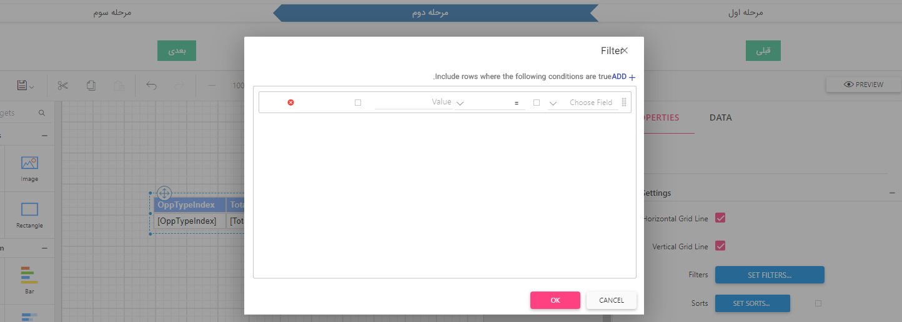

**choose field:** فیلدی که می‌خواهید بر اساس آن گزارش خود را فیلتر کنید از این بخش انتخاب کنید.

**2:** از این بخش نوع فیلتر را می‌توانید انتخاب کنید

**Value:** اگر بخواهید تنها فیلتر با مقدار مشخصی اعمال گردد آن مقدار را می‌توانید در این بخش وارد کنید.

به‌عنوان‌مثال: می‌خواهید گزارشی از آیتم‌هایی با تاریخ ایجاد قبل از تاریخ 30 آذر 98 داشته باشید، ابتدا فیلد   create date را از بخش choose field  انتخاب کنید، سپس علامت کمتر را انتخاب کنید و تاریخ موردنظرتان را در بخش value  وارد کنید.

**reset:**  با reset  می‌توان مقدار value  را تعریف شده را حذف کرد.

**Expression:**     از این بخش می‌توان پارامتری که در بخش   Parameters  تعریف شده را برای نمایش این فیلتر انتخاب کرد. در واقع تنظیمات نمایشی فیلتر در بخش Parameters   تعریف می‌شود و اینکه این فیلتر روی کدام فیلد اعمال شود از بخش choose field انتخاب می‌گردد.

**5**.با این کلید می‌توانید فیلتر موردنظر خود را حذف کنید .

**Set sorts:** با کلیک بر روی دکمه add می‌توانید یک نحوه مرتب‌سازی جدید تعریف کنید.

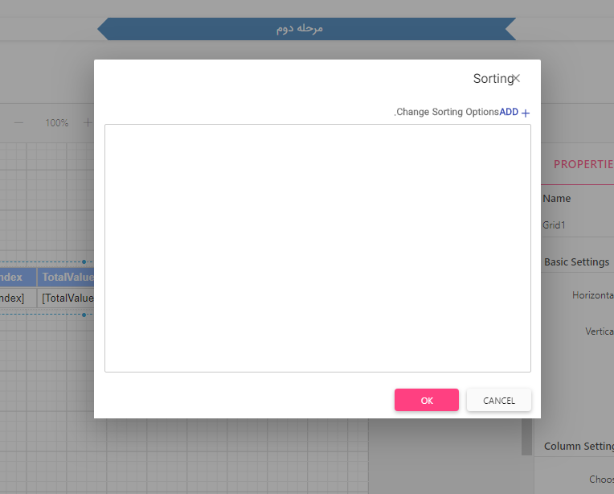

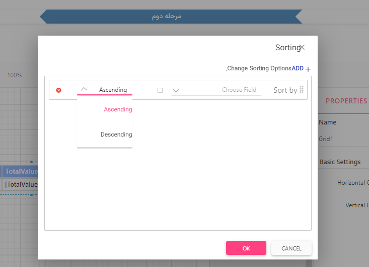

**choose field:** فیلدی که می‌خواهید بر اساس آن رکوردهای خود را مرتب کنید از این بخش انتخاب کنید.

**reset:**  با reset  می‌توان فیلد انتخاب شده را حذف کرد.

**Expression:**     از این بخش می‌توان پارامتری که در بخش   Parameters  تعریف شده است را برای نمایش این نحوه مرتب‌سازی انتخاب کرد. در واقع تنظیمات نمایشی این پارامتر در بخش Parameters   تعریف می‌شود و اینکه این مرتب‌سازی روی کدام فیلد اعمال شود از بخش choose field انتخاب می‌گردد.

**1**. نحوه مرتب‌سازی (صعودی / نزولی) مشخص کنید .

**2**. با این کلید می‌توانید مرتب‌سازی موردنظر خود را حذف کنید. 

#### مشاهده خروجی گزارش
برای مشاهده خروجی گزارش طراحی شده از گزینه Preview  استفاده کنید. قابل‌ذکر است که در حالت طراحی زمانی که روی دکمه Preview کلیک می‌کنید فقط 10 رکورد از خروجی موردنظر را مشاهده خواهید کرد. ولی در زمان اجرای گزارش، خروجی‌های کامل را در اختیار خواهید داشت.

اعمال تغییرات روی ستون‌های گریدی که در طراحی به گزارش افزوده شده

بدیهی است که ممکن است قصد ویرایش گرید وارد شده به طراحی گزارش را داشته باشید.

برای اعمال تغییرات کافی است روی گرید کلیک کرده در تب Properties  روی گزینه Properties کلیک کنید. به‌این‌ترتیب کلیه خصوصیات گرید انتخاب شده را مشاهده خواهید کرد. 

به‌عنوان‌مثال برای تغییر عنوان ستون‌ها کافی است در بخش Column Setting ، از گزینه (1) ChooseColumn برای انتخاب ستون موردنظر و در بخش پایین آن (2) نام موردنظر را وارد کنیم.

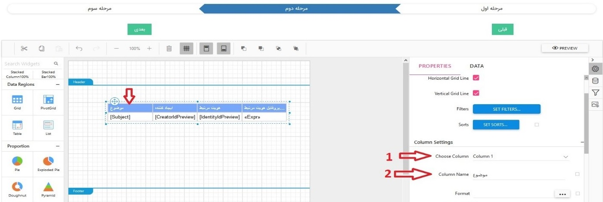

> نکته: در صورت ویرایش ستون‌های گزارش، ترتیب ستون‌ها در بخش تنظیمات مربوط به نام نمایش ستون‌ها (column setting) جابه‌جا شده و باید دوباره مرتب شود.

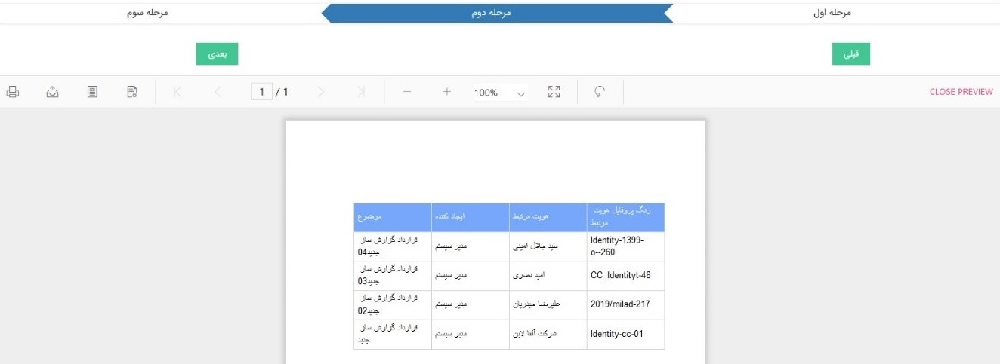

> نکته: در صورت ویرایش ستون‌های گزارش، ترتیب ستون‌ها در بخش تنظیمات مربوط به نام نمایش ستون‌ها (column setting) جابه‌جا شده و باید دوباره مرتب شود.

با کلیک بر روی دکمه ارسال کردن به گام بعدی منتقل می‌شوید.

### گام سوم: ذخیره گزارش

پس از انجام این مراحل و طراحی گزارش مربوطه نام موردنظر و یک دسته‌بندی برای ذخیره گزارش انتخاب کنید

> نکته: امکان افزودن دسته‌بندی جدید، تغییر نام و حذف یک دسته‌بندی از این بخش وجود دارد .

با کلیک بر روی دکمه نهایی گزارش ذخیره می‌گردد .

ساخت گزارش حساس به زبان سیستم
در نظر داشته باشید که یک گزارش باید به زبان سیستم حساس باشد. به این معنی که اگر گزارشی طراحی می‌کنید این گزارش در زبان فارسی نمایش متفاوتی از زبان انگلیسی دارد. برای طراحی گزارش به این صورت می‌توانید به شرح زیر عمل کنید:

شما می‌توانید در هر طراحی یک گزارش یکبار آن را در مود راست به چپ و یکبار آن را مود چپ به راست ذخیره کنید. به‌این‌ترتیب طراحی راست به چپ در زبان فارسی و طراحی چپ به راست در زبان انگلیسی در اختیار خواهند 

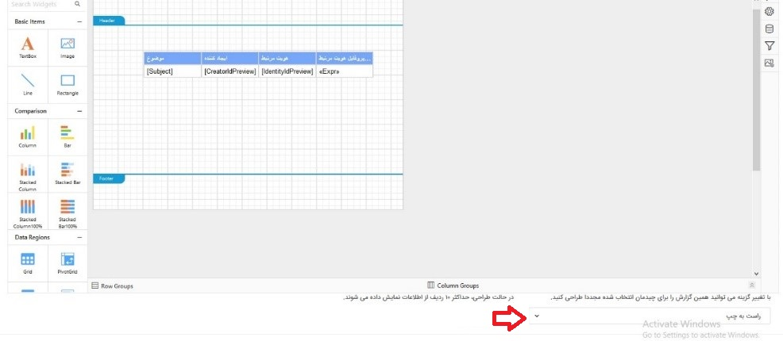

افزودن سورس داده‌ای به یک گزارش ازپیش‌ساخته شده
در صفحات لیست با کلیک روی دکمه مدیریت گزارش‌ها و بعد انتخاب یکی از گزارش‌های از قبل ساخته شده، این امکان وجود دارد که این لیست نیز به‌عنوان یک منبع داده‌ای به گزارش موردنظر افزوده شود.  این داده‌ها در بخش Expression طراحی گزارش و در بخش Date در اختیار قرار می‌گیرند.

 با استفاده از این قابلیت این امکان فراهم است که منبع‌های مختلفی در گزارش داشته باشیم و یا ارتباط بین دو منبع را از طریق نوشتن عبارات RDL  فراهم کنیم.

به‌عنوان نمونه، ما در سوابق فرم، قرارداد ایجاد کرده‌ایم، در گزارش از قراردادها می‌خواهیم ویژگی‌هایی از فرمی که به این قرارداد مرتبط است را نیز داشته باشیم. برای مثال نام فرم مرتبط با این قرارداد را در گزارش خود داشته باشیم.

برای این کار درصورتی‌که گزارشی از قرار داده ایجاد کرده باشیم می‌توانیم در لیست فرم‌ها در مدیریت گزارش، این گزارش را به گزارش تهیه شده از قرارداد بیفزاییم. حال در گزارش قرارداد، منبع گزارش فرم‌ها هم اضافه شده است که می‌توانیم با EXPRESSION  روی فیلد کلید که در این مثال موجودیت پدر (Parentcrmobjectid) می‌باشد این ارتباط را برقرار کنیم.

نمونه کد مربوط به این مثال

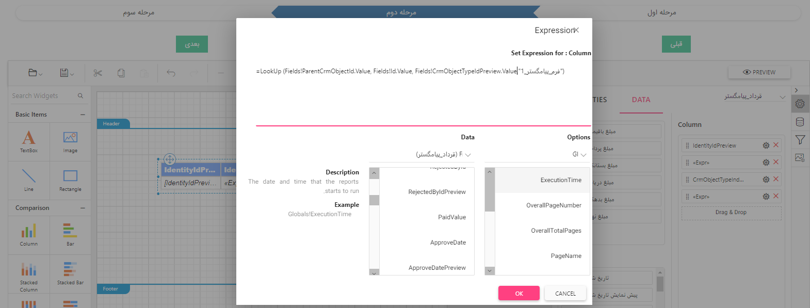