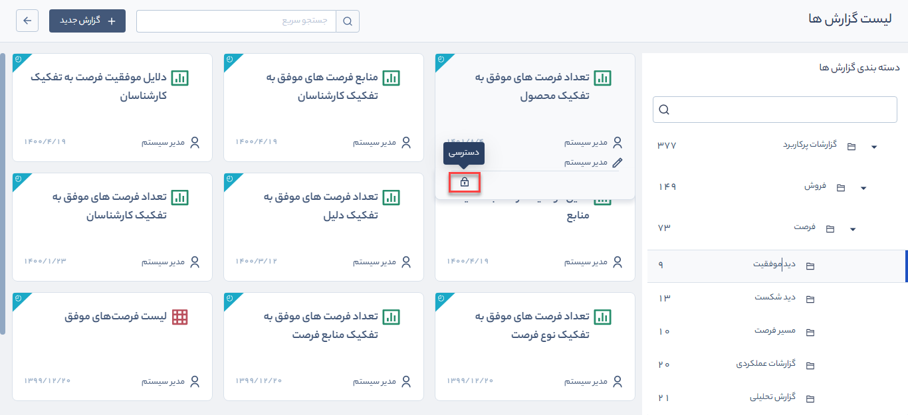
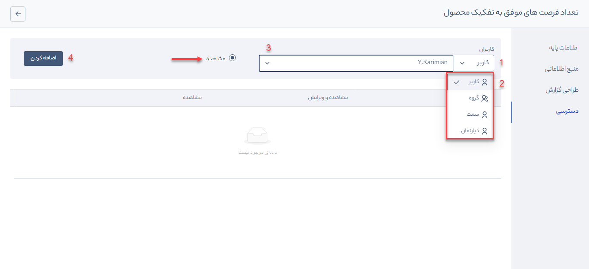
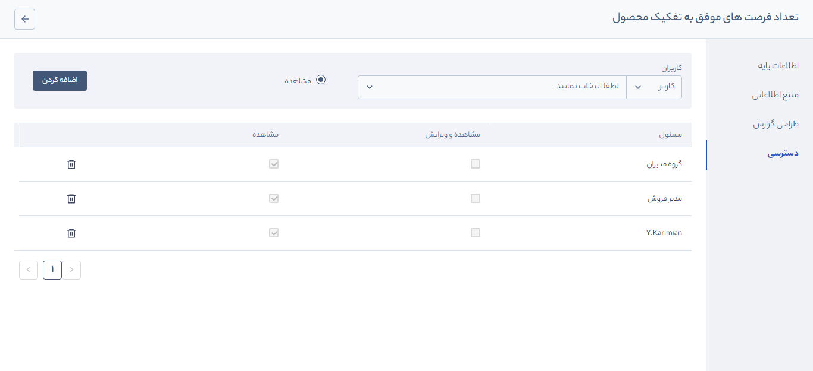

# تنظیمات دسترسی به گزارشات
گزارش‌های **سیستمی** و **پرکاربرد** از آن دسته گزارش‌هایی هستند که به طور پیش‌فرض در نرم‌افزار وجود دارد و شما تنها می‌توانید با فرمت مورد نظر خود، گزارش دریافت کنید. کاربر با مجوز **مدیر سیستم** امکان **مشاهده** همه‌ی گزارش‌ها را دارد و تنها راهبر نرم‌افزار می‌تواند دسترسی مشاهده را به سایر کاربران تخصیص دهد.

## تخصیص دسترسی مشاهده گزارش به کاربران
همانطور که در بخش قبل گفتیم، تخصیص دسترسی به گزارشات تنها توسط مدیر سیستم انجام می‌شود. این عملیات را با ذکر مثال شرح خواهیم داد. می‌خواهیم به **مدیر فروش** دسترسی مشاهده گزارش **تعداد فرصت های موفق به تفکیک محصول** را بدهیم.
1. از منوی سه خط مسیر گزارش‌ها > **لیست گزارش‌ها** > **گزارش‌های پرکاربرد** > **فروش** > **فرصت** > **دید موفقیت** را کلیک کنید.
2. از لیست گزارش‌های نمایش داده شده گزارش **تعداد فرصت های موفق به تفکیک محصول** را بیابید.
3. موس را روی کارت گزارش نگه دارید، کادری با آیکن **قفل** نمایش داده می‌شود. روی آیکن قفل کلیک کنید تا وارد محیط تعیین دسترسی گزارش شوید.

4.  در این بخش می‌توانید به روش‌های مختلف **کاربر**، **گروه کاربران**، **سمت** و **دپارتمان** مجوز مشاهده را به کاربران تخصیص دهید.

طبق تصویر بالا و مراحل تعیین شده عمل کنید: 
   1. روی کلمه **کاربر** کلیک کنید. 
   2. تعیین کنید که به کدام روش می‌خواهید به کاربر/کاربران سیستم روی این گزارش دسترسی دهید (کاربر، گروه، سمت یا دپارتمان).
   3. در هرکدام از  حالت‌ها، لیستی به شما نمایش داده می‌شود. اگر کاربر را انتخاب کنید لیستی از **کاربران فعال** سیستم در اختیار شما قرار می‌گیرد که باید کاربر مورد نظر خود را انتخاب کنید.
   4. در نهایت روی دکمه **اضافه کردن** کلیک کنید تا کاربر انتخاب شده به جدول پایین صفحه اضافه شود.

