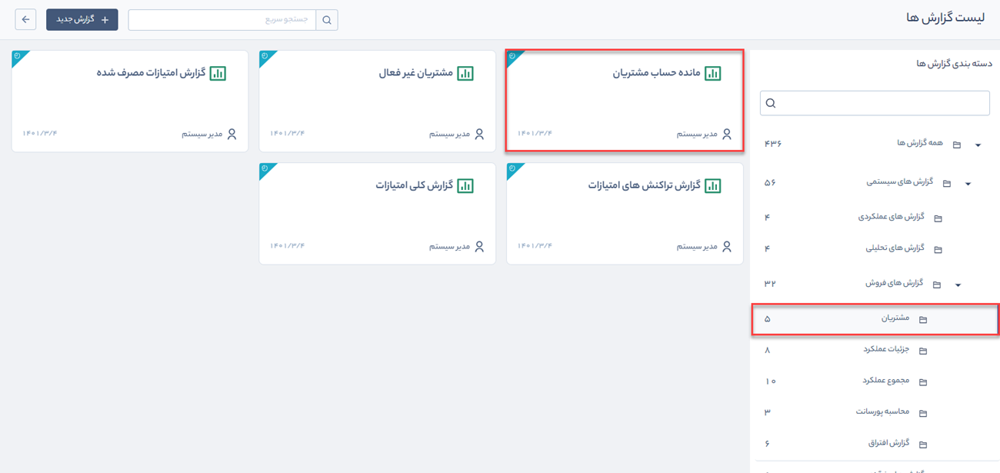

# گزارش مانده حساب مشتریان
 گزارش مانده حساب مشتریان از مسیر گزارش‌های سیستمی > گزارش‌های فروش > مشتریان قابل‌دسترسی است.

> **نکته:**    برای دریافت این گزارش بایستی مجوز مدیر فروش یا مدیر مالی را داشته باشید.

در این گزارش شما می‌توانید بدهکاری و بستانکاری مشتریان را بر اساس پارامترهای مشخص به‌صورت زیر دریافت کنید. 

1.  منبع مورد نظر برای گزارش‌گیری (دسته بندی بانک اطلاعاتی یا گروه‌های هدف)  را در **دسته‌بندی** انتخاب کرده و از میان دسته‌بندی‌های زیرمجموعه آن، موارد دلخواه را با استفاده از علامت پلاس اضافه کنید.

2.  برای دریافت گزارش مانده حساب مشتریان در بازه زمانی خاص، این گزینه را فعال و سپس بازه زمانی مورد نظر خود را مشخص کنید.

3. تاریخ آخرین بدهکاری یا بستانکاری مشتری (ثبت فاکتور، قرارداد مالی، دریافت و پرداخت) را در فیلد **آخرین بدهکاری تا** مشخص کنید.

4. وضعیت تراز مالی (بدهکار، بستانکار) مخاطبانی را که مایل به گزارش‌گیری از آنها هستید، در **وضعیت بدهکاری** انتخاب کنید.

5. بازه حداقل و حداکثر بدهکاری یا بستانکاری مشتریان را در **مقدار مانده** درج کنید.

6.  با فعال کردن گزینه **فقط مشتریان**،  نرم افزار تنها از مخاطبانی گزارش‌گیری می‌کند که شماره مشتری به آنها اختصاص  یافته است. 

7.  با فعال کردن گزینه **فقط مانده‌دارها** تنها مشتریانی که تراز حساب آنها غیر صفر است نمایش داده می‌شود.

8.   در صورت غیر فعال بودن گزینه **نمایش اعشار**، مبالغ نمایش داده شده در خروجی این گزارش به صورت صحیح خواهند بود.

9. فرمت فایل خروجی گزارش (PDF، Excel یا Html) را در **فرمت فایل** مشخص کنید.

10. پس از اعمال فیلترهای موردنظر خود با کلیک بر روی دکمه **دریافت گزارش**، گزارش مانده حساب مشتریان را دریافت کنید.

